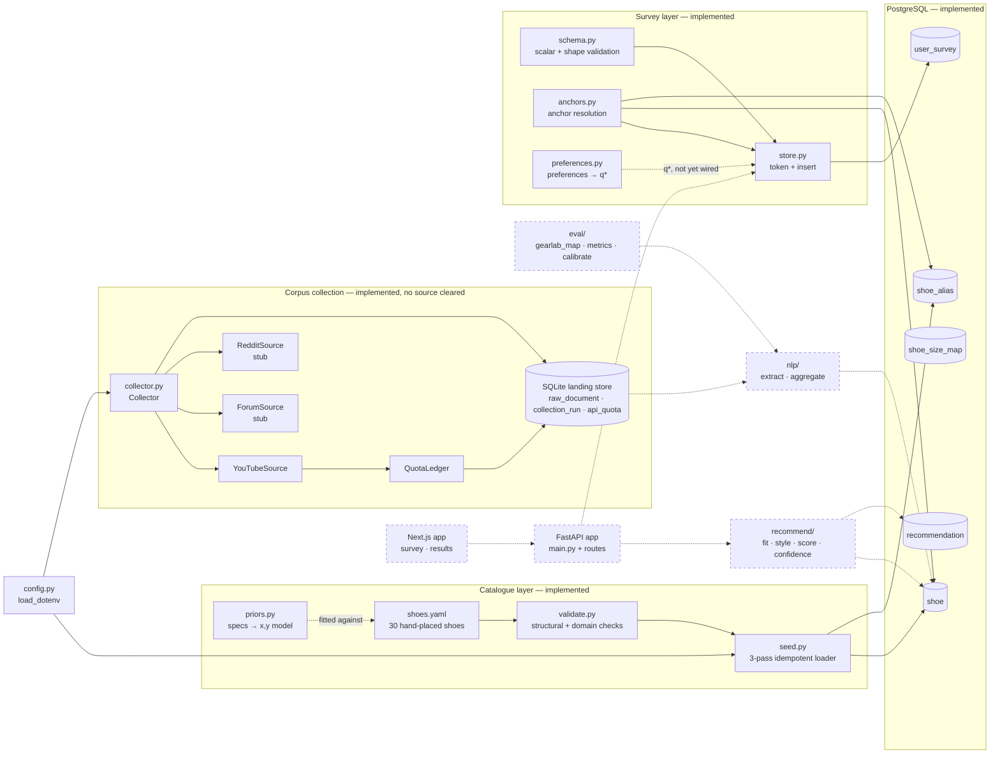
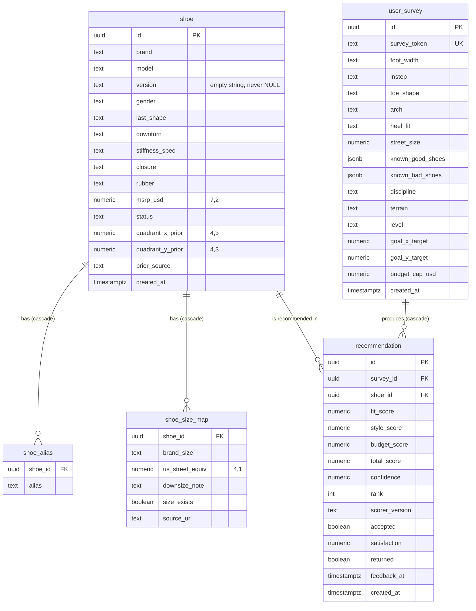

# CruxUp — Architecture

A reference for the structure, data model and design of the CruxUp climbing shoe recommender. It describes the software **as implemented** and marks where the planned design has not been built yet.

- **Last verified against the codebase:** 2026-09-23
- **Plan, tasks and decisions of record:** [`timeline.md`](../timeline.md). Decision IDs (D1–D12) and task IDs (W0-1a, …) below refer to it.
- **Local setup:** [`SETUP.md`](../SETUP.md)
- **Verification:** the commands at the foot of this document re-check the claims that can be checked mechanically.

---

## 1. System overview

- **Purpose:** recommend climbing shoes on three independent dimensions:
  - **Fit** — does the shoe suit the user's foot? (questionnaire + anchor shoes)
  - **Style** — does the shoe's character match the user's discipline and preferences? (a 2-D quadrant)
  - **Budget** — is it within the user's price limit?
- **The quadrant plane** is the core abstraction. Every shoe and every user target is a point in `[-1,1]²`:
  - `x`: comfort (−1) ↔ performance (+1)
  - `y`: stiff (−1) ↔ soft (+1)
  - Q1 performance+stiff · Q2 comfort+stiff · Q3 comfort+soft · Q4 performance+soft
- **Placement provenance.** A shoe's position has one of three sources, ranked by confidence: **corpus** (aggregated community discussion) > **hand** (human judgement) > **spec** (derived from manufacturer specifications). The source is stored with every placement.
- **Build state:**
  - **Implemented:** the product database schema, the shoe catalogue and its validator, a spec-to-placement model, the catalogue loader, environment configuration, a source-agnostic corpus collector, survey capture (§4.7), and preference→target (`q*`) derivation (§4.8).
  - **Not implemented:** the HTTP API, the recommendation scorer, NLP extraction and aggregation, evaluation, and the entire web frontend. These exist as documented stubs (§7). Survey *capture* — validation, anchor resolution and persistence — is implemented (§4.7), and so is the pure `q*` function (§4.8), but nothing yet connects the two, and there is no HTTP surface over either.
- **Current binding constraint:** **no corpus source is cleared.** YouTube collection failed a terms review, Reddit access is pending, and forum terms are unreviewed (`timeline.md` §10.2; D11 reopened). The planned first release (D7) is designed to work **without** a corpus, on hand- and spec-derived placements.

---

## 2. Component diagram

Solid boxes are implemented; dashed boxes are stubs or planned.



---

## 3. Repository layout

| Path | Role | Status |
|---|---|---|
| `backend/app/catalog/data/shoes.yaml` | Seed catalogue; source of truth for shoes | Implemented |
| `backend/app/catalog/validate.py` | Catalogue validation | Implemented |
| `backend/app/catalog/priors.py` | Spec → quadrant placement model | Implemented |
| `backend/app/catalog/seed.py` | Catalogue → PostgreSQL loader | Implemented |
| `backend/app/catalog/sizing.py` | Per-brand sizing map | Stub |
| `backend/app/config.py` | `.env` loading | Implemented |
| `backend/app/db/migrations/0001_init.sql` | Product schema | Implemented |
| `backend/app/db/migrations/0001_init_down.sql` | Reversal of the above | Implemented |
| `backend/app/db/client.py`, `models.py` | Database client, typed models | Stub |
| `backend/app/scraping/collector.py` | Collector, sources, quota ledger, landing store | Implemented |
| `backend/app/scraping/{sources,youtube,reddit,rate_limiter,compile,mentions}.py` | Originally planned per-module split for collection | Stub (§7) |
| `backend/app/main.py`, `backend/app/api/routes/` | FastAPI app and routes | Stub |
| `backend/app/survey/` | Survey capture: `schema.py` validation, `anchors.py` catalogue resolution, `store.py` persistence; `preferences.py` preference → `q*` derivation | Implemented (§4.7, §4.8) |
| `backend/app/recommend/` | Fit, style, score, confidence | Stub |
| `backend/app/nlp/` | Extraction, aggregation, lexicon, distillation | Stub |
| `backend/app/eval/` | Calibration and metrics | Stub |
| `backend/tests/` | Tests: 4 implemented files, 3 stubs | Partial |
| `backend/data/` | Local data: `gearlab/` placeholder; landing store (gitignored) | Runtime |
| `src/app/` | Next.js App Router frontend: `page.tsx`, `layout.tsx`, `survey/`, `results/`, `lib/api.ts`, `lib/types.ts` | Stub |
| `scaffold.sh` | Non-destructive generator for the stub tree (54 `stub` entries; writes only files that do not exist) | Tooling |
| `backend/scraping/`, `backend/NLP/` | Empty files from an earlier layout | Dead code (§12) |
| `timeline.md`, `SETUP.md` | Plan of record; local setup | Docs |

---

## 4. Implemented components

### 4.1 Catalogue — `backend/app/catalog/data/shoes.yaml`
- **Shape:** a mapping root with a `shoes` list. Each entry has `brand`, `model`, optional `version`, `gender`, `last_shape`, `downturn`, `stiffness_spec`, `closure`, `rubber`, `msrp_usd`, `quadrant_x_prior`, `quadrant_y_prior`, `prior_source`, `aliases`, and optional `anchor` and `note`.
- **Contents:** 30 shoes and 71 aliases, all `prior_source: hand`; `msrp_usd` is null on every row.
- **Anchors:** five shoes marked `anchor: true` are calibration ground truth for the quadrant — La Sportiva Solution (Q1), La Sportiva TC Pro (Q2), Evolv Defy (Q3), Scarpa Drago (Q4), Scarpa Instinct VSR (Q4).
- **Identity:** `(brand, model, version, gender)`. A `version` that changes the last is a separate shoe — the Solution (Q1) and Solution Comp (Q4) are separate rows in different quadrants.
- `anchor` and `note` are metadata and documentation; they are not persisted.

### 4.2 Catalogue validation — `backend/app/catalog/validate.py`
- **Interface:** `validate(path=CATALOG, require_msrp=False) -> list[str]` (an empty list means valid); `quadrant(x, y) -> str`; CLI `python3 backend/app/catalog/validate.py [--catalog PATH] [--require-msrp]`, exit code 1 on errors.
- **Order of checks:** structure first (a mapping root, `shoes` as a list, each entry a mapping); then field types (identity fields are strings; priors and `msrp_usd` are numbers, not booleans; `aliases` is a list of strings); then domain rules. Malformed input returns errors and never raises.
- **Domain rules** (several mirror database constraints so failures surface before load):
  - count within `MIN_SHOES`–`MAX_SHOES` (currently 25–30)
  - the five anchors are marked `anchor: true` and land in their expected quadrants
  - `gender`, `downturn` and `closure` enums match the SQL `CHECK` constraints
  - `prior_source` ∈ {`corpus`, `hand`, `spec`}, present exactly when coordinates are present
  - priors lie in `[-1,1]` and not exactly on an axis
  - `(brand, model, version, gender)` is unique
  - aliases are unique across the whole catalogue, case-insensitively
- **Budget-gate guard:** by default null prices only warn; `--require-msrp` makes them errors. This check must pass before any budget filtering relies on prices.

### 4.3 Placement model — `backend/app/catalog/priors.py`
- **Interface:** `derive_prior(shoe: dict) -> (x, y)`; `refit(shoes) -> dict` (weights plus LOOCV scores); `quadrant(x, y)`; the `PriorSource` enum (`CORPUS`, `HAND`, `SPEC`); CLI `python3 backend/app/catalog/priors.py [--refit] [--catalog PATH]`.
- **Model:** linear, over an 18-feature vector:
  - bias
  - one-hot `downturn` (3), `last_shape` (3), `stiffness_spec` (6), `closure` (3)
  - interaction `flat_and_stiff` — a flat last with a stiff or moderate-stiff midsole
  - interaction `soft_slipper` — a slipper closure with a soft or very soft midsole
- **Why the interactions:** a flat last alone predicts comfort, but a flat *and* stiff shoe is a precision edging shoe. `flat_and_stiff` carries x-weight +0.322.
- **Output contract:** clamped to `[-1,1]`; an exact zero is nudged to −0.001 (the comfort/stiff side) so every placement has a quadrant; rounded to 3 decimals to match `NUMERIC(4,3)`.
- **Fitting:** `refit()` fits by numpy least squares and scores the fit under leave-one-out cross-validation. `WEIGHTS` holds the checked-in output of `refit()` on the hand-placed set, so behaviour is deterministic and reproducible. numpy is needed only for refitting; `derive_prior()` is pure Python.
- **Measured accuracy** on the 30 hand-placed shoes: LOOCV MAE x **0.139**, y **0.113**; quadrant agreement **26/30 (87%)**.
- **Role:** makes catalogue growth cheap — a new shoe needs manufacturer spec fields, not a per-shoe judgement call.
- **Limitation:** the model is fitted to a single rater's placements, so its accuracy is agreement with that rater. An independent rater panel is planned (W0-4a).

### 4.4 Catalogue loader — `backend/app/catalog/seed.py`
- **Interface:** `load_catalog(path) -> list[dict]` (validates first; raises `ValueError` if invalid); `seed(conn, shoes, dry_run=False) -> SeedResult`; CLI `python3 backend/app/catalog/seed.py [--catalog PATH] [--database-url URL] [--dry-run]`.
- **Persisted columns** (`COLUMNS`, 13): `brand, model, version, gender, last_shape, downturn, stiffness_spec, closure, rubber, msrp_usd, quadrant_x_prior, quadrant_y_prior, prior_source`.
- **Algorithm — three passes in one transaction:**
  1. Upsert every shoe with `INSERT … ON CONFLICT (brand, model, version, gender) DO UPDATE … RETURNING id, (xmax = 0)`, collecting each ID and whether it was inserted or updated.
  2. `DELETE FROM shoe_alias WHERE shoe_id = ANY(<all collected ids>)`.
  3. Insert every shoe's current aliases.
- **Why three passes:** aliases are unique across the whole table, so per-shoe delete-and-insert depends on order. An alias moving from a later catalogue entry to an earlier one collides with the not-yet-deleted row and aborts the transaction; clearing every affected alias first removes the dependency.
- **Idempotency:** re-seeding an unchanged catalogue updates rows in place. Shoe UUIDs survive re-seeds, which matters because `recommendation.shoe_id` references them.
- **Normalisation:** `version` becomes `''` rather than NULL — NULL never equals NULL, which would defeat the upsert. `gender` defaults to `unisex`.
- **Replace, not merge:** removing an alias from the catalogue removes it from the database.
- **Failure behaviour:** invalid catalogue → exit 1 before any connection; missing `DATABASE_URL` → exit 2; missing `shoe` table → exit 1 with a migration hint; connection failure → exit 1; `--dry-run` rolls back.

### 4.5 Configuration — `backend/app/config.py`
- **Interface:** `load_dotenv(path=None, override=False) -> list[str]`; `configured(*keys) -> dict[str, bool]`; `PROJECT_ROOT`; `DEFAULT_ENV` (the repository-root `.env`).
- **Semantics:**
  - Returns the **names** of the keys it set, never values; `configured()` returns booleans. Secrets cannot leak through return values.
  - Variables already in the process environment take precedence over the file unless `override=True`.
  - Supports `#` comments, an `export ` prefix, spaces around `=`, and one pair of matching surrounding quotes. An empty assignment means *unset*.
  - A missing file returns `[]`, so real environment variables work identically without a file.
- **Dependency choice:** standard library only, so entry points cannot fail to start over an unrelated package.
- **Variables read by implemented code:**

| Variable | Used by | Required |
|---|---|---|
| `DATABASE_URL` | `seed.py` | For seeding |
| `CRUXUP_AUTHOR_SALT` | `collector.py` | For collection — no default |
| `YOUTUBE_API_KEY` | `YouTubeSource` | Source skipped without it |
| `REDDIT_CLIENT_ID`, `REDDIT_CLIENT_SECRET`, `REDDIT_USER_AGENT` | `RedditSource` | Source skipped without them |

- `SUPABASE_URL`, `SUPABASE_KEY` and `ANTHROPIC_API_KEY` appear in `.env.example` but are not read by any implemented code.

### 4.6 Corpus collector — `backend/app/scraping/collector.py`

#### Structure
- **`Source`** (abstract): `available() -> (bool, reason)` never raises, and unavailability is a normal state; `collect(query, limit) -> list[RawDocument]`.
- **`RawDocument`** (frozen dataclass): `source`, `external_id`, `body`, `permalink`, `created_utc`, `author_hash`, `payload`.
- **`YouTubeSource`** is implemented. **`ForumSource`** and **`RedditSource`** implement `available()`, but their `collect()` raises `NotImplementedError`.
- **`Collector`** runs every *available* source over every query:
  - skips unavailable sources with a log line
  - records every run
  - stops a source on `NotImplementedError`
  - isolates other per-query failures
  - waits 1 s between queries
- **`LandingStore`** — a local SQLite store, `backend/data/corpus_landing.sqlite3` by default.
- **`QuotaLedger`** — persistent quota accounting (below).
- **CLI:** `python3 backend/app/scraping/collector.py [--limit N] [--db PATH] [--status] [-v]`. `--status` prints documents per day and today's quota usage.

#### YouTube adapter
- Calls `search.list` (type `video`, `relevanceLanguage=en`, `videos_per_query` = 5 by default), then `commentThreads.list` per video (`textFormat=plainText`, `order=relevance`, paginated up to the limit).
- **Transport is injectable** (`fetch`), so the adapter is fully testable offline. The default transport uses stdlib `urllib` and maps HTTP 403 quota responses to `QuotaExceeded`.
- A video with comments disabled is skipped without failing the run; an unparseable timestamp keeps the document with `created_utc = None`; empty comment bodies are dropped.
- **Stored per document:** the comment ID as `external_id`, the text, a permalink (`watch?v=<video>&lc=<comment>`), the timestamp, the author hash, and `payload = {video_id, like_count}`. `authorDisplayName` is never stored.

#### Quota accounting
- **Buckets**, following YouTube's published quota model:

| Bucket | Endpoints | Cost | Daily limit |
|---|---|---|---|
| `youtube.search` | `search.list` | 1 per call | 100 calls |
| `youtube.units` | all others, including `commentThreads.list` | 1 per call | 10,000 units |

- **Reserved before the request.** YouTube charges quota for every request, including invalid ones, so quota is reserved atomically first: `INSERT OR IGNORE` the day's row, then `UPDATE … SET used = used + cost WHERE used + cost <= limit`. Zero rows updated means `QuotaExceeded`.
- **Persistence:** counters live in the landing store keyed by `(day, bucket)`, so separate processes on the same day share one budget.
- **Day boundary:** `America/Los_Angeles`, matching YouTube's midnight-Pacific reset.
- **On exhaustion,** `collect()` returns the documents gathered so far rather than failing.
- `QuotaLedger.in_memory()` exists for tests and library use; the CLI always injects the persistent ledger.

#### Author pseudonymisation
- `author_hash = HMAC-SHA256(key = CRUXUP_AUTHOR_SALT, message = author channel ID)`, hex-encoded.
- The key is read **when a hash is computed**, not at import, so a value loaded from `.env` after import is honoured.
- **Fails closed:** there is no default key. A missing key, one shorter than 32 characters, or a known-compromised value raises `MissingAuthorSalt`. The CLI checks the key after loading configuration and exits with code 2 **before any network request**.
- **The key is a secret.** Author IDs are public, so anyone holding the key could recompute hashes for candidate IDs. Changing the key makes previously stored hashes incomparable.

#### Landing store schema (SQLite)
| Table | Key | Columns |
|---|---|---|
| `raw_document` | `(source, external_id)` | `body, permalink, created_utc, author_hash, payload_json, collected_at` |
| `collection_run` | `id` | `started_at, finished_at, source, query, fetched, inserted, error` |
| `api_quota` | `(day, bucket)` | `used` |

- `INSERT OR IGNORE` on the primary key makes collection idempotent across restarts.
- The landing store holds raw payloads. Normalising them into the PostgreSQL corpus schema is planned (W1-full). **Retention is set by each source's terms** — YouTube caps stored data at 30 days.
- The store is gitignored (`backend/data/*.sqlite3`) and **currently empty**.

---

### 4.7 Survey capture — `backend/app/survey/`

Loads one questionnaire submission into `user_survey`. It adds no DDL: the table
and its CHECK constraints already exist in `0001_init.sql`, and this layer is the
validation and loading path in front of them.

#### Structure
- **`schema.py`** — `validate(payload) -> list[str]`. Scalar fields and top-level
  shape only; accumulates every problem rather than raising on the first, matching
  `catalog/validate.py`. CLI: `python3 backend/app/survey/schema.py <payload.json>`.
- **`anchors.py`** — resolves anchor sets *G* (`known_good_shoes`) and *B*
  (`known_bad_shoes`) against the catalogue.
  - **`CatalogLookup`** (Protocol) with two implementations: **`StaticCatalog`**
    (in-memory, used by the hermetic tests) and **`PostgresCatalog`** (reads
    `shoe` / `shoe_alias` from an already-open connection, never opening its own).
  - **`CatalogShoe`** (frozen dataclass) projects exactly `shoe_unique_identity`
    plus the id.
  - `resolve_anchors(good, bad, catalog)` returns resolved lists plus errors.
- **`store.py`** — `build_survey_row()` merges both validation stages into one
  error list; `insert_survey()` writes one row in a single transaction. CLI:
  `python3 backend/app/survey/store.py <payload.json> [--dry-run]`.

#### Vocabularies and the schema they mirror
`schema.ENUMS` mirrors five CHECK constraints (`survey_width_valid`,
`survey_instep_valid`, `survey_toe_valid`, `survey_arch_valid`,
`survey_disc_valid`). A test parses those constraints back out of the migration
and asserts equality, so the two cannot drift silently.

`heel_fit`, `terrain` and `level` have **no** CHECK constraint in the schema, so
they are validated only in Python (`schema.PY_ONLY_ENUMS`). This asymmetry is
deliberate and tracked — see §12.

#### Resolution rules
- Matching is case-insensitive on `(brand, model)`, narrowed by an optional
  `version` and/or `gender`.
- **An ambiguous name is an error, never a guess.** Three catalogue entries share
  a `(brand, model)` pair and differ only by version — Scarpa Instinct (VS/VSR),
  La Sportiva Katana (Lace/Velcro), La Sportiva Solution (base/Comp). Two are §3
  calibration anchors, so silently picking one would corrupt calibration-grade
  input. The error lists every candidate.
- A registered `shoe_alias` used as the `model` is an unambiguous disambiguator,
  because `shoe_alias_globally_unique` is unique across the catalogue. It is tried
  only when the identity match found nothing, so a bare shared name stays
  ambiguous regardless of whether it happens to also be an alias.
- `size` is opaque to the catalogue: it is never gated against `shoe_size_map`
  (D9 makes `size_exists` the only hard sizing gate, decided downstream).
- The same shoe in both *G* and *B* is contradictory and is rejected.

#### Input constraints
- **Allow-lists, not deny-lists.** Unknown top-level keys and unknown anchor
  sub-keys are rejected outright, so an identifier cannot ride into storage
  through an unmodelled field (D4). `shoe_id` is an *output* of resolution and is
  refused as an input, so a caller cannot point an anchor at an arbitrary shoe.
- **`size` is bounded in length and character set.** A length cap alone is not
  sufficient — an email address is short — so the characters a brand size is
  actually written with are enumerated, which rejects an address on `@`.
- Free text is rejected if it carries a NUL byte or a lone UTF-16 surrogate;
  both are representable in a Python string but not storable, and would otherwise
  surface as an exception from inside the driver rather than a validation error.
- The number of anchors per submission is capped, because each one costs a
  catalogue round trip. The cap short-circuits resolution, so an oversized
  submission performs no lookups at all.
- Numeric fields are checked against their column **scale**, not merely their
  range: PostgreSQL silently *rounds* a value that exceeds a `NUMERIC` scale
  rather than rejecting it, so a submission could otherwise validate clean and be
  stored as a different number. The comparison carries a float tolerance, because
  `q*` is computed upstream and binary-float noise is expected.

#### Identity
`survey_token` is generated with `secrets.token_urlsafe` (CSPRNG) and is the only
identity written. It is never accepted from a submission.

### 4.8 Preference → target — `backend/app/survey/preferences.py`

Maps a user's preference answers to `q*`, the point on the quadrant plane their
recommendations are steered toward (`timeline.md` §7.5). The Style score (§7.3)
measures each shoe's distance from this point. Pure arithmetic: no database, no
IO, standard library only.

#### Interface
- **`target_quadrant(discipline, terrain=None, level=None, goal=None) -> (x, y)`**
  - `discipline` is required: `boulder`, `sport`, `trad` or `gym`.
  - `terrain` (`slab`, `vertical`, `overhang`, `crack`) and `level` (`beginner`,
    `intermediate`, `advanced`, `elite`) are optional.
  - `goal` is an optional comfort-vs-performance slider value in `[-1, 1]`
    (−1 comfort, +1 performance).
  - An omitted input contributes nothing.
  - The coordinates are rounded to 3 decimal places, the scale of
    `goal_x_target` / `goal_y_target` (`NUMERIC(4,3)`), so `q*` can be stored
    without PostgreSQL rounding it again.
- **`quadrant_of(q) -> "Q1" … "Q4"`** labels a point per §1. It raises on a
  point that lies on an axis or has a non-finite coordinate.
  `catalog/priors.quadrant()` classifies shoe placements on the same plane but
  returns an `ON-AXIS` label instead of raising. It is not shared because
  `priors.py` depends on PyYAML.

#### Mapping
Discipline chooses the quadrant. The other inputs only move `q*` *within* it.

| Input | Value | Contribution (x, y) | Rationale (`timeline.md` §3) |
|---|---|---|---|
| discipline | `sport` | (+0.55, −0.55) | Q1: performance + stiff |
| discipline | `trad` | (−0.55, −0.55) | Q2: comfort + stiff |
| discipline | `gym` | (−0.55, +0.55) | Q3: comfort + soft |
| discipline | `boulder` | (+0.55, +0.55) | Q4: performance + soft |
| terrain | `vertical` | (+0.15, −0.15) | toward Q1: technical face, edging |
| terrain | `crack` | (−0.15, −0.15) | toward Q2: all-day, multi-pitch |
| terrain | `slab` | (−0.15, +0.15) | toward Q3: slabs |
| terrain | `overhang` | (+0.15, +0.15) | toward Q4: steep terrain |
| level | `beginner` → `elite` | x only: −0.15, −0.05, +0.05, +0.15 | beginners sit on the comfort side |
| goal | `g ∈ [−1, 1]` | x only: 0.15 · g | the comfort ↔ performance axis |

The two magnitudes are named constants, `BASE_MAGNITUDE = 0.55` and
`NUDGE = 0.15`. The tables are read-only mappings.

#### Invariant: `q*` always lies inside its discipline's quadrant
On any axis, at most three nudges can oppose the discipline's sign, which caps
the total at 3 × 0.15 = 0.45. That is less than the 0.55 base, so for **every**
combination of inputs:

- `|x|` and `|y|` are at least 0.10. `q*` never lies on an axis, where no
  quadrant is defined, and never crosses into another quadrant.
- `|x|` and `|y|` are at most 0.55 + 0.45 = 1.00. `q*` stays inside `[-1, 1]²`,
  and the clamp in the code never changes a value.

This holds by construction, not by clamping. The module checks both
inequalities when it is imported and raises `RuntimeError` if a change to the
constants breaks them. The check is an explicit `raise` rather than `assert`,
because `python -O` removes assert statements.

#### Validation
- Inputs are checked in the order discipline, terrain, level, goal. The first
  problem raises `ValueError`, naming the field and its allowed values.
- A `bool` is not accepted as a number.
- `goal` must be finite and within `[-1, 1]`. An integer too large to convert to
  a float is rejected with `ValueError`, not `OverflowError`.
- Unlike `schema.validate()`, errors are not accumulated. The function sits
  downstream of submission validation, not in front of a form.

#### Vocabulary
The function keys its tables to the same vocabularies `survey/schema.py`
accepts. `preferences.py` does not import `schema.py`, so tests pin the two
together: the discipline, terrain and level keys, and the output precision
(`OUTPUT_DECIMALS` = `schema.GOAL_TARGET_DECIMALS`).

#### Not yet modelled
- **Stiffness preference** and **downsizing/pain tolerance** are listed in §7.5
  but have no mapping and no `user_survey` column.
- **The function is not called anywhere.** `store.py` stores `goal_x_target` /
  `goal_y_target` exactly as supplied. The submission allow-list has no key for
  the raw `goal` slider, and no column stores it. See §12.

---

## 5. Data model (PostgreSQL)

Defined in `backend/app/db/migrations/0001_init.sql` and reversed by `0001_init_down.sql`. It requires the `pgcrypto` extension (`gen_random_uuid()`) and targets PostgreSQL 14+; it is verified on 16.15. Only the **product** schema exists; the corpus schema (`corpus_snapshot`, `mention`, `extraction`, `shoe_axis_score`, `lexicon`, `gearlab_label`) is specified in `timeline.md` §8.2 but not implemented.



### 5.1 Constraints
| Table | Constraint | Enforces |
|---|---|---|
| `shoe` | `shoe_unique_identity` | unique `(brand, model, version, gender)` |
| `shoe` | `shoe_status_valid` | `status` ∈ active, discontinued, revised |
| `shoe` | `shoe_gender_valid` | `gender` ∈ mens, womens, unisex |
| `shoe` | `shoe_downturn_valid` | `downturn` ∈ flat, moderate, aggressive (or NULL) |
| `shoe` | `shoe_closure_valid` | `closure` ∈ lace, velcro, slipper (or NULL) |
| `shoe` | `shoe_prior_x_range`, `shoe_prior_y_range` | priors within `[-1,1]` |
| `shoe` | `shoe_prior_paired` | x and y priors both set or both NULL |
| `shoe` | `shoe_prior_source_valid` | `prior_source` ∈ corpus, hand, spec (or NULL) |
| `shoe` | `shoe_prior_source_paired` | a placement has a source, and a source has a placement |
| `shoe_alias` | primary key `(shoe_id, alias)` + unique index `shoe_alias_globally_unique` on `lower(alias)` | an alias identifies exactly one shoe, case-insensitively |
| `shoe_size_map` | primary key `(shoe_id, brand_size)` | one row per brand size |
| `user_survey` | `survey_token` unique | the only respondent identity |
| `user_survey` | `survey_width_valid`, `survey_instep_valid`, `survey_toe_valid`, `survey_arch_valid`, `survey_disc_valid` | controlled vocabularies |
| `user_survey` | `survey_target_x`, `survey_target_y` | target within `[-1,1]` |
| `user_survey` | `survey_anchors_array` | both anchor columns are JSON arrays |
| `recommendation` | `rec_unique_shoe_per_survey` | a shoe appears once per survey |
| `recommendation` | `rec_rank_positive` | `rank > 0` |
| `recommendation` | `rec_confidence_unit` | confidence within `[0,1]` |
| `recommendation` | `rec_satisfaction` | satisfaction within 1–5 |
| `recommendation` | `rec_feedback_timestamped` | any feedback field requires `feedback_at` |

### 5.2 Indexes
- `shoe_status_idx` — partial, `WHERE status = 'active'`
- `shoe_brand_idx`
- `shoe_size_map_street_idx` — partial, `WHERE size_exists`
- `user_survey_created_idx` — on `created_at DESC`
- `recommendation_survey_rank_idx` — on `(survey_id, rank)`
- `recommendation_feedback_idx` — partial, `WHERE feedback_at IS NOT NULL`

### 5.3 Design notes
- **Privacy:** no personal identifiers are stored. `user_survey.survey_token` is an anonymous handle that links follow-up feedback to recommendations. The schema has no image or biometric storage (D4).
- **`size_exists`** is the only hard sizing gate: it is FALSE only when a brand does not make that size. A downsizing mismatch is intended as a ranked warning, never an exclusion (D9).
- **`scorer_version`** records which weight configuration produced a recommendation, so historical rows stay interpretable after scoring changes.
- **The feedback columns** (`accepted`, `satisfaction`, `returned`, `feedback_at`) exist from the first migration, so online evaluation data is never lost to a later schema change.

---

## 6. Data flows

### 6.1 Loading the catalogue
1. `seed.py` resolves `DATABASE_URL` from `--database-url`, the environment, or `.env`.
2. `load_catalog()` runs `validate()`; any error aborts before a database connection is opened.
3. `seed()` upserts all shoes, clears their aliases in one statement, re-inserts the aliases, and commits — or rolls back under `--dry-run`.

### 6.2 Producing placements
1. **Hand placement:** a person sets `quadrant_x_prior`, `quadrant_y_prior` and `prior_source: hand` in `shoes.yaml`. These rows form the calibration set.
2. **Spec placement** (intended use): for a new shoe with only spec fields, `derive_prior()` supplies the coordinates and the shoe is recorded with `prior_source: spec`.
3. **Refitting:** when hand placements change, `priors.py --refit` refits on rows whose `prior_source` is `hand` and prints new weights. The test suite fails if the checked-in weights drift from `refit()` output or the LOOCV score regresses.
4. **Corpus placement** (planned): aggregated extracted signals would replace placements, with `prior_source: corpus`, for shoes with enough mentions.

### 6.3 Collecting corpus documents (implemented; no source currently cleared)
1. `main()` loads `.env`, opens the landing store and the persistent `QuotaLedger`, and checks the author key — exiting before any request if the key is invalid.
2. For each available source and query: reserve quota → request → hash authors → `INSERT OR IGNORE` the documents → record the run.
3. On quota exhaustion, the source returns partial results and collection moves on.

### 6.4 Capturing a survey
1. `schema.validate()` checks scalar fields and shape — no catalogue or database
   needed, so an invalid submission is rejected before a connection is opened.
2. `anchors.resolve_anchors()` resolves each anchor to a `shoe.id` against the
   catalogue, or reports an unknown, ambiguous or contradictory entry.
3. Both error lists are merged, so a caller sees every problem in one round trip.
4. A `survey_token` is generated and the row is inserted in one transaction;
   `--dry-run` exercises the whole path, including JSONB adaptation, then rolls back.

`goal_x_target` / `goal_y_target` are currently stored exactly as submitted. The
path does not yet call `preferences.target_quadrant()` (§4.8) to derive them.

### 6.5 Recommendation (planned)
- A survey's preference answers yield a target `q*`. The derivation itself is implemented (§4.8); connecting it to capture and to scoring is not.
- The scorer combines Fit, Style and Budget, gates on `size_exists` and price, and ranks the results.
- Each result carries a confidence driven by `prior_source`, mention count and agreement, and is written as a `recommendation` row under the active `scorer_version`.
- Apart from the `q*` function, none of this is implemented.

---

## 7. Planned components (stubs)

Each stub holds a one-line docstring naming its intended responsibility and task ID. **Several docstrings predate later design decisions; where they conflict, the current design wins:**

| Stub | Docstring intent | Current design (overrides the docstring) |
|---|---|---|
| `backend/app/main.py` | FastAPI entrypoint mounting routes | Owned by **W7-1**. `fastapi` and `uvicorn` are declared but not yet imported anywhere |
| `api/routes/survey.py` | `POST /survey` → persist survey, derive q* | Owned by **W7-1**. A thin wrapper only: `survey/store.py` already validates and persists and `survey/preferences.py` already derives `q*`, and duplicating rules here would let them drift. How the raw `goal` slider reaches `target_quadrant()` is still open (§12) |
| `api/routes/recommend.py` | `POST /recommend` → ranked results + confidence | Owned by **W7-2**, after the scorer exists (W3-3) |
| `api/routes/shoes.py` | `GET /shoes`, `/shoes/{id}` | Owned by **W7-1**. Backs the anchor picker, so it must return `version` and `gender` — three catalogue pairs share `(brand, model)` and the UI cannot disambiguate without them |
| `db/client.py` | Supabase/Postgres client | Implemented code uses `psycopg` directly against `DATABASE_URL`, which keeps the database portable |
| `db/models.py` | Typed models mirroring migrations; cites "PROJECT_PLAN §8" | That file does not exist; the schema of record is `timeline.md` §8 and `0001_init.sql` |
| `recommend/fit.py`, `style.py`, `confidence.py` | §7.2, §7.3, §7.7 | Confidence must reflect `prior_source` |
| `recommend/score.py` | "gated by size & price" | The size gate is `size_exists` only (D9); weights are set by judgement, not tuned (§7.6) |
| `catalog/sizing.py` | "Hard gate in scoring" | **Superseded by D9** — a downsizing mismatch is a warning; only `size_exists` excludes |
| `eval/gearlab_map.py` | "Tune weights to confirmed placements" | **Superseded by D8** — weights are frozen before measurement; evaluation uses LOOCV |
| `eval/metrics.py`, `calibrate.py` | MAE, confusion matrix, calibration | Calibration must beat the `priors.py` baseline to justify the pipeline |
| `nlp/extract.py` | LLM extraction "gated by lexicon" | Whether a lexicon is used at all depends on an experiment (W2-0) |
| `nlp/aggregate.py` | Aggregation with an N_min gate | N_min must come from a measured coverage curve; early data showed 0 of 30 shoes reaching 25 mentions |
| `nlp/train.py` | Distillation | Deferred (D1) |
| `nlp/lexicon/loader.py`, `lexicon.yaml` | Versioned phrase → axis lexicon | Conditional on W2-0 |
| `scraping/sources.py`, `youtube.py`, `reddit.py` | Separate source modules | Sources are implemented inside `collector.py`. YouTube collection is not cleared (`timeline.md` §10.2) |
| `scraping/rate_limiter.py` | Shared token bucket + backoff | Per-source quota is handled by `QuotaLedger`; a shared limiter and backoff remain planned (W0-3) |
| `scraping/compile.py` | Ingest → normalise → snapshot | Planned (W1-full) |
| `scraping/mentions.py` | Mention detection "via shoe_alias / NER" | **Redesign required:** most comments do not name a shoe, so attribution must come mainly from the video or thread subject, with aliases secondary (W1-3) |
| `src/app/**` | Survey, results, API client, shared types | Frontend not started |

---

## 8. Architectural decisions

The decisions that shape the structure, in brief. Full rationale is in `timeline.md` §2.

- **Placement provenance is first-class** (D12). Coordinates never exist without their source; both the catalogue validator and the database enforce it.
- **Product before pipeline** (D7). The first release depends only on the catalogue, the survey and the scorer, not on any corpus. This isolates the product from the unresolved data-access question.
- **Spec-derived placement instead of a capped catalogue** (D12, superseding D6). The catalogue grows through a fitted spec model rather than being limited to what can be hand-placed. Fit and Budget never depend on the corpus.
- **Offline batch extraction, not query-time retrieval.** Any NLP signal is computed ahead of time and stored as placements, so recommendations stay reproducible and fast with no model in the request path. This is not a RAG system.
- **Evaluation discipline** (D8). Calibration weights are frozen before measurement, and small samples use leave-one-out cross-validation.
- **Soft sizing** (D9). A shoe is excluded only for a size its brand does not make.
- **Source-agnostic collection** (D11). No single data source is load-bearing; sources are pluggable adapters that may be unavailable.
- **Non-commercial and advertising-free** (D11). The product carries no advertising. Using free API tiers under non-commercial terms constrains future monetisation for as long as that data is in use.
- **Privacy by construction** (D4). No images, no biometrics, no personal identifiers; author identity exists only as a keyed pseudonym.
- **The browser never reaches the service layer directly** (decided 2026-09-21, `timeline.md` §6). The planned data path is browser → Next.js route handler → FastAPI on localhost → PostgreSQL. The frontend talks only to its own origin, so there is no CORS surface and the backend is not addressable from the client. The alternative — querying PostgreSQL from TypeScript — was rejected because it would duplicate the anchor resolution, allow-lists and domain guards that already exist and are tested in Python, leaving two validators to keep in step.

---

## 9. Cross-cutting concerns

### 9.1 Security and privacy
- **Secrets** come only from the environment or a gitignored `.env`; `.env.example` holds names only. The loader never returns or logs values.
- **Author pseudonymisation** is keyed and fails closed (§4.6).
- **Survey data** holds no direct identifiers (§5.3).
- **Git hygiene:** `.gitignore` covers `.env`, `.env*.local`, `backend/data/*.sqlite3` (collected third-party content) and `.pytest_cache`.

### 9.2 External constraints
- **YouTube Data API:** separate daily quota buckets (§4.6). The Developer Policies limit stored data to 30 days and prohibit aggregating data or deriving new metrics from it, so YouTube collection is **not cleared** for the planned aggregation (`timeline.md` §10.2).
- **Reddit Data API:** the free tier is non-commercial, and new OAuth clients need manual approval. Not integrated.
- **Community forums:** terms and `robots.txt` not yet reviewed. Not integrated.
- **GearLab:** planned for internal calibration only, by manual transcription, and never surfaced in the product (D2).

### 9.3 Reliability and idempotency
- **Catalogue load:** idempotent upsert with stable UUIDs; alias replacement that doesn't depend on order; a single transaction.
- **Collection:**
  - document inserts are idempotent
  - quota is reserved atomically, persisted across processes, and consumed by failed requests
  - partial results survive quota exhaustion
  - one failing query or source does not abort a run

### 9.4 Reproducibility
- Prior weights are checked in and can be regenerated with `priors.py --refit`.
- `recommendation.scorer_version` ties each result to a weight configuration.
- The migration pair is reversible and can be re-applied.

---

## 10. Dependencies

### 10.1 Python (`backend/requirements.txt`)
| Package | Imported by implemented code | Purpose |
|---|---|---|
| `psycopg[binary]` | Yes — `seed.py` | PostgreSQL access |
| `pyyaml` | Yes — `validate.py`, `seed.py`, `priors.py`, tests | Catalogue parsing |
| `numpy` | Yes — `priors.py` (refit only), tests | Model fitting; test dependency |
| `pytest` | Yes — tests | Test runner |
| `fastapi`, `uvicorn[standard]`, `pydantic`, `pydantic-settings` | No | Planned API |
| `supabase` | No | Declared for hosted Postgres; implemented code uses `psycopg` |
| `praw` | No | Planned Reddit adapter |
| `google-api-python-client` | No | Declared for YouTube; the implemented adapter uses stdlib `urllib` |
| `anthropic` | No | Planned LLM extraction |
| `tenacity`, `structlog` | No | Planned retries and structured logging |

- Beyond these, implemented code uses only the standard library, including `argparse`, `dataclasses`, `datetime`, `enum`, `hashlib`, `hmac`, `json`, `logging`, `pathlib`, `sqlite3`, `urllib` and `zoneinfo`.
- `pglast` is an optional development tool for checking DDL without a server, not a runtime dependency.

### 10.2 Frontend (`package.json`)
- **Runtime:** `next` 16.2.4, `react` 19.2.4, `react-dom` 19.2.4.
- **Development:** TypeScript 5, Tailwind CSS 4 (via `@tailwindcss/postcss`), ESLint 9 with `eslint-config-next`.

---

## 11. Testing architecture

- **Runner:** `pytest`, run from the repository root: `python3 -m pytest backend/tests/ -q`.
- **Isolation:** no network and no database. External APIs are replaced by an injected transport; SQLite state uses temporary paths; tests that check availability explicitly remove environment credentials; an autouse fixture supplies a synthetic author key.
- **`backend/tests/test_collector.py`** — 25 tests:
  - privacy: display names never stored; hashes keyed; key read at hash time; weak and compromised keys rejected
  - quota: separate buckets; exhausting one does not block the other; failed requests consume quota; persistence across processes; daily reset; partial results
  - robustness: disabled comments, malformed timestamps, empty bodies, pagination limits
  - storage: idempotent insert, daily volume
  - availability: sources unavailable without credentials
- **`backend/tests/test_priors.py`** — 39 tests:
  - database contract: every derived placement in range and off-axis
  - model behaviour: interaction terms, monotonic stiffness, downturn ordering
  - regression guards: LOOCV score thresholds; checked-in weights equal `refit()` output
  - anchor agreement
  - numpy is imported unconditionally, so the regression guards cannot be silently skipped
- **`backend/tests/test_survey.py`** — 155 tests:
  - schema drift: the five CHECK vocabularies are parsed out of `0001_init.sql`
    and compared, with a self-check so the parser cannot pass vacuously
  - domains: enum membership, numeric range *and* scale, float-noise tolerance
  - anchors: unknown, ambiguous, alias-disambiguated, case-insensitive,
    contradictory, and the optional opaque `size`
  - §7.1: an all-NULL fit profile with anchors alone is accepted, as is an
    entirely empty submission
  - input constraints: oversized and out-of-charset `size`, NUL bytes, lone
    surrogates, anchor-count cap, and a counting catalogue proving a rejected
    oversized submission performs zero lookups
  - persistence: CSPRNG token, parameterised insert, commit/rollback, JSONB
    adaptation
  - CLI: exit codes for malformed JSON, validation failure, missing
    `DATABASE_URL`, and an unreachable database
- **`backend/tests/test_preferences.py`** — 1,334 tests (30 functions, mostly
  parametrised):
  - §7.5 acceptance: each discipline alone lands in its §3 quadrant
  - exhaustive: all 600 combinations of discipline × terrain (4 + omitted) ×
    level (4 + omitted) × `goal` (5 values + omitted) stay inside `[-1, 1]²`, at least
    0.10 from both axes, and in the discipline's quadrant
  - storability: the same 600 outputs pass `schema.validate()`
  - vocabulary pins against `schema.py`, direction of every nudge, monotonic
    `level` and `goal`, and `level`/`goal` leaving `y` unchanged
  - rejections, including `bool`, numeric strings, NaN, ±∞, out-of-range and
    over-large integer `goal`; read-only tables; the import-time invariant check
    fails for bad constants, including under `python -O`
  - golden values with hand-checked arithmetic
- **Database-backed tests are opt-in by reachability.** Ten tests use a live
  PostgreSQL when one is available and skip cleanly when it is not, so the default
  suite stays hermetic. Each rolls back and asserts it left `user_survey` empty.
  This is the first automated database coverage in the project; migration
  apply/reverse remains manual (`SETUP.md` §3).
- **Stub test files:** `test_fit.py`, `test_aggregate.py`, `test_calibration.py`.
- **Total:** 1,553 tests with a database reachable; 1,543 passed and 10 skipped without one.

---

## 12. Known gaps and technical debt

- **Survey vocabularies are enforced only in Python.** `heel_fit`, `terrain` and
  `level` have no CHECK constraint in `user_survey`, unlike the five fields beside
  them, so a writer bypassing `survey/schema.py` could store any value. The same
  applies to the `size` length and character-set limits and the anchor count, which
  live in the loading layer rather than the schema. A follow-up migration should
  add the missing constraints.
- **Anchor resolution is one query per anchor.** `PostgresCatalog` issues a lookup
  per entry rather than one batched query. The per-submission cap bounds this, and
  at catalogue scale (30 rows now, ~100 under D12) the cost is negligible, but a
  bulk path would need batching.
- **`lower(brand)`/`lower(model)` matching cannot use an index.** `shoe_brand_idx`
  and `shoe_unique_identity` index the raw columns, so identity resolution is a
  sequential scan. Immaterial at present size; an expression index would be needed
  well past D12.
- **`q*` is not connected to capture.** `survey/preferences.py` is implemented
  and tested, but no caller uses it. Two further gaps have to be closed before
  it is:
  - The submission allow-list (`schema.ALLOWED_KEYS`) has no key for the raw
    comfort-vs-performance `goal`, so a payload carrying one is rejected today.
    The endpoint would have to convert `goal` to `goal_x_target` /
    `goal_y_target` before validation, or the schema would have to accept it.
  - `user_survey` stores the derived `q*` but not the raw `goal`. A stored
    target therefore cannot be recomputed exactly if the mapping constants
    change later.

  The planned owner is W7-1's `POST /survey`, but that task does not yet
  depend on W4'-2.
- **Two quadrant classifiers.** `catalog/priors.quadrant()` and
  `survey/preferences.quadrant_of()` both label points on the same plane. They
  differ on axis points: the first returns `ON-AXIS`, the second raises. They
  are kept apart because `preferences.py` must not depend on PyYAML.
- **Catalogue size band is stale.** `validate.py` enforces 25–30 shoes, reflecting the superseded D6; the target is now ~100 (D12). It must be raised before the catalogue expands.
- **Refit input filtering in tests.** `test_priors.py` refits on every shoe with coordinates. Once `prior_source: spec` rows exist, it must filter to `hand` rows, as the `--refit` CLI already does, or the model would be fitted partly on its own output.
- **No prices.** `msrp_usd` is null on every catalogue row, so budget filtering cannot be relied on (`validate.py --require-msrp` fails).
- **Unused declared dependencies:** 10 of 14 packages are declared ahead of use (§10.1).
- **Stale stub docstrings** in `catalog/sizing.py`, `recommend/score.py`, `eval/gearlab_map.py`, `scraping/mentions.py` and `db/models.py` contradict the current design (§7).
- **Broken references:** `db/models.py` and `scaffold.sh` cite `PROJECT_PLAN.md`, which does not exist; the plan of record is `timeline.md`.
- **Legacy dead code:** `backend/scraping/` (`compile.py`, `sources.py`, `NLP_training_data.txt`) and `backend/NLP/` (`processing/NLP.py`, `training/trainer.py`) are empty files from an earlier layout, duplicated by `backend/app/`.
- **Module split mismatch:** collection sources live in `collector.py`, but stub modules for a per-source split remain under `backend/app/scraping/`.
- **Migration edited in place:** `0001_init.sql` was changed after first use to add `prior_source`. That is acceptable before any deployment; later changes should be additive migrations.
- **The frontend cannot build.** `src/app/layout.tsx` and `src/app/page.tsx` are empty files, and the App Router requires a root layout that renders `<html>`/`<body>`. There is also no installed dependency tree (no `node_modules`, no lockfile) and no test runner declared in `package.json`, so no frontend test or end-to-end tooling can run. Tracked as **W6-0**.
- **No HTTP layer exists.** `fastapi` and `uvicorn` are declared in `backend/requirements.txt` but imported nowhere; `main.py` and all three route modules are one-line stubs. Survey capture is therefore reachable only through its CLI. Tracked as **W7-1**.
- **Documentation stubs:** `docs/eval-methodology.md` and `docs/lexicon-guide.md` are placeholders, and `README.md` is a single line.
- **No corpus source is cleared** (§9.2), so the NLP half of the architecture has no permitted input today.

---

## Verification

These commands re-check the mechanically verifiable claims in this document:

```bash
python3 -m pytest backend/tests/ -q                              # 1553 passed (database reachable)
python3 -m pytest backend/tests/test_collector.py -q             # 25 passed
python3 -m pytest backend/tests/test_priors.py -q                # 39 passed
python3 -m pytest backend/tests/test_survey.py -q                # 155 passed
python3 -m pytest backend/tests/test_preferences.py -q           # 1334 passed
DATABASE_URL=postgresql://localhost:1/nope \
  python3 -m pytest backend/tests/ -q                            # 1543 passed, 10 skipped — the suite is hermetic
python3 backend/app/catalog/validate.py | tail -1                # catalogue valid
python3 backend/app/catalog/priors.py --refit | head -2          # LOOCV  MAE x = 0.139  MAE y = 0.113  agreement = 87%
psql -d <db> -f backend/app/db/migrations/0001_init.sql          # applies clean on an empty database
psql -d <db> -f backend/app/db/migrations/0001_init_down.sql     # reverses to zero tables
CRUXUP_AUTHOR_SALT= python3 backend/app/scraping/collector.py; echo $?   # 2 — refuses to start
```
