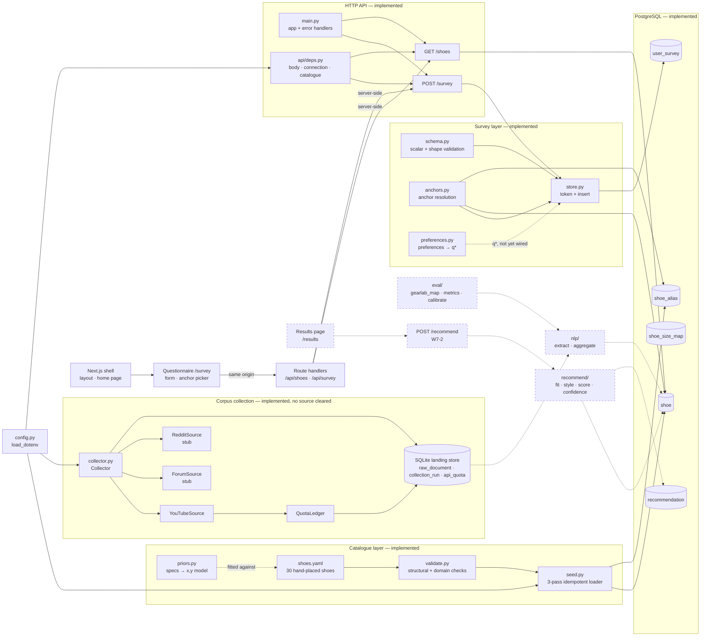
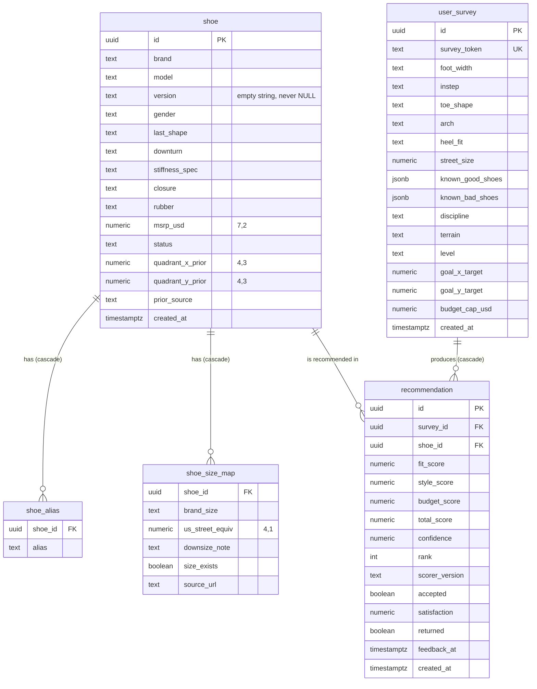

# CruxUp — Architecture

A reference for the structure, data model and design of the CruxUp climbing shoe recommender. It describes the software **as implemented** and marks where the planned design has not been built yet.

- **Last verified against the codebase:** 2026-10-01
- **Plan, tasks and decisions of record:** [`timeline.md`](../timeline.md). Decision IDs (D1–D12) and task IDs (W0-1a, …) below refer to it.
- **Local setup:** [`SETUP.md`](../SETUP.md)
- **Verification:** the commands at the foot of this document re-check the claims that can be checked mechanically.

---

## 1. System overview

- **Purpose:** recommend climbing shoes on three independent dimensions:
  - **Fit** — does the shoe suit the user's foot? (questionnaire + anchor shoes)
  - **Style** — does the shoe's character match the user's discipline and preferences? (a 2-D quadrant)
  - **Budget** — is it within the user's price limit?
- **The quadrant plane** is the core abstraction. Every shoe and every user target is a point in `[-1,1]²`:
  - `x`: comfort (−1) ↔ performance (+1)
  - `y`: stiff (−1) ↔ soft (+1)
  - Q1 performance+stiff · Q2 comfort+stiff · Q3 comfort+soft · Q4 performance+soft
- **Placement provenance.** A shoe's position has one of three sources, ranked by confidence: **corpus** (aggregated community discussion) > **hand** (human judgement) > **spec** (derived from manufacturer specifications). The source is stored with every placement.
- **Build state:**
  - **Implemented:** the product database schema, the shoe catalogue and its validator, a spec-to-placement model, the catalogue loader, environment configuration, a source-agnostic corpus collector, survey capture (§4.7), preference→target (`q*`) derivation (§4.8), an HTTP API with `POST /survey` and `GET /shoes` (§4.9), and the frontend shell with its component and end-to-end test harness (§4.10).
  - **Also implemented:** the questionnaire at `/survey` and the two Next.js route handlers that relay it to the API server-side (§4.11).
  - **Not implemented:** `POST /recommend`, the recommendation scorer, NLP extraction and aggregation, evaluation, and the results page. These exist as documented stubs (§7). The pure `q*` function (§4.8) is still not called by survey capture, so the questionnaire does not ask for the comfort-vs-performance goal (§12).
- **Current binding constraint:** **no corpus source is cleared.** YouTube collection failed a terms review, Reddit access is pending, and forum terms are unreviewed (`timeline.md` §10.2; D11 reopened). The planned first release (D7) is designed to work **without** a corpus, on hand- and spec-derived placements.

---

## 2. Component diagram

Solid boxes are implemented; dashed boxes are stubs or planned.


```mermaid
flowchart LR
  subgraph Catalogue["Catalogue layer — implemented"]
    YAML[shoes.yaml<br/>30 hand-placed shoes]
    VAL[validate.py<br/>structural + domain checks]
    PRI[priors.py<br/>specs → x,y model]
    SEED[seed.py<br/>3-pass idempotent loader]
  end

  subgraph DB["PostgreSQL — implemented"]
    SHOE[(shoe)]
    ALIAS[(shoe_alias)]
    SIZE[(shoe_size_map)]
    SURV[(user_survey)]
    REC[(recommendation)]
  end

  subgraph Collect["Corpus collection — implemented, no source cleared"]
    COLL[collector.py<br/>Collector]
    YT[YouTubeSource]
    FOR[ForumSource<br/>stub]
    RED[RedditSource<br/>stub]
    LEDGER[QuotaLedger]
    LAND[(SQLite landing store<br/>raw_document · collection_run · api_quota)]
  end

  subgraph Survey["Survey layer — implemented"]
    SCH[schema.py<br/>scalar + shape validation]
    ANC[anchors.py<br/>anchor resolution]
    STO[store.py<br/>token + insert]
    PREF[preferences.py<br/>preferences → q*]
  end

  subgraph HTTP["HTTP API — implemented"]
    MAIN[main.py<br/>app + error handlers]
    DEPS[api/deps.py<br/>body · connection · catalogue]
    RSURV[POST /survey]
    RSHOE[GET /shoes]
  end

  CFG[config.py<br/>load_dotenv]

  YAML --> VAL --> SEED --> SHOE
  SEED --> ALIAS
  PRI -. fitted against .-> YAML
  CFG --> SEED
  CFG --> COLL
  COLL --> YT & FOR & RED
  YT --> LEDGER --> LAND
  COLL --> LAND
  SCH --> STO
  ANC --> STO
  ANC --> SHOE & ALIAS
  STO --> SURV
  PREF -.->|"q*, not yet wired"| STO
  MAIN --> RSURV
  MAIN --> RSHOE
  DEPS --> RSURV
  DEPS --> RSHOE
  CFG --> DEPS
  RSURV --> STO
  RSHOE --> SHOE

  RREC[POST /recommend<br/>W7-2]:::planned
  SCORE[recommend/<br/>fit · style · score · confidence]:::planned
  NLP[nlp/<br/>extract · aggregate]:::planned
  EVAL[eval/<br/>gearlab_map · metrics · calibrate]:::planned
  SHELL[Next.js shell<br/>layout · home page]
  SURVEYUI[Questionnaire /survey<br/>form · anchor picker]
  RELAY[Route handlers<br/>/api/shoes · /api/survey]
  WEB[Results page<br/>/results]:::planned

  SHELL --> SURVEYUI
  SURVEYUI -->|same origin| RELAY
  RELAY -->|server-side| RSHOE
  RELAY -->|server-side| RSURV
  WEB -.-> RREC -.-> SCORE -.-> SHOE
  SCORE -.-> REC
  LAND -.-> NLP -.-> SHOE
  EVAL -.-> NLP

  classDef planned stroke-dasharray: 5 5
```

---

## 3. Repository layout

| Path | Role | Status |
|---|---|---|
| `backend/app/catalog/data/shoes.yaml` | Seed catalogue; source of truth for shoes | Implemented |
| `backend/app/catalog/validate.py` | Catalogue validation | Implemented |
| `backend/app/catalog/priors.py` | Spec → quadrant placement model | Implemented |
| `backend/app/catalog/seed.py` | Catalogue → PostgreSQL loader | Implemented |
| `backend/app/catalog/sizing.py` | Per-brand sizing map | Stub |
| `backend/app/config.py` | `.env` loading | Implemented |
| `backend/app/db/migrations/0001_init.sql` | Product schema | Implemented |
| `backend/app/db/migrations/0001_init_down.sql` | Reversal of the above | Implemented |
| `backend/app/db/client.py`, `models.py` | Database client, typed models | Stub |
| `backend/app/scraping/collector.py` | Collector, sources, quota ledger, landing store | Implemented |
| `backend/app/scraping/{sources,youtube,reddit,rate_limiter,compile,mentions}.py` | Originally planned per-module split for collection | Stub (§7) |
| `backend/app/main.py`, `backend/app/api/deps.py` | FastAPI app, error handlers; body parsing, connection and catalogue dependencies | Implemented (§4.9) |
| `backend/app/api/routes/survey.py`, `shoes.py` | `POST /survey`, `GET /shoes` | Implemented (§4.9) |
| `backend/app/api/routes/recommend.py` | `POST /recommend` | Stub (W7-2) |
| `backend/app/survey/` | Survey capture: `schema.py` validation, `anchors.py` catalogue resolution, `store.py` persistence; `preferences.py` preference → `q*` derivation | Implemented (§4.7, §4.8) |
| `backend/app/recommend/` | Fit, style, score, confidence | Stub |
| `backend/app/nlp/` | Extraction, aggregation, lexicon, distillation | Stub |
| `backend/app/eval/` | Calibration and metrics | Stub |
| `backend/tests/` | Tests: 5 implemented files, 3 stubs | Partial |
| `backend/data/` | Local data: `gearlab/` placeholder; landing store (gitignored) | Runtime |
| `frontend/` | The Next.js application, a self-contained npm project with its own manifest, lockfile, configuration and `.gitignore`. The repository root has no `package.json` | Implemented (§4.10) |
| `frontend/src/app/layout.tsx`, `page.tsx`, `globals.css` | Next.js App Router root layout, home page, global stylesheet | Implemented (§4.10) |
| `frontend/src/app/survey/`, `components/`, `lib/` | Questionnaire page, form and anchor picker, browser client, types, vocabularies, payload builder | Implemented (§4.11) |
| `frontend/src/app/api/` | Route handlers `GET /api/shoes` and `POST /api/survey`, relaying to the API server-side | Implemented (§4.11) |
| `frontend/src/app/results/` | Ranked results page | Stub (W6-3) |
| `frontend/src/app/page.test.tsx`, `frontend/e2e/` | Component test (Vitest) and end-to-end specs (Playwright) | Implemented (§4.10, §11) |
| `frontend/package.json`, `frontend/package-lock.json` | npm manifest, scripts and committed lockfile | Implemented (§10.2) |
| `frontend/vitest.config.mts`, `vitest.setup.ts`, `playwright.config.ts` | Test-runner configuration | Implemented (§4.10) |
| `.github/workflows/ci.yml` | Continuous integration: two backend jobs and one frontend job | Implemented (§11) |
| `scaffold.sh` | Non-destructive generator for the stub tree (54 `stub` entries; writes only files that do not exist) | Tooling |
| `backend/scraping/`, `backend/NLP/` | Empty files from an earlier layout | Dead code (§12) |
| `timeline.md`, `SETUP.md` | Plan of record; local setup | Docs |

---

## 4. Implemented components

### 4.1 Catalogue — `backend/app/catalog/data/shoes.yaml`
- **Shape:** a mapping root with a `shoes` list. Each entry has `brand`, `model`, optional `version`, `gender`, `last_shape`, `downturn`, `stiffness_spec`, `closure`, `rubber`, `msrp_usd`, `quadrant_x_prior`, `quadrant_y_prior`, `prior_source`, `aliases`, and optional `anchor` and `note`.
- **Contents:** 30 shoes and 71 aliases, all `prior_source: hand`; `msrp_usd` is null on every row.
- **Anchors:** five shoes marked `anchor: true` are calibration ground truth for the quadrant — La Sportiva Solution (Q1), La Sportiva TC Pro (Q2), Evolv Defy (Q3), Scarpa Drago (Q4), Scarpa Instinct VSR (Q4).
- **Identity:** `(brand, model, version, gender)`. A `version` that changes the last is a separate shoe — the Solution (Q1) and Solution Comp (Q4) are separate rows in different quadrants.
- `anchor` and `note` are metadata and documentation; they are not persisted.

### 4.2 Catalogue validation — `backend/app/catalog/validate.py`
- **Interface:** `validate(path=CATALOG, require_msrp=False) -> list[str]` (an empty list means valid); `quadrant(x, y) -> str`; CLI `python3 backend/app/catalog/validate.py [--catalog PATH] [--require-msrp]`, exit code 1 on errors.
- **Order of checks:** structure first (a mapping root, `shoes` as a list, each entry a mapping); then field types (identity fields are strings; priors and `msrp_usd` are numbers, not booleans; `aliases` is a list of strings); then domain rules. Malformed input returns errors and never raises.
- **Domain rules** (several mirror database constraints so failures surface before load):
  - count within `MIN_SHOES`–`MAX_SHOES` (currently 25–30)
  - the five anchors are marked `anchor: true` and land in their expected quadrants
  - `gender`, `downturn` and `closure` enums match the SQL `CHECK` constraints
  - `prior_source` ∈ {`corpus`, `hand`, `spec`}, present exactly when coordinates are present
  - priors lie in `[-1,1]` and not exactly on an axis
  - `(brand, model, version, gender)` is unique
  - aliases are unique across the whole catalogue, case-insensitively
- **Budget-gate guard:** by default null prices only warn; `--require-msrp` makes them errors. This check must pass before any budget filtering relies on prices.

### 4.3 Placement model — `backend/app/catalog/priors.py`
- **Interface:** `derive_prior(shoe: dict) -> (x, y)`; `refit(shoes) -> dict` (weights plus LOOCV scores); `quadrant(x, y)`; the `PriorSource` enum (`CORPUS`, `HAND`, `SPEC`); CLI `python3 backend/app/catalog/priors.py [--refit] [--catalog PATH]`.
- **Model:** linear, over an 18-feature vector:
  - bias
  - one-hot `downturn` (3), `last_shape` (3), `stiffness_spec` (6), `closure` (3)
  - interaction `flat_and_stiff` — a flat last with a stiff or moderate-stiff midsole
  - interaction `soft_slipper` — a slipper closure with a soft or very soft midsole
- **Why the interactions:** a flat last alone predicts comfort, but a flat *and* stiff shoe is a precision edging shoe. `flat_and_stiff` carries x-weight +0.322.
- **Output contract:** clamped to `[-1,1]`; an exact zero is nudged to −0.001 (the comfort/stiff side) so every placement has a quadrant; rounded to 3 decimals to match `NUMERIC(4,3)`.
- **Fitting:** `refit()` fits by numpy least squares and scores the fit under leave-one-out cross-validation. `WEIGHTS` holds the checked-in output of `refit()` on the hand-placed set, so behaviour is deterministic and reproducible. numpy is needed only for refitting; `derive_prior()` is pure Python.
- **Measured accuracy** on the 30 hand-placed shoes: LOOCV MAE x **0.139**, y **0.113**; quadrant agreement **26/30 (87%)**.
- **Role:** makes catalogue growth cheap — a new shoe needs manufacturer spec fields, not a per-shoe judgement call.
- **Limitation:** the model is fitted to a single rater's placements, so its accuracy is agreement with that rater. An independent rater panel is planned (W0-4a).

### 4.4 Catalogue loader — `backend/app/catalog/seed.py`
- **Interface:** `load_catalog(path) -> list[dict]` (validates first; raises `ValueError` if invalid); `seed(conn, shoes, dry_run=False) -> SeedResult`; CLI `python3 backend/app/catalog/seed.py [--catalog PATH] [--database-url URL] [--dry-run]`.
- **Persisted columns** (`COLUMNS`, 13): `brand, model, version, gender, last_shape, downturn, stiffness_spec, closure, rubber, msrp_usd, quadrant_x_prior, quadrant_y_prior, prior_source`.
- **Algorithm — three passes in one transaction:**
  1. Upsert every shoe with `INSERT … ON CONFLICT (brand, model, version, gender) DO UPDATE … RETURNING id, (xmax = 0)`, collecting each ID and whether it was inserted or updated.
  2. `DELETE FROM shoe_alias WHERE shoe_id = ANY(<all collected ids>)`.
  3. Insert every shoe's current aliases.
- **Why three passes:** aliases are unique across the whole table, so per-shoe delete-and-insert depends on order. An alias moving from a later catalogue entry to an earlier one collides with the not-yet-deleted row and aborts the transaction; clearing every affected alias first removes the dependency.
- **Idempotency:** re-seeding an unchanged catalogue updates rows in place. Shoe UUIDs survive re-seeds, which matters because `recommendation.shoe_id` references them.
- **Normalisation:** `version` becomes `''` rather than NULL — NULL never equals NULL, which would defeat the upsert. `gender` defaults to `unisex`.
- **Replace, not merge:** removing an alias from the catalogue removes it from the database.
- **Failure behaviour:** invalid catalogue → exit 1 before any connection; missing `DATABASE_URL` → exit 2; missing `shoe` table → exit 1 with a migration hint; connection failure → exit 1; `--dry-run` rolls back.

### 4.5 Configuration — `backend/app/config.py`
- **Interface:** `load_dotenv(path=None, override=False) -> list[str]`; `configured(*keys) -> dict[str, bool]`; `PROJECT_ROOT`; `DEFAULT_ENV` (the repository-root `.env`).
- **Semantics:**
  - Returns the **names** of the keys it set, never values; `configured()` returns booleans. Secrets cannot leak through return values.
  - Variables already in the process environment take precedence over the file unless `override=True`.
  - Supports `#` comments, an `export ` prefix, spaces around `=`, and one pair of matching surrounding quotes. An empty assignment means *unset*.
  - A missing file returns `[]`, so real environment variables work identically without a file.
- **Dependency choice:** standard library only, so entry points cannot fail to start over an unrelated package.
- **Variables read by implemented code:**

| Variable | Used by | Required |
|---|---|---|
| `DATABASE_URL` | `seed.py` | For seeding |
| `CRUXUP_AUTHOR_SALT` | `collector.py` | For collection — no default |
| `YOUTUBE_API_KEY` | `YouTubeSource` | Source skipped without it |
| `REDDIT_CLIENT_ID`, `REDDIT_CLIENT_SECRET`, `REDDIT_USER_AGENT` | `RedditSource` | Source skipped without them |

- `SUPABASE_URL`, `SUPABASE_KEY` and `ANTHROPIC_API_KEY` appear in `.env.example` but are not read by any implemented code.

### 4.6 Corpus collector — `backend/app/scraping/collector.py`

#### Structure
- **`Source`** (abstract): `available() -> (bool, reason)` never raises, and unavailability is a normal state; `collect(query, limit) -> list[RawDocument]`.
- **`RawDocument`** (frozen dataclass): `source`, `external_id`, `body`, `permalink`, `created_utc`, `author_hash`, `payload`.
- **`YouTubeSource`** is implemented. **`ForumSource`** and **`RedditSource`** implement `available()`, but their `collect()` raises `NotImplementedError`.
- **`Collector`** runs every *available* source over every query:
  - skips unavailable sources with a log line
  - records every run
  - stops a source on `NotImplementedError`
  - isolates other per-query failures
  - waits 1 s between queries
- **`LandingStore`** — a local SQLite store, `backend/data/corpus_landing.sqlite3` by default.
- **`QuotaLedger`** — persistent quota accounting (below).
- **CLI:** `python3 backend/app/scraping/collector.py [--limit N] [--db PATH] [--status] [-v]`. `--status` prints documents per day and today's quota usage.

#### YouTube adapter
- Calls `search.list` (type `video`, `relevanceLanguage=en`, `videos_per_query` = 5 by default), then `commentThreads.list` per video (`textFormat=plainText`, `order=relevance`, paginated up to the limit).
- **Transport is injectable** (`fetch`), so the adapter is fully testable offline. The default transport uses stdlib `urllib` and maps HTTP 403 quota responses to `QuotaExceeded`.
- A video with comments disabled is skipped without failing the run; an unparseable timestamp keeps the document with `created_utc = None`; empty comment bodies are dropped.
- **Stored per document:** the comment ID as `external_id`, the text, a permalink (`watch?v=<video>&lc=<comment>`), the timestamp, the author hash, and `payload = {video_id, like_count}`. `authorDisplayName` is never stored.

#### Quota accounting
- **Buckets**, following YouTube's published quota model:

| Bucket | Endpoints | Cost | Daily limit |
|---|---|---|---|
| `youtube.search` | `search.list` | 1 per call | 100 calls |
| `youtube.units` | all others, including `commentThreads.list` | 1 per call | 10,000 units |

- **Reserved before the request.** YouTube charges quota for every request, including invalid ones, so quota is reserved atomically first: `INSERT OR IGNORE` the day's row, then `UPDATE … SET used = used + cost WHERE used + cost <= limit`. Zero rows updated means `QuotaExceeded`.
- **Persistence:** counters live in the landing store keyed by `(day, bucket)`, so separate processes on the same day share one budget.
- **Day boundary:** `America/Los_Angeles`, matching YouTube's midnight-Pacific reset.
- **On exhaustion,** `collect()` returns the documents gathered so far rather than failing.
- `QuotaLedger.in_memory()` exists for tests and library use; the CLI always injects the persistent ledger.

#### Author pseudonymisation
- `author_hash = HMAC-SHA256(key = CRUXUP_AUTHOR_SALT, message = author channel ID)`, hex-encoded.
- The key is read **when a hash is computed**, not at import, so a value loaded from `.env` after import is honoured.
- **Fails closed:** there is no default key. A missing key, one shorter than 32 characters, or a known-compromised value raises `MissingAuthorSalt`. The CLI checks the key after loading configuration and exits with code 2 **before any network request**.
- **The key is a secret.** Author IDs are public, so anyone holding the key could recompute hashes for candidate IDs. Changing the key makes previously stored hashes incomparable.

#### Landing store schema (SQLite)
| Table | Key | Columns |
|---|---|---|
| `raw_document` | `(source, external_id)` | `body, permalink, created_utc, author_hash, payload_json, collected_at` |
| `collection_run` | `id` | `started_at, finished_at, source, query, fetched, inserted, error` |
| `api_quota` | `(day, bucket)` | `used` |

- `INSERT OR IGNORE` on the primary key makes collection idempotent across restarts.
- The landing store holds raw payloads. Normalising them into the PostgreSQL corpus schema is planned (W1-full). **Retention is set by each source's terms** — YouTube caps stored data at 30 days.
- The store is gitignored (`backend/data/*.sqlite3`) and **currently empty**.

---

### 4.7 Survey capture — `backend/app/survey/`

Loads one questionnaire submission into `user_survey`. It adds no DDL: the table
and its CHECK constraints already exist in `0001_init.sql`, and this layer is the
validation and loading path in front of them.

#### Structure
- **`schema.py`** — `validate(payload) -> list[str]`. Scalar fields and top-level
  shape only; accumulates every problem rather than raising on the first, matching
  `catalog/validate.py`. CLI: `python3 backend/app/survey/schema.py <payload.json>`.
- **`anchors.py`** — resolves anchor sets *G* (`known_good_shoes`) and *B*
  (`known_bad_shoes`) against the catalogue.
  - **`CatalogLookup`** (Protocol) with two implementations: **`StaticCatalog`**
    (in-memory, used by the hermetic tests) and **`PostgresCatalog`** (reads
    `shoe` / `shoe_alias` from an already-open connection, never opening its own).
  - **`CatalogShoe`** (frozen dataclass) projects exactly `shoe_unique_identity`
    plus the id.
  - `resolve_anchors(good, bad, catalog)` returns resolved lists plus errors.
- **`store.py`** — `build_survey_row()` merges both validation stages into one
  error list; `insert_survey()` writes one row in a single transaction. CLI:
  `python3 backend/app/survey/store.py <payload.json> [--dry-run]`.

#### Vocabularies and the schema they mirror
`schema.ENUMS` mirrors five CHECK constraints (`survey_width_valid`,
`survey_instep_valid`, `survey_toe_valid`, `survey_arch_valid`,
`survey_disc_valid`). A test parses those constraints back out of the migration
and asserts equality, so the two cannot drift silently.

`heel_fit`, `terrain` and `level` have **no** CHECK constraint in the schema, so
they are validated only in Python (`schema.PY_ONLY_ENUMS`). This asymmetry is
deliberate and tracked — see §12.

#### Resolution rules
- Matching is case-insensitive on `(brand, model)`, narrowed by an optional
  `version` and/or `gender`.
- **An ambiguous name is an error, never a guess.** Three catalogue entries share
  a `(brand, model)` pair and differ only by version — Scarpa Instinct (VS/VSR),
  La Sportiva Katana (Lace/Velcro), La Sportiva Solution (base/Comp). Two are §3
  calibration anchors, so silently picking one would corrupt calibration-grade
  input. The error lists every candidate.
- A registered `shoe_alias` used as the `model` is an unambiguous disambiguator,
  because `shoe_alias_globally_unique` is unique across the catalogue. It is tried
  only when the identity match found nothing, so a bare shared name stays
  ambiguous regardless of whether it happens to also be an alias.
- `size` is opaque to the catalogue: it is never gated against `shoe_size_map`
  (D9 makes `size_exists` the only hard sizing gate, decided downstream).
- The same shoe in both *G* and *B* is contradictory and is rejected.

#### Input constraints
- **Allow-lists, not deny-lists.** Unknown top-level keys and unknown anchor
  sub-keys are rejected outright, so an identifier cannot ride into storage
  through an unmodelled field (D4). `shoe_id` is an *output* of resolution and is
  refused as an input, so a caller cannot point an anchor at an arbitrary shoe.
- **`size` is bounded in length and character set.** A length cap alone is not
  sufficient — an email address is short — so the characters a brand size is
  actually written with are enumerated, which rejects an address on `@`.
- Free text is rejected if it carries a NUL byte or a lone UTF-16 surrogate;
  both are representable in a Python string but not storable, and would otherwise
  surface as an exception from inside the driver rather than a validation error.
- The number of anchors per submission is capped, because each one costs a
  catalogue round trip. The cap short-circuits resolution, so an oversized
  submission performs no lookups at all.
- Numeric fields are checked against their column **scale**, not merely their
  range: PostgreSQL silently *rounds* a value that exceeds a `NUMERIC` scale
  rather than rejecting it, so a submission could otherwise validate clean and be
  stored as a different number. The comparison carries a float tolerance, because
  `q*` is computed upstream and binary-float noise is expected.

#### Identity
`survey_token` is generated with `secrets.token_urlsafe` (CSPRNG) and is the only
identity written. It is never accepted from a submission.

### 4.8 Preference → target — `backend/app/survey/preferences.py`

Maps a user's preference answers to `q*`, the point on the quadrant plane their
recommendations are steered toward (`timeline.md` §7.5). The Style score (§7.3)
measures each shoe's distance from this point. Pure arithmetic: no database, no
IO, standard library only.

#### Interface
- **`target_quadrant(discipline, terrain=None, level=None, goal=None) -> (x, y)`**
  - `discipline` is required: `boulder`, `sport`, `trad` or `gym`.
  - `terrain` (`slab`, `vertical`, `overhang`, `crack`) and `level` (`beginner`,
    `intermediate`, `advanced`, `elite`) are optional.
  - `goal` is an optional comfort-vs-performance slider value in `[-1, 1]`
    (−1 comfort, +1 performance).
  - An omitted input contributes nothing.
  - The coordinates are rounded to 3 decimal places, the scale of
    `goal_x_target` / `goal_y_target` (`NUMERIC(4,3)`), so `q*` can be stored
    without PostgreSQL rounding it again.
- **`quadrant_of(q) -> "Q1" … "Q4"`** labels a point per §1. It raises on a
  point that lies on an axis or has a non-finite coordinate.
  `catalog/priors.quadrant()` classifies shoe placements on the same plane but
  returns an `ON-AXIS` label instead of raising. It is not shared because
  `priors.py` depends on PyYAML.

#### Mapping
Discipline chooses the quadrant. The other inputs only move `q*` *within* it.

| Input | Value | Contribution (x, y) | Rationale (`timeline.md` §3) |
|---|---|---|---|
| discipline | `sport` | (+0.55, −0.55) | Q1: performance + stiff |
| discipline | `trad` | (−0.55, −0.55) | Q2: comfort + stiff |
| discipline | `gym` | (−0.55, +0.55) | Q3: comfort + soft |
| discipline | `boulder` | (+0.55, +0.55) | Q4: performance + soft |
| terrain | `vertical` | (+0.15, −0.15) | toward Q1: technical face, edging |
| terrain | `crack` | (−0.15, −0.15) | toward Q2: all-day, multi-pitch |
| terrain | `slab` | (−0.15, +0.15) | toward Q3: slabs |
| terrain | `overhang` | (+0.15, +0.15) | toward Q4: steep terrain |
| level | `beginner` → `elite` | x only: −0.15, −0.05, +0.05, +0.15 | beginners sit on the comfort side |
| goal | `g ∈ [−1, 1]` | x only: 0.15 · g | the comfort ↔ performance axis |

The two magnitudes are named constants, `BASE_MAGNITUDE = 0.55` and
`NUDGE = 0.15`. The tables are read-only mappings.

#### Invariant: `q*` always lies inside its discipline's quadrant
On any axis, at most three nudges can oppose the discipline's sign, which caps
the total at 3 × 0.15 = 0.45. That is less than the 0.55 base, so for **every**
combination of inputs:

- `|x|` and `|y|` are at least 0.10. `q*` never lies on an axis, where no
  quadrant is defined, and never crosses into another quadrant.
- `|x|` and `|y|` are at most 0.55 + 0.45 = 1.00. `q*` stays inside `[-1, 1]²`,
  and the clamp in the code never changes a value.

This holds by construction, not by clamping. The module checks both
inequalities when it is imported and raises `RuntimeError` if a change to the
constants breaks them. The check is an explicit `raise` rather than `assert`,
because `python -O` removes assert statements.

#### Validation
- Inputs are checked in the order discipline, terrain, level, goal. The first
  problem raises `ValueError`, naming the field and its allowed values.
- A `bool` is not accepted as a number.
- `goal` must be finite and within `[-1, 1]`. An integer too large to convert to
  a float is rejected with `ValueError`, not `OverflowError`.
- Unlike `schema.validate()`, errors are not accumulated. The function sits
  downstream of submission validation, not in front of a form.

#### Vocabulary
The function keys its tables to the same vocabularies `survey/schema.py`
accepts. `preferences.py` does not import `schema.py`, so tests pin the two
together: the discipline, terrain and level keys, and the output precision
(`OUTPUT_DECIMALS` = `schema.GOAL_TARGET_DECIMALS`).

#### Not yet modelled
- **Stiffness preference** and **downsizing/pain tolerance** are listed in §7.5
  but have no mapping and no `user_survey` column.
- **The function is not called anywhere.** `store.py` stores `goal_x_target` /
  `goal_y_target` exactly as supplied. The submission allow-list has no key for
  the raw `goal` slider, and no column stores it. See §12.

### 4.9 HTTP API — `backend/app/main.py`, `backend/app/api/`

A FastAPI service over the survey layer (§4.7) and the catalogue (W7-1). It
has two endpoints; `POST /recommend` belongs to W7-2 and is not routed.

| File | Role |
|---|---|
| `main.py` | `create_app()` factory and module-level `app`; mounts both routers; exception handlers |
| `api/deps.py` | `json_body` (request-body parsing), `database_url()`, `get_conn()` (one connection per request), `get_catalog()` |
| `api/routes/survey.py` | `POST /survey` |
| `api/routes/shoes.py` | `GET /shoes` |

- **Running:** `cd backend && uvicorn app.main:app`, which binds `127.0.0.1:8000`
  by default. `app` is a package rooted at `backend/`. The survey modules are
  imported flat through their own directory, the way `store.py` imports its
  siblings, so the service and `store.py` share one `anchors` module object.
- **`POST /survey`** is a thin wrapper. It calls
  `build_survey_row(payload, PostgresCatalog(conn))`, then
  `insert_survey(conn, row)`. It has no request model and no checks of its own,
  so its rules cannot drift from `survey/`.

  | Outcome | Status | Body |
  |---|---|---|
  | Valid submission | 201 | `{"survey_token": "..."}`; nothing else is echoed |
  | Invalid submission | 422 | `{"errors": [...]}`: `build_survey_row`'s list verbatim, every error in one response. Nothing is written |
  | Body does not parse (malformed syntax, invalid UTF-8, nesting past the parser's recursion limit) | 422 | `{"errors": ["request body is not valid JSON"]}` |
  | Database unreachable, or `DATABASE_URL` unset | 503 | `{"detail": "database unavailable"}` |
  | Any other database or unexpected error | 500 | `{"detail": "could not complete the request"}` |

  - **Non-object bodies:** a body that parses but is not an object (an array,
    string, number, `null` or empty body, or a non-JSON content type) is passed
    to `build_survey_row`, which rejects it. The API adds no shape rule of its own.
  - **Invalid submissions read but never write:** anchor resolution reads the
    catalogue even for an invalid submission, so every error is reported at
    once. Nothing is committed on that path; the connection is closed without a
    commit, which discards the read transaction.
- **Body parsing** happens in `deps.json_body`, not FastAPI's `Body()`.
  - FastAPI turns only a `JSONDecodeError` into its validation error. A
    `RecursionError` (deep nesting) or `UnicodeDecodeError` (invalid UTF-8)
    became a 400 of a different shape, which no handler saw and which was
    never logged.
  - `json_body` catches `(ValueError, RecursionError)`, the same pair
    `store.main()` catches. Otherwise it follows `Body()`'s rules: an empty
    body is `null`; JSON is parsed with no content type, or with
    `application/json` or `application/*+json`; any other content type passes
    through as raw bytes.
  - A test pins that `/survey` declares no request body or parameters to
    FastAPI, so the framework can never validate anything ahead of
    `build_survey_row`. As a consequence, `/docs` shows no request schema
    for `/survey`. The payload shape is `survey/schema.py` (§4.7), which is
    not duplicated in OpenAPI so the two cannot drift.
- **`GET /shoes`** returns every `shoe` row as
  `{id, brand, model, version, gender}`, ordered by brand, model, version and
  gender. `version` is `''` for a base model.
  - **Why `version` and `gender`:** they distinguish the three pairs that share
    `(brand, model)`. A test proves that every returned item, submitted back as
    an anchor, resolves to exactly its own `id`, so a picker built on this list
    cannot produce an ambiguous anchor.
  - **No `status` filter,** because anchor resolution matches shoes of any
    status.
  - **No pagination.** The catalogue has 30 rows today and ~100 under D12.
- **Connections:** `get_conn()` opens one psycopg connection per request, with
  `connect_timeout=5`. The catalogue reads and the insert share it, and it is
  always closed. There is no pool, so concurrent requests each hold their
  own connection against the server's `max_connections`.
- **Configuration:** `DATABASE_URL` is resolved at request time, from the
  environment first and then `.env`. With no value, the API fails closed with
  a 503 rather than guessing a database.
- **Error hygiene:** response bodies are fixed strings, with no exception text,
  DSN, SQL or submitted content. The server log records only the exception
  class, the class of any chained cause, the method and the path.
- **Deliberately not in the service:**
  - no CORS middleware, because the browser never calls it directly (§8);
  - no request-size limit;
  - `/docs` and `/openapi.json` stay enabled.

  The Next.js route handlers are the internet-facing layer and own these
  controls (§4.11, §12).
- **Not yet wired:** `preferences.target_quadrant()`. `POST /survey` stores
  `goal_x_target` / `goal_y_target` as submitted (§12).

### 4.10 Frontend shell and test harness — `frontend/`

The minimum the Next.js App Router needs in order to build, plus the two test layers that later frontend work builds on (W6-0). The questionnaire built on it is described in §4.11; the results page is still a placeholder (§7).

Everything in this section lives in `frontend/`, a self-contained npm project. Paths below are relative to it, and every `npm` command runs there.

#### Structure
| File | Role |
|---|---|
| `src/app/layout.tsx` | Root layout, a server component. Renders `<html lang="en">` and `<body>`, imports `globals.css`, and exports `metadata` (title `CruxUp` and a one-line description). |
| `src/app/page.tsx` | Home page, a server component: an `<h1>`, one sentence describing the product, and a `next/link` to `/survey`. |
| `src/app/globals.css` | `@import "tailwindcss";` only. No design tokens yet. |
| `src/app/results/page.tsx` | Placeholder page that renders `null` (W6-3). |
| `vitest.config.mts`, `vitest.setup.ts` | Component-test configuration, coverage thresholds and per-test setup. |
| `playwright.config.ts`, `e2e/` | End-to-end configuration, specs, and the mock API with its catalogue fixture. |
| `.env.example` | Documents `CRUXUP_API_URL`, the backend address the route handlers use (§4.11). |

#### Build output
- `next build` prerenders `/`, `/_not-found`, `/survey` and `/results` as static content.
- No route handler, client component, middleware or server action exists yet. The data path in §8 (browser → route handler → FastAPI) is not yet built on the frontend side.
- **No web fonts are loaded.** `next/font/google` would download fonts during `next build`, which would make the build depend on network access.
- **Module alias:** `@/*` resolves to `src/*`, in both `tsconfig.json` and Vitest (`resolve.tsconfigPaths`). Nothing imports through it yet.

#### Test layers
| Layer | Tool | Location | Runs against | Covers |
|---|---|---|---|---|
| Component | Vitest 4 + React Testing Library | `src/**/*.test.{ts,tsx}` | jsdom | One component's rendered, accessible structure. Synchronous server components render directly. |
| End-to-end | Playwright, Chromium only | `e2e/*.spec.ts` | A real Next.js server on port 3100, relaying to a mock API on port 8100 | Routing, keyboard flows, what the relay forwards, request origins, and automated accessibility scans. |

- **Vitest:**
  - `vitest.setup.ts` registers the `@testing-library/jest-dom` matchers, stubs `scrollIntoView` (absent in jsdom), and unmounts after every test.
  - Route-handler tests run in Node rather than jsdom (`// @vitest-environment node`).
  - `npm run test:coverage` enforces thresholds of 80% lines, statements and functions and 75% branches on `src/app/{api,components,lib}/**`. Pages and the layout are covered by Playwright instead.
  - Test APIs are imported explicitly rather than injected as globals.
  - Vitest includes only `src/`, and Playwright reads only `e2e/`, so neither runner picks up the other's files.
- **Async server components** cannot be rendered by React Testing Library. They belong to the Playwright layer.
- **Playwright servers:**
  - `e2e/mock-api.mjs` is a dependency-free stand-in for the API on port 8100. It serves `GET /shoes` from `e2e/fixtures/shoes.json` (the 30 real catalogue rows, with synthetic ids) and records each `POST /survey` body for assertions. It validates nothing, with one exception: a size containing a comma gets the API's exact size-error message, so the plain-language translation is exercised end to end. The real API's rules are covered by its own tests (§11).
  - The Next.js server is started with `CRUXUP_API_URL` pointing at the mock.
  - Locally it starts `next dev`, and an already-running server on port 3100 is reused.
  - When `CI` is set, it starts `next start` against the build made by the preceding CI step, so CI exercises production output.
  - Retries (2) and `forbidOnly` apply in CI only.
  - Port 3100 avoids colliding with a development server on the default 3000.

#### Toolchain
- **Location:** `frontend/` holds the manifest, lockfile, `tsconfig.json`, the ESLint, PostCSS, Next.js and test-runner configs, and a `.gitignore` for dependencies, build output and test artifacts. No lockfile exists above it, so Next.js treats `frontend/` as the project root without configuration.
- **Package manager:** npm, with a committed `package-lock.json` (lockfile v3). `npm ci` reproduces the install.
- **Pinning:** `next` and `eslint-config-next` are pinned exactly, at the same version. `engines.node` is `>=20.9.0`, the Next.js 16 minimum.
- **Lint:** ESLint 9 flat config, using `eslint-config-next` `core-web-vitals` + `typescript`. It ignores coverage and Playwright output. A `.venv/**` ignore entry remains from when the app lived at the repository root; it no longer matches anything.
  - Next.js 16's `next build` does not run ESLint, so lint is a separate CI step.
- **Type-check:** `tsc --noEmit` (`npm run typecheck`). `next build` also type-checks every file that `tsconfig.json` includes, test files and configs among them.
  - Its `**/*.ts`, `**/*.tsx` and `**/*.mts` include globs are scoped to `frontend/`, so the type-checker never reaches `backend/` or `.venv/`.

### 4.11 Questionnaire and relay — `frontend/src/app/{survey,components,lib,api}/`

The questionnaire that captures a survey (W6-1). The browser talks only to the app's own origin. Two route handlers relay its requests to the API server-side, so the API is never addressed by the client (§8). Paths below are relative to `frontend/src/app/`.

#### Structure
| File | Role |
|---|---|
| `survey/page.tsx` | Server component. Title "Questionnaire \| CruxUp", one `<h1>`, a short introduction, and `<SurveyForm />`. Prerendered as static content. |
| `components/SurveyForm.tsx` | Client component. Loads the catalogue once, holds the answers, builds and submits the payload, and renders the outcome. |
| `components/AnchorPicker.tsx` | Client component. Catalogue autocomplete for one anchor list. There are two instances: "Shoes that fit you well" (`known_good_shoes`) and "Shoes that fit you badly" (`known_bad_shoes`). |
| `lib/types.ts` | Types mirroring the API: `Shoe`, `Gender`, the vocabulary unions, `AnchorEntry`, `SurveyPayload` and the response bodies. |
| `lib/vocab.ts` | Option values and labels for every select, and the street-size and budget bounds. |
| `lib/payload.ts` | Pure function from form state to request body. |
| `lib/errors.ts` | Turns the API's 422 messages into plain-language text, linked to the field they concern where recognised. |
| `lib/shoe.ts` | The display name of a shoe ("Scarpa Instinct VSR (unisex)"), shared by the picker and the error text. |
| `lib/api.ts` | Browser client. It calls only `/api/shoes` and `/api/survey`, and checks the shape of every catalogue row it receives. |
| `api/_lib/backend.ts` | Server-only relay helper: backend address, capped body reading, and the upstream request. The `_lib` prefix keeps it out of routing. |
| `api/shoes/route.ts` | `GET /api/shoes` → the API's `GET /shoes`. |
| `api/survey/route.ts` | `POST /api/survey` → the API's `POST /survey`. |

#### Relay
- **Scope:** exactly two handlers, one method each, with no catch-all proxy. `/api/docs`, `/api/openapi.json` and `/api/redoc` therefore return 404, and other methods return 405.
- **Backend address:** the server-only variable `CRUXUP_API_URL`, read on every request; default `http://127.0.0.1:8000`; trailing slashes removed. It is not a `NEXT_PUBLIC_` variable, so it never reaches the browser bundle.
- **Upstream requests are built fresh:** only `accept: application/json` (plus `content-type: application/json` on `POST`). No incoming header or cookie is forwarded. Requests use `cache: "no-store"`, a 10-second timeout, and `redirect: "error"`.
- **Request body:**
  - The survey handler first requires a JSON content type (`application/json` or `application/*+json`, with optional parameters). Anything else, including no content type, gets 415 `{"errors":["request body must be JSON (content-type: application/json)"]}` without contacting the API.
    - The API itself rejects non-JSON bodies, but the relay always labels the body it forwards as JSON, so the relay has to enforce this.
    - It stops cross-site "simple" requests: a `text/plain` POST from another origin, or an HTML form, is not preflighted by the browser.
  - The body is read as a stream with a running byte count, and stops at 65,536 bytes (`MAX_SURVEY_BODY_BYTES`) with a 413 `{"errors":["request body exceeds 65536 bytes"]}`. An oversized `content-length` is refused before reading.
  - The body is forwarded unparsed: every validation rule stays in the Python layer (§4.7, §4.9).
- **Responses:**
  - Upstream status and body pass through unchanged (201, 422, 503, 500).
  - A failed upstream call (refused, timed out, or redirected) becomes a 502, with `{"errors":["The survey service is unavailable. Please try again later."]}` for the survey and `{"detail":"catalogue service unavailable"}` for the catalogue.
  - Neither handler sets route-segment config. Since Next.js 15, `GET` route handlers are dynamic by default, and `POST` is never cached; the build lists both as dynamic. Avoiding the `dynamic` export also keeps the handlers valid if Cache Components is ever enabled, since that option removes it.

#### Form
- **Groups:** "Your feet" (width, instep, toe shape, arch, heel, street size), "How you climb" (discipline, terrain, level), "Budget" (cap in US dollars), and "Shoes you know" (the two pickers).
- **Every question is optional.**
  - Each select starts on an empty "Not sure" option, and its option values are the API's vocabularies (§4.7).
  - The number inputs carry the API's bounds as `min`/`max`/`step` (street size 0.1–20 by 0.1; budget 0.01–99,999.99 by 0.01), and their hints state the same bounds in words. The browser's own constraint validation stays on.
- **Payload:**
  - Unset answers are left out entirely, never sent as `null` or `""`. An answer naming only shoes is therefore sent as just the anchor list(s), which the API accepts with every fit and preference field NULL (`timeline.md` §7.1).
  - Numbers are sent as JSON numbers.
- **Not asked:** the comfort-vs-performance goal and the derived `goal_x_target`/`goal_y_target`. How that answer should reach `q*` is still undecided (§12).
- **Outcomes:**
  - 201 replaces the form with a confirmation (`role="status"`), and focus moves to its heading. The survey token is neither displayed nor stored.
  - 422 opens a `role="alert"` summary headed "Please check your answers.", moves focus to it, and keeps the answers. Each message is shown as plain text, never as markup:
    - **Recognised messages are translated** (`lib/errors.ts`). Today these are the API's two shoe-size errors, which are the only validation errors the form's constraints still allow through. They become plain language that names the shoe. For example, "Size for Scarpa Instinct VSR (unisex): use only letters, numbers, spaces and . / + - (for example 41 or 8.5)." The text is a link that moves focus to that size field. The field is marked `aria-invalid`, and the message is attached through `aria-describedby`; both clear when the field is edited.
    - **Any other message** is shown as "One of your answers could not be accepted. Please check them and try again.", with the API's original text inside a native "Technical details" disclosure.
    - Recognition matches the API's wording. If that wording changes, messages fall back to the generic text rather than being lost.
  - Any other failure shows one general message.
  - While a submission is pending, the button reads "Sending…" and is `aria-disabled` rather than `disabled`, so it keeps focus; repeat submissions are ignored.
- **Catalogue failure:** if the catalogue cannot be loaded, or a row does not match the expected shape, both pickers are disabled and explain why, and each offers a "Try again" button. The rest of the form can still be submitted. The catalogue request is aborted if the page is left before it completes.

#### Anchor picker
- **Pattern:** the WAI-ARIA combobox with a listbox popup, written without a UI library.
  - The input has `role="combobox"`, `aria-expanded`, `aria-controls`, `aria-autocomplete="list"`, `aria-activedescendant` and a `<label>`.
  - Options carry `aria-selected`.
- **Filtering:** client-side and case-insensitive. Every typed word must appear in the shoe's brand, model, version or gender label.
- **Disambiguation:**
  - Each option names the brand, model, version (when there is one) and gender. For example, "Scarpa Instinct VS (unisex)" and "Scarpa Instinct VSR (unisex)", or "La Sportiva Solution (unisex)" and "La Sportiva Solution Comp (unisex)".
  - A chosen shoe is submitted as `{brand, model, version, gender}`, copied from its `GET /shoes` row, plus `size` if one was entered. The API's tests pin that exactly this always resolves to that one shoe (§4.9). The row's `id` is never sent.
- **Keyboard and pointer:**
  - ArrowDown and ArrowUp open the list and move through the options, wrapping at the ends. Enter selects, Escape closes the list or clears the text, and Tab moves on. Clicking the field opens the full list.
  - **Enter in the picker never submits the form.** It chooses the active option, or does nothing. A search query is never an answer, and accidentally submitting the whole questionnaire is costly. The submit button, and Enter in other text fields, still submit.
  - Key handling is suspended during IME composition.
  - The active option is scrolled into view, and is marked by an outline as well as a colour, so it stays visible in forced-colours mode.
  - Pressing on the list's scrollbar does not close it.
  - The hint explains the keys: type to search, then use the arrow keys and Enter.
- **Announcements:** each picker has one visible status line, which is also a polite live region. In priority order it shows:
  - the loading or error message;
  - "… added. N selected." or "… removed. N selected." after a change;
  - "N shoes match" while typing;
  - "No matching shoes." This gains "Shoes you already chose are not shown." whenever choices are being hidden.
- **Chosen shoes** are listed with an optional size field and a "Remove …" button. A shoe already chosen in either list is not offered again.
  - The size field's visible label is "Size (optional)", and its accessible name continues "for <shoe>".
  - Its hint states the accepted format: letters, numbers, spaces and `. / + -` (the fractions ½ ⅓ ⅔ ¼ ¾ are also accepted).
  - Its length limit (64) and accepted punctuation are constants tested against `anchors.py`.

---

## 5. Data model (PostgreSQL)

Defined in `backend/app/db/migrations/0001_init.sql` and reversed by `0001_init_down.sql`. It requires the `pgcrypto` extension (`gen_random_uuid()`) and targets PostgreSQL 14+; it is verified on 16.15. Only the **product** schema exists; the corpus schema (`corpus_snapshot`, `mention`, `extraction`, `shoe_axis_score`, `lexicon`, `gearlab_label`) is specified in `timeline.md` §8.2 but not implemented.


```mermaid
erDiagram
  shoe ||--o{ shoe_alias : "has (cascade)"
  shoe ||--o{ shoe_size_map : "has (cascade)"
  shoe ||--o{ recommendation : "is recommended in"
  user_survey ||--o{ recommendation : "produces (cascade)"

  shoe {
    uuid id PK
    text brand
    text model
    text version "empty string, never NULL"
    text gender
    text last_shape
    text downturn
    text stiffness_spec
    text closure
    text rubber
    numeric msrp_usd "7,2"
    text status
    numeric quadrant_x_prior "4,3"
    numeric quadrant_y_prior "4,3"
    text prior_source
    timestamptz created_at
  }
  shoe_alias {
    uuid shoe_id FK
    text alias
  }
  shoe_size_map {
    uuid shoe_id FK
    text brand_size
    numeric us_street_equiv "4,1"
    text downsize_note
    boolean size_exists
    text source_url
  }
  user_survey {
    uuid id PK
    text survey_token UK
    text foot_width
    text instep
    text toe_shape
    text arch
    text heel_fit
    numeric street_size
    jsonb known_good_shoes
    jsonb known_bad_shoes
    text discipline
    text terrain
    text level
    numeric goal_x_target
    numeric goal_y_target
    numeric budget_cap_usd
    timestamptz created_at
  }
  recommendation {
    uuid id PK
    uuid survey_id FK
    uuid shoe_id FK
    numeric fit_score
    numeric style_score
    numeric budget_score
    numeric total_score
    numeric confidence
    int rank
    text scorer_version
    boolean accepted
    numeric satisfaction
    boolean returned
    timestamptz feedback_at
    timestamptz created_at
  }
```

### 5.1 Constraints
| Table | Constraint | Enforces |
|---|---|---|
| `shoe` | `shoe_unique_identity` | unique `(brand, model, version, gender)` |
| `shoe` | `shoe_status_valid` | `status` ∈ active, discontinued, revised |
| `shoe` | `shoe_gender_valid` | `gender` ∈ mens, womens, unisex |
| `shoe` | `shoe_downturn_valid` | `downturn` ∈ flat, moderate, aggressive (or NULL) |
| `shoe` | `shoe_closure_valid` | `closure` ∈ lace, velcro, slipper (or NULL) |
| `shoe` | `shoe_prior_x_range`, `shoe_prior_y_range` | priors within `[-1,1]` |
| `shoe` | `shoe_prior_paired` | x and y priors both set or both NULL |
| `shoe` | `shoe_prior_source_valid` | `prior_source` ∈ corpus, hand, spec (or NULL) |
| `shoe` | `shoe_prior_source_paired` | a placement has a source, and a source has a placement |
| `shoe_alias` | primary key `(shoe_id, alias)` + unique index `shoe_alias_globally_unique` on `lower(alias)` | an alias identifies exactly one shoe, case-insensitively |
| `shoe_size_map` | primary key `(shoe_id, brand_size)` | one row per brand size |
| `user_survey` | `survey_token` unique | the only respondent identity |
| `user_survey` | `survey_width_valid`, `survey_instep_valid`, `survey_toe_valid`, `survey_arch_valid`, `survey_disc_valid` | controlled vocabularies |
| `user_survey` | `survey_target_x`, `survey_target_y` | target within `[-1,1]` |
| `user_survey` | `survey_anchors_array` | both anchor columns are JSON arrays |
| `recommendation` | `rec_unique_shoe_per_survey` | a shoe appears once per survey |
| `recommendation` | `rec_rank_positive` | `rank > 0` |
| `recommendation` | `rec_confidence_unit` | confidence within `[0,1]` |
| `recommendation` | `rec_satisfaction` | satisfaction within 1–5 |
| `recommendation` | `rec_feedback_timestamped` | any feedback field requires `feedback_at` |

### 5.2 Indexes
- `shoe_status_idx` — partial, `WHERE status = 'active'`
- `shoe_brand_idx`
- `shoe_size_map_street_idx` — partial, `WHERE size_exists`
- `user_survey_created_idx` — on `created_at DESC`
- `recommendation_survey_rank_idx` — on `(survey_id, rank)`
- `recommendation_feedback_idx` — partial, `WHERE feedback_at IS NOT NULL`

### 5.3 Design notes
- **Privacy:** no personal identifiers are stored. `user_survey.survey_token` is an anonymous handle that links follow-up feedback to recommendations. The schema has no image or biometric storage (D4).
- **`size_exists`** is the only hard sizing gate: it is FALSE only when a brand does not make that size. A downsizing mismatch is intended as a ranked warning, never an exclusion (D9).
- **`scorer_version`** records which weight configuration produced a recommendation, so historical rows stay interpretable after scoring changes.
- **The feedback columns** (`accepted`, `satisfaction`, `returned`, `feedback_at`) exist from the first migration, so online evaluation data is never lost to a later schema change.

---

## 6. Data flows

### 6.1 Loading the catalogue
1. `seed.py` resolves `DATABASE_URL` from `--database-url`, the environment, or `.env`.
2. `load_catalog()` runs `validate()`; any error aborts before a database connection is opened.
3. `seed()` upserts all shoes, clears their aliases in one statement, re-inserts the aliases, and commits — or rolls back under `--dry-run`.

### 6.2 Producing placements
1. **Hand placement:** a person sets `quadrant_x_prior`, `quadrant_y_prior` and `prior_source: hand` in `shoes.yaml`. These rows form the calibration set.
2. **Spec placement** (intended use): for a new shoe with only spec fields, `derive_prior()` supplies the coordinates and the shoe is recorded with `prior_source: spec`.
3. **Refitting:** when hand placements change, `priors.py --refit` refits on rows whose `prior_source` is `hand` and prints new weights. The test suite fails if the checked-in weights drift from `refit()` output or the LOOCV score regresses.
4. **Corpus placement** (planned): aggregated extracted signals would replace placements, with `prior_source: corpus`, for shoes with enough mentions.

### 6.3 Collecting corpus documents (implemented; no source currently cleared)
1. `main()` loads `.env`, opens the landing store and the persistent `QuotaLedger`, and checks the author key — exiting before any request if the key is invalid.
2. For each available source and query: reserve quota → request → hash authors → `INSERT OR IGNORE` the documents → record the run.
3. On quota exhaustion, the source returns partial results and collection moves on.

### 6.4 Capturing a survey
Two entry points share one path: `POST /survey` (§4.9) and the `store.py` CLI.
The questionnaire (§4.11) reaches `POST /survey` through its route handler. It
fills its anchor picker from `GET /shoes`, also relayed, and submits each
chosen shoe as `{brand, model, version, gender}`.
1. `schema.validate()` checks scalar fields and shape without the catalogue. The
   CLI runs it before opening a connection, so an invalid file is rejected
   offline. The API runs it inside `build_survey_row()`, together with step 2.
2. `anchors.resolve_anchors()` resolves each anchor to a `shoe.id` against the
   catalogue, or reports an unknown, ambiguous or contradictory entry.
3. Both error lists are merged, so a caller sees every problem in one round trip.
   The API returns them as a 422 without writing anything.
4. A `survey_token` is generated and the row is inserted in one transaction.
   `--dry-run` exercises the whole path, including JSONB adaptation, then rolls back.
5. The API returns only the `survey_token` (201). It is the sole handle on the row.

`goal_x_target` / `goal_y_target` are currently stored exactly as submitted. The
path does not yet call `preferences.target_quadrant()` (§4.8) to derive them.

### 6.5 Recommendation (planned)
- A survey's preference answers yield a target `q*`. The derivation itself is implemented (§4.8); connecting it to capture and to scoring is not.
- The scorer combines Fit, Style and Budget, gates on `size_exists` and price, and ranks the results.
- Each result carries a confidence driven by `prior_source`, mention count and agreement, and is written as a `recommendation` row under the active `scorer_version`.
- Apart from the `q*` function, none of this is implemented.

---

## 7. Planned components (stubs)

Each stub holds a one-line docstring naming its intended responsibility and task ID. **Several docstrings predate later design decisions; where they conflict, the current design wins:**

| Stub | Docstring intent | Current design (overrides the docstring) |
|---|---|---|
| `api/routes/recommend.py` | `POST /recommend` → ranked results + confidence | Owned by **W7-2**, which moves into the thin slice (`timeline.md` v3.3): a thin wrapper over the v0 scorer. It takes `{"survey_token"}` in the body and returns `outcome` `ranked` or `no_style_target`. Not yet routed by `main.py`. The results page will reach it through a third route handler, `/api/recommend`, which reads the token from an HttpOnly cookie (W6-3) |
| `db/client.py` | Supabase/Postgres client | Implemented code uses `psycopg` directly against `DATABASE_URL`, which keeps the database portable |
| `db/models.py` | Typed models mirroring migrations; cites "PROJECT_PLAN §8" | That file does not exist; the schema of record is `timeline.md` §8 and `0001_init.sql` |
| `recommend/fit.py`, `style.py`, `confidence.py` | §7.2, §7.3, §7.7 | Confidence must reflect `prior_source` |
| `recommend/score.py` | "gated by size & price" | The size gate is `size_exists` only (D9); weights are set by judgement, not tuned (§7.6). **Planned v0 (W3-1a, `timeline.md` v3.3):**<br>• pure `style.py` and `score.py`, a hash-pinned `config.py`, and one database-facing `service.py`;<br>• ranks by style match only. Fit, budget and confidence are NULL ("not assessed"), because the catalogue has no prices, no size map and no width/volume/heel data;<br>• shoes the user named as fitting badly sort last with a label;<br>• results are written once and `scorer_version` is always set explicitly. |
| `catalog/sizing.py` | "Hard gate in scoring" | **Superseded by D9** — a downsizing mismatch is a warning; only `size_exists` excludes |
| `eval/gearlab_map.py` | "Tune weights to confirmed placements" | **Superseded by D8** — weights are frozen before measurement; evaluation uses LOOCV |
| `eval/metrics.py`, `calibrate.py` | MAE, confusion matrix, calibration | Calibration must beat the `priors.py` baseline to justify the pipeline |
| `nlp/extract.py` | LLM extraction "gated by lexicon" | Whether a lexicon is used at all depends on an experiment (W2-0) |
| `nlp/aggregate.py` | Aggregation with an N_min gate | N_min must come from a measured coverage curve; early data showed 0 of 30 shoes reaching 25 mentions |
| `nlp/train.py` | Distillation | Deferred (D1) |
| `nlp/lexicon/loader.py`, `lexicon.yaml` | Versioned phrase → axis lexicon | Conditional on W2-0 |
| `scraping/sources.py`, `youtube.py`, `reddit.py` | Separate source modules | Sources are implemented inside `collector.py`. YouTube collection is not cleared (`timeline.md` §10.2) |
| `scraping/rate_limiter.py` | Shared token bucket + backoff | Per-source quota is handled by `QuotaLedger`; a shared limiter and backoff remain planned (W0-3) |
| `scraping/compile.py` | Ingest → normalise → snapshot | Planned (W1-full) |
| `scraping/mentions.py` | Mention detection "via shoe_alias / NER" | **Redesign required:** most comments do not name a shoe, so attribution must come mainly from the video or thread subject, with aliases secondary (W1-3) |
| `frontend/src/app/results/page.tsx` | Ranked results with confidence | A placeholder that renders `null` and builds as a static route. Owned by **W6-3**, which also decides how a survey is linked to its results; the questionnaire does not keep the survey token (§4.11) |

---

## 8. Architectural decisions

The decisions that shape the structure, in brief. Full rationale is in `timeline.md` §2.

- **Placement provenance is first-class** (D12). Coordinates never exist without their source; both the catalogue validator and the database enforce it.
- **Product before pipeline** (D7). The first release depends only on the catalogue, the survey and the scorer, not on any corpus. This isolates the product from the unresolved data-access question.
- **Spec-derived placement instead of a capped catalogue** (D12, superseding D6). The catalogue grows through a fitted spec model rather than being limited to what can be hand-placed. Fit and Budget never depend on the corpus.
- **Offline batch extraction, not query-time retrieval.** Any NLP signal is computed ahead of time and stored as placements, so recommendations stay reproducible and fast with no model in the request path. This is not a RAG system.
- **Evaluation discipline** (D8). Calibration weights are frozen before measurement, and small samples use leave-one-out cross-validation.
- **Soft sizing** (D9). A shoe is excluded only for a size its brand does not make.
- **Source-agnostic collection** (D11). No single data source is load-bearing; sources are pluggable adapters that may be unavailable.
- **Non-commercial and advertising-free** (D11). The product carries no advertising. Using free API tiers under non-commercial terms constrains future monetisation for as long as that data is in use.
- **Privacy by construction** (D4). No images, no biometrics, no personal identifiers; author identity exists only as a keyed pseudonym.
- **`q*` has a single author** (decided 2026-10-02, `timeline.md` v3.3). The survey layer computes the user's target when a survey is saved and stores it with the raw answers and a mapping version. Clients cannot supply it, and the scorer only reads it. One author means a survey's target never shifts silently when the mapping constants change, and a stored target can always be audited against its inputs. *(Planned: W4'-4a and W4'-4b.)*
- **The first results are a style match** (decided 2026-10-02). The v0 scorer ranks by quadrant proximity only, and labels fit and budget as not assessed rather than inventing them. Results are written once, so later feedback (§9.4) stays tied to what each user actually saw. *(Planned: W3-1a, W7-2, W6-3.)*
- **The browser never reaches the service layer directly** (decided 2026-09-21, `timeline.md` §6). The data path is browser → Next.js route handler → FastAPI on localhost → PostgreSQL. Both ends are implemented: FastAPI without CORS middleware (§4.9), and two Next.js route handlers that relay server-side (§4.11). The frontend talks only to its own origin, so there is no CORS surface and the backend is not addressable from the client. The alternative — querying PostgreSQL from TypeScript — was rejected because it would duplicate the anchor resolution, allow-lists and domain guards that already exist and are tested in Python, leaving two validators to keep in step.

---

## 9. Cross-cutting concerns

### 9.1 Security and privacy
- **Secrets** come only from the environment or a gitignored `.env`; `.env.example` holds names only. The loader never returns or logs values.
- **Author pseudonymisation** is keyed and fails closed (§4.6).
- **Survey data** holds no direct identifiers (§5.3).
- **HTTP surface** (§4.9):
  - **Inputs:** `POST /survey` takes only a body, and every rule applied to it
    is the survey layer's. A caller cannot supply `survey_token` or `shoe_id`
    (§4.7).
  - **Queries:** all SQL is parameterised. `GET /shoes` runs a fixed query.
  - **Responses:** 201 returns only the token. 5xx bodies are fixed strings.
    The log never records a payload, DSN or exception message.
  - **Error text quotes input.** 422 messages quote submitted values such as
    anchor brand and model. The frontend must render them as text, never as
    markup.
- **Exposure:** the API binds to localhost and has no authentication, because
  the survey is anonymous by design. The Next.js route handlers (§4.11) are the
  only intended client. They forward only `/survey` and `/shoes`, require a JSON
  content type on survey submissions (415 otherwise), cap request bodies at
  64 KiB, never forward client headers or cookies, and do not follow redirects.
- **Before any public deployment** (identified in review, not built):
  - rate limiting at the edge;
  - an `Origin` / `Sec-Fetch-Site` check on `POST /api/survey`;
  - proxy request and body timeouts;
  - a size cap and status allow-list on relayed API responses;
  - security headers (`X-Content-Type-Options`, `Referrer-Policy`, `frame-ancestors` / `X-Frame-Options`) and `poweredByHeader: false` in `next.config.ts`;
  - keeping the API on a private address, so its `/docs` stays unreachable.
- **Frontend rendering:** API error messages are shown only as text, never as
  markup. The questionnaire neither displays nor stores the survey token.
- **Git hygiene:** the root `.gitignore` covers `.env`, `.env*.local`, `backend/data/*.sqlite3` (collected third-party content) and `.pytest_cache`. `frontend/.gitignore` covers `node_modules`, `.next`, `next-env.d.ts`, coverage and Playwright output (`test-results/`, `playwright-report/`, `blob-report/`). `frontend/package-lock.json` is committed.
- **Dependency audit:** `npm audit` reports no known vulnerabilities at the pinned versions (§10.2).

### 9.2 External constraints
- **YouTube Data API:** separate daily quota buckets (§4.6). The Developer Policies limit stored data to 30 days and prohibit aggregating data or deriving new metrics from it, so YouTube collection is **not cleared** for the planned aggregation (`timeline.md` §10.2).
- **Reddit Data API:** the free tier is non-commercial, and new OAuth clients need manual approval. Not integrated.
- **Community forums:** terms and `robots.txt` not yet reviewed. Not integrated.
- **GearLab:** planned for internal calibration only, by manual transcription, and never surfaced in the product (D2).

### 9.3 Reliability and idempotency
- **Catalogue load:** idempotent upsert with stable UUIDs; alias replacement that doesn't depend on order; a single transaction.
- **Collection:**
  - document inserts are idempotent
  - quota is reserved atomically, persisted across processes, and consumed by failed requests
  - partial results survive quota exhaustion
  - one failing query or source does not abort a run

### 9.4 Reproducibility
- Prior weights are checked in and can be regenerated with `priors.py --refit`.
- `recommendation.scorer_version` ties each result to a weight configuration.
- The migration pair is reversible and can be re-applied.

---

## 10. Dependencies

### 10.1 Python (`backend/requirements.txt`)
| Package | Imported by implemented code | Purpose |
|---|---|---|
| `psycopg[binary]` | Yes — `seed.py`, `survey/store.py`, `api/` | PostgreSQL access |
| `pyyaml` | Yes — `validate.py`, `seed.py`, `priors.py`, tests | Catalogue parsing |
| `numpy` | Yes — `priors.py` (refit only), tests | Model fitting; test dependency |
| `pytest` | Yes — tests | Test runner |
| `fastapi`, `pydantic` | Yes — `main.py`, `api/` | HTTP API (§4.9) |
| `uvicorn[standard]` | Run as the server (`uvicorn app.main:app`); not imported | ASGI server |
| `httpx` | Yes — tests (`fastapi.testclient`) | Test dependency |
| `pydantic-settings` | No | Planned typed settings |
| `supabase` | No | Declared for hosted Postgres; implemented code uses `psycopg` |
| `praw` | No | Planned Reddit adapter |
| `google-api-python-client` | No | Declared for YouTube; the implemented adapter uses stdlib `urllib` |
| `anthropic` | No | Planned LLM extraction |
| `tenacity`, `structlog` | No | Planned retries and structured logging |

- Beyond these, implemented code uses only the standard library, including `argparse`, `dataclasses`, `datetime`, `enum`, `hashlib`, `hmac`, `json`, `logging`, `pathlib`, `sqlite3`, `urllib` and `zoneinfo`.
- `pglast` is an optional development tool for checking DDL without a server, not a runtime dependency.

### 10.2 Frontend (`frontend/package.json`, locked by `frontend/package-lock.json`)
| Package | Locked version | Purpose |
|---|---|---|
| `next` | 16.3.8 (exact pin) | App Router framework |
| `react`, `react-dom` | 19.2.4 (exact pin) | UI runtime |
| `typescript` | 5.9.3 | Type-checking |
| `tailwindcss`, `@tailwindcss/postcss` | 4.3.3 | Styling, via PostCSS |
| `eslint`, `eslint-config-next` | 9.39.5, 16.3.8 (exact pin) | Lint |
| `vitest`, `@vitest/coverage-v8` | 4.1.11 | Component-test runner; V8 coverage (`npm run test:coverage`, no thresholds yet) |
| `@vitejs/plugin-react` | 6.1.1 | JSX transform for Vitest |
| `jsdom` | 30.1.1 | DOM environment for component tests |
| `@testing-library/react`, `@testing-library/dom`, `@testing-library/jest-dom` | 16.3.3, 10.4.2, 7.0.1 | Component queries and DOM matchers |
| `@playwright/test` | 1.63.0 | End-to-end runner (Chromium) |
| `@testing-library/user-event` | 14.6.7 | Realistic keyboard and pointer input in component tests |
| `@axe-core/playwright` | 4.13.0 (`axe-core` 4.13.0) | Automated WCAG scans in end-to-end tests |
| `@types/node`, `@types/react`, `@types/react-dom` | 20.19.43, 19.3.0, 19.3.0 | Type definitions |

- `next` 16.2.4, the version first scaffolded, falls inside the affected range of published advisories (≤16.3.5), including remote code execution in the Image Optimization API and middleware bypasses. 16.3.8 is outside that range and was the latest release when pinned.
- Vitest is held at 4.x because Vitest 5 requires `@types/node` 22 or later, while the type definitions track the `engines` floor (Node 20).
- Everything listed except `next`, `react` and `react-dom` is a development dependency.

---

## 11. Testing architecture

- **Runners:** `pytest` for the backend, run from the repository root: `python3 -m pytest backend/tests/ -q`. Vitest and Playwright for the frontend (§4.10), run from `frontend/`: `npm test` and `npm run test:e2e`.
- **Frontend tests** (paths under `frontend/`): 127 Vitest tests in 9 files and 13 Playwright tests in 2 files.
  - **`src/app/page.test.tsx`** — 2 Vitest tests. The home page renders a level-1 heading `CruxUp` and a link whose `href` is `/survey`. Both use role-based queries.
  - **`src/app/survey/page.test.tsx`** — 1 test: the page's metadata title, and that it renders a single `<h1>`.
  - **`src/app/lib/payload.test.ts`** — 8 tests (the eighth checks that chosen shoes keep their order, which the error links rely on):
    - nothing answered gives `{}`;
    - an answer naming only one shoe gives exactly `{known_good_shoes:[{brand, model, version, gender}]}`, with no fit keys and no `null`s;
    - `version: ''` is kept for the base Solution;
    - `size` is included only when it is not empty;
    - selects are sent as strings and numbers as numbers, and blanks are left out;
    - non-finite numbers are left out, and goal keys are never sent;
    - empty anchor lists are left out.
  - **`src/app/lib/vocab.test.ts`** — 9 tests: a **drift guard**.
    - It reads `backend/app/survey/schema.py` and compares `ENUMS`, `PY_ONLY_ENUMS` and the street-size and budget constants with the TypeScript copies, including the derived input bounds.
    - It reads `backend/app/survey/anchors.py` and compares the size field's accepted punctuation, its fractions, and `ANCHOR_SIZE_MAX_LEN`.
    - It fails if parsing finds nothing, so it cannot pass vacuously.
  - **`src/app/lib/errors.test.ts`** — 5 tests: both shoe-size error shapes are translated and tied to the right shoe; unrecognised messages fall back to the generic text, with the original kept for "Technical details".
  - **`src/app/lib/api.test.ts`** — 8 tests: the catalogue loader accepts well-formed rows, rejects six malformed shapes (not an array, a non-string `id`, a missing `brand`, a `null` version, an unknown gender, a `null` row), and passes its abort signal to `fetch`.
  - **`src/app/api/routes.test.ts`** — 31 tests, run in Node, of the relay:
    - non-JSON or missing content types get 415 without contacting the API, and `application/json; charset=utf-8` and `+json` types are forwarded;
    - the backend address is read on every call, with the default when unset;
    - status and body pass through;
    - incoming `cookie` and `authorization` headers are not forwarded;
    - a 413 is returned without contacting the API, both for a false `content-length` and for an oversized one;
    - exactly 65,536 bytes of two-byte characters is forwarded, and one more character is refused;
    - `redirect: "error"` is set;
    - the 502 envelopes are correct.
  - **`src/app/components/AnchorPicker.test.tsx`** — 36 tests:
    - shoes sharing a brand and model get distinct names (Instinct VS/VSR, Solution/Solution Comp, and a test-only pair differing only by gender);
    - keyboard selection submits the right version;
    - arrow keys, Enter (which never submits) and Escape behave correctly, and are ignored during IME composition;
    - `aria-activedescendant` and `aria-expanded` are kept in sync;
    - clicking opens the list;
    - the active option is scrolled into view and carries its outline;
    - the status line's messages appear in the right priority, including the added and removed notices and the "already chosen" explanation;
    - a shoe can be removed by keyboard;
    - shoes already chosen are not offered again;
    - the size field's label, hint, length limit and invalid state are correct;
    - loading, error and "Try again" behave correctly.
  - **`src/app/components/SurveyForm.test.tsx`** — 27 tests:
    - every control is found by its label;
    - pressing Tab from the top reaches every control in order, ending at the submit button;
    - an answer naming only one shoe, made by keyboard, sends exactly that payload;
    - a size error is translated, marks its field invalid, and links to it;
    - an unrecognised 422 keeps `<b>x</b>` as text inside "Technical details";
    - focus moves to the alert;
    - the button reads "Sending…" and a second submit is ignored while pending, then the button is re-enabled;
    - the catalogue request is aborted on unmount;
    - general and catalogue failures, and "Try again", are handled.
  - **`e2e/home.spec.ts`** — 2 Playwright tests:
    - the home page has the title `CruxUp`, and its link navigates to `/survey`;
    - `GET /survey` returns 200 and shows the questionnaire heading. The URL assertion alone would also pass on a 404, which keeps the same URL.
  - **`e2e/survey.spec.ts`** — 11 Playwright tests, against the mock API:
    - a keyboard-only answer naming only Scarpa Instinct VSR reaches the mock as exactly that payload;
    - a size error reaches the page in plain language, with no internal field paths, and its link focuses the field;
    - an unrecognised 422 stays plain text inside "Technical details";
    - every browser request goes to the app's own origin;
    - an axe WCAG 2 A/AA scan finds no violations in six states (initial; list open; shoe selected; 422 shown; "Technical details" open; confirmation);
    - `/api/docs`, `/api/openapi.json` and `/api/redoc` return 404, and `GET /api/survey` is refused.
- **Isolation:** no network and no database. External APIs are replaced by an injected transport; SQLite state uses temporary paths; tests that check availability explicitly remove environment credentials; an autouse fixture supplies a synthetic author key.
- **`backend/tests/test_collector.py`** — 25 tests:
  - privacy: display names never stored; hashes keyed; key read at hash time; weak and compromised keys rejected
  - quota: separate buckets; exhausting one does not block the other; failed requests consume quota; persistence across processes; daily reset; partial results
  - robustness: disabled comments, malformed timestamps, empty bodies, pagination limits
  - storage: idempotent insert, daily volume
  - availability: sources unavailable without credentials
- **`backend/tests/test_priors.py`** — 39 tests:
  - database contract: every derived placement in range and off-axis
  - model behaviour: interaction terms, monotonic stiffness, downturn ordering
  - regression guards: LOOCV score thresholds; checked-in weights equal `refit()` output
  - anchor agreement
  - numpy is imported unconditionally, so the regression guards cannot be silently skipped
- **`backend/tests/test_survey.py`** — 155 tests:
  - schema drift: the five CHECK vocabularies are parsed out of `0001_init.sql`
    and compared, with a self-check so the parser cannot pass vacuously
  - domains: enum membership, numeric range *and* scale, float-noise tolerance
  - anchors: unknown, ambiguous, alias-disambiguated, case-insensitive,
    contradictory, and the optional opaque `size`
  - §7.1: an all-NULL fit profile with anchors alone is accepted, as is an
    entirely empty submission
  - input constraints: oversized and out-of-charset `size`, NUL bytes, lone
    surrogates, anchor-count cap, and a counting catalogue proving a rejected
    oversized submission performs zero lookups
  - persistence: CSPRNG token, parameterised insert, commit/rollback, JSONB
    adaptation
  - CLI: exit codes for malformed JSON, validation failure, missing
    `DATABASE_URL`, and an unreachable database
- **`backend/tests/test_preferences.py`** — 1,334 tests (30 functions, mostly
  parametrised):
  - §7.5 acceptance: each discipline alone lands in its §3 quadrant
  - exhaustive: all 600 combinations of discipline × terrain (4 + omitted) ×
    level (4 + omitted) × `goal` (5 values + omitted) stay inside `[-1, 1]²`, at least
    0.10 from both axes, and in the discipline's quadrant
  - storability: the same 600 outputs pass `schema.validate()`
  - vocabulary pins against `schema.py`, direction of every nudge, monotonic
    `level` and `goal`, and `level`/`goal` leaving `y` unchanged
  - rejections, including `bool`, numeric strings, NaN, ±∞, out-of-range and
    over-large integer `goal`; read-only tables; the import-time invariant check
    fails for bad constants, including under `python -O`
  - golden values with hand-checked arithmetic
- **`backend/tests/test_api.py`** — 57 tests (30 functions), through FastAPI's
  `TestClient`. Hermetic tests swap `get_conn` / `get_catalog` for fakes or a
  static catalogue; some keep the real `get_conn` and stub only `psycopg.connect`.
  - wiring: both routes registered, read from the OpenAPI schema; no
    `/recommend` (schema check and a live 404); no CORS middleware; sync
    handlers
  - no validation of its own: a multi-error payload, and a 12-case parity
    table, each assert that the 422 list *equals* `build_survey_row()`'s list
    and that nothing is written. The OpenAPI operation for `/survey` must
    declare no body or parameters, so FastAPI itself validates nothing. `{}`, anchors-only and non-object bodies get
    the survey layer's verdict, not FastAPI's
  - body parsing: malformed JSON, invalid UTF-8, and array or object nesting a
    million deep all yield the one 422 envelope, logged without the body;
    every JSON content type FastAPI parsed is still parsed
  - error hygiene: 503 and 500 bodies never contain a marker planted in the
    exception; `DATABASE_URL` unset gives 503 without a connection attempt;
    a non-database exception gives a JSON 500
  - connection lifecycle: one connection per request, closed exactly once on
    success, validation failure, database error and unexpected error
  - `GET /shoes`: exact keys, `''` versions, string ids, the three shared
    `(brand, model)` pairs, and a round trip — every item resolves back to
    its own `id`
- **Database-backed tests are opt-in by reachability.** Fourteen tests (ten in
  `test_survey.py`, four in `test_api.py`) use a live PostgreSQL when one is
  available, and skip cleanly when it is not, so the default suite stays
  hermetic.
  - **Every one but one** rolls back and asserts it left `user_survey` empty.
  - **The exception** is `test_api.py`'s persistence test. Persistence can only
    be shown by a real commit, observed from a second connection, so that test
    commits and then deletes its row unconditionally.

  CI's check that no `user_survey` rows remain is the backstop. This is the
  project's first automated database coverage; migration apply/reverse remains
  manual for local databases (`SETUP.md` §3).
- **Continuous integration** (`.github/workflows/ci.yml`, GitHub Actions; runs on pushes to `main`, on pull requests, and manually):
  - `unit` — Python 3.10 and 3.12, no database. Validates the catalogue, then runs the suite with an unreachable `DATABASE_URL`, proving the DB-backed tests skip rather than fail.
  - `integration` — a PostgreSQL 16 service container. Applies `0001_init.sql`, reverses it and checks zero tables remain, re-applies it, seeds the catalogue, runs the full suite, and **fails if any test skipped**, since a skip with a database present means the setup broke. It then checks `user_survey` is empty.
  - `frontend` — Node 24, with every `run` step in `frontend/`. Runs `npm ci`, lint, type-check, Vitest with its coverage thresholds (`npm run test:coverage`), `next build`, then installs Chromium and runs Playwright against the production build. The Playwright HTML report is uploaded as an artifact when the job fails.
  - There is no deploy stage, because there is no hosting target.
  - The migration apply/reverse check is automated here; `SETUP.md` §3 remains the manual procedure for a local database.
- **Stub test files:** `test_fit.py`, `test_aggregate.py`, `test_calibration.py`.
- **Total:** backend 1,610 tests with a database reachable, and 1,596 passed plus 14 skipped without one. The same counts hold on Python 3.9 (FastAPI 0.128, Starlette 0.49) and 3.14 (FastAPI 0.141, Starlette 1.7). Frontend: 127 Vitest tests and 13 Playwright tests.

---

## 12. Known gaps and technical debt

- **Survey vocabularies are enforced only in Python.** `heel_fit`, `terrain` and
  `level` have no CHECK constraint in `user_survey`, unlike the five fields beside
  them, so a writer bypassing `survey/schema.py` could store any value. The same
  applies to the `size` length and character-set limits and the anchor count, which
  live in the loading layer rather than the schema. A follow-up migration should
  add the missing constraints.
- **Anchor resolution is one query per anchor.** `PostgresCatalog` issues a lookup
  per entry rather than one batched query. The per-submission cap bounds this, and
  at catalogue scale (30 rows now, ~100 under D12) the cost is negligible, but a
  bulk path would need batching.
- **`lower(brand)`/`lower(model)` matching cannot use an index.** `shoe_brand_idx`
  and `shoe_unique_identity` index the raw columns, so identity resolution is a
  sequential scan. Immaterial at present size; an expression index would be needed
  well past D12.
- **`q*` is not connected to capture.** `survey/preferences.py` is implemented
  and tested, but no caller uses it. Two further gaps have to be closed before
  it is:
  - The submission allow-list (`schema.ALLOWED_KEYS`) has no key for the raw
    comfort-vs-performance `goal`, so a payload carrying one is rejected today.
    The endpoint would have to convert `goal` to `goal_x_target` /
    `goal_y_target` before validation, or the schema would have to accept it.
  - `user_survey` stores the derived `q*` but not the raw `goal`. A stored
    target therefore cannot be recomputed exactly if the mapping constants
    change later.

  `POST /survey` (W7-1) was delivered without this wiring, and the
  questionnaire (§4.11) does not ask for the goal. **The design is now decided
  (`timeline.md` v3.3, §13) but not built:**
  - `q*` gets a single author: the survey layer computes it at capture (W4'-4a).
  - Clients may no longer send `goal_x_target` / `goal_y_target`.
  - Migration `0002_survey_target` (W4'-4b) adds the raw `goal`, a mapping
    version, and CHECK constraints that also cover `heel_fit`, `terrain` and
    `level`.
  - The scorer will read the stored `q*` and never derive it.
  - Until W4'-4a lands, every stored survey has a NULL `q*`.
  - Today a client can still store a `q*` that contradicts its own
    discipline: `test_api.py` stores a trad survey (Q2) with a Q3 target.
- **Two quadrant classifiers.** `catalog/priors.quadrant()` and
  `survey/preferences.quadrant_of()` both label points on the same plane. They
  differ on axis points: the first returns `ON-AXIS`, the second raises. They
  are kept apart because `preferences.py` must not depend on PyYAML.
- **Catalogue size band is stale.** `validate.py` enforces 25–30 shoes, reflecting the superseded D6; the target is now ~100 (D12). It must be raised before the catalogue expands.
- **Refit input filtering in tests.** `test_priors.py` refits on every shoe with coordinates. Once `prior_source: spec` rows exist, it must filter to `hand` rows, as the `--refit` CLI already does, or the model would be fitted partly on its own output.
- **No prices.** `msrp_usd` is null on every catalogue row, so budget filtering cannot be relied on (`validate.py --require-msrp` fails).
- **Unused declared dependencies:** 7 of 15 packages are declared ahead of use (§10.1).
- **Unpinned dependencies.** `backend/requirements.txt` pins no versions, so CI
  installs the newest releases. Running the suite against them surfaced two
  test breaks that the code itself did not have:
  - FastAPI 0.14x no longer lists included routes in `app.routes`.
  - Python 3.12+ decouples the JSON parser's recursion guard from
    `sys.getrecursionlimit()`.

  The tests now use version-stable checks, but a future release can still break
  CI without a code change.
- **Service-edge controls live in the Next.js route handlers.** The API has no
  request-size limit, leaves `/docs` and `/openapi.json` enabled, and has no
  authentication (§4.9, §9.1). This is safe only while it is reachable solely
  through the relay. The relay forwards only `/survey` and `/shoes`, requires
  JSON, and caps bodies at 64 KiB (§4.11), but **neither layer limits request
  rate**, so nothing stops repeated anonymous submissions. The other controls
  still needed before a public deployment are listed in §9.1.
- **No connection pool.** Each request opens and closes its own connection. At
  current scale that is simpler than a pool; under load, or with multiple
  worker processes, it can approach PostgreSQL's `max_connections`.
- **Stale stub docstrings** in `catalog/sizing.py`, `recommend/score.py`, `eval/gearlab_map.py`, `scraping/mentions.py` and `db/models.py` contradict the current design (§7).
- **Broken references:** `db/models.py` and `scaffold.sh` cite `PROJECT_PLAN.md`, which does not exist; the plan of record is `timeline.md`.
- **Legacy dead code:** `backend/scraping/` (`compile.py`, `sources.py`, `NLP_training_data.txt`) and `backend/NLP/` (`processing/NLP.py`, `training/trainer.py`) are empty files from an earlier layout, duplicated by `backend/app/`.
- **Module split mismatch:** collection sources live in `collector.py`, but stub modules for a per-source split remain under `backend/app/scraping/`.
- **Migration edited in place:** `0001_init.sql` was changed after first use to add `prior_source`. That is acceptable before any deployment; later changes should be additive migrations.
- **There is no results page.** `/results` renders nothing, and the questionnaire neither shows nor keeps the survey token, so nothing yet links a submission to its results. Tracked as **W6-3**.
- **Error translation depends on the API's wording.**
  - The API returns 422 errors as developer-phrased strings, e.g. `known_good_shoes[0]: 'size' contains [','] -- …`.
  - The questionnaire translates the two shoe-size shapes into plain language tied to their field (§4.11) by matching that text. Every other message falls back to generic wording, with the original under "Technical details".
  - This is enough while the form's own constraints let only size errors through. But a reworded API message silently loses its translation, and a new validation rule would surface only as the generic text.
  - Structured errors from the API (a field path and a code per error) would remove the text matching.
- **No manual screen-reader verification.** The questionnaire was checked with axe in six states and against the WAI-ARIA combobox pattern by review, but not with NVDA, JAWS, VoiceOver or TalkBack. The live-region announcements and the alert that also takes focus may sound different across screen readers. The forced-colours outline on the active option has been checked by class name only, not rendered.
- **End-to-end tests run against a mock API.** `e2e/mock-api.mjs` validates nothing, and `e2e/fixtures/shoes.json` is a snapshot of the catalogue that is not regenerated when the catalogue changes. A change to the real API's contract therefore would not fail the Playwright suite. The relay's behaviour against the real API is covered by the backend's own tests plus a manual end-to-end check; CI does not run one.
- **End-to-end tests use different servers locally and in CI.** Local runs use `next dev` and CI uses `next start`, so behaviour that differs between development and production builds (for example prefetching, or dev-only warnings) can pass in one and fail in the other. CI is the authoritative run. To reproduce it locally, run `npm run build` and then `CI=1 npm run test:e2e` in `frontend/`.
- **A coding-agent environment makes `next dev` write files.** When Next.js 16.3 detects that it is running inside a coding agent (through environment variables such as `AI_AGENT` or `CLAUDECODE`), `next dev` creates `AGENTS.md` and `CLAUDE.md` in its project directory, `frontend/`. If a `CLAUDE.md` already exists there, it inserts its own rules block into it. Neither file is part of the repository, and `next start` and `next build` do not do this.
- **Documentation stubs:** `docs/eval-methodology.md` and `docs/lexicon-guide.md` are placeholders, and `README.md` is a single line.
- **No corpus source is cleared** (§9.2), so the NLP half of the architecture has no permitted input today.

---

## Verification

These commands re-check the mechanically verifiable claims in this document:

```bash
python3 -m pytest backend/tests/ -q                              # 1610 passed (database reachable)
python3 -m pytest backend/tests/test_collector.py -q             # 25 passed
python3 -m pytest backend/tests/test_priors.py -q                # 39 passed
python3 -m pytest backend/tests/test_survey.py -q                # 155 passed
python3 -m pytest backend/tests/test_preferences.py -q           # 1334 passed
python3 -m pytest backend/tests/test_api.py -q                   # 57 passed (4 skip without a database)
DATABASE_URL=postgresql://localhost:1/nope \
  python3 -m pytest backend/tests/ -q                            # 1596 passed, 14 skipped — the suite is hermetic
(cd backend && uvicorn app.main:app --port 8000) &                # then, in another shell:
curl -s localhost:8000/shoes | python3 -c "import json,sys; print(sorted(json.load(sys.stdin)[0]))"   # ['brand', 'gender', 'id', 'model', 'version']
curl -s -H 'content-type: application/json' -d '{"email":"x"}' localhost:8000/survey   # 422 {"errors": ["unknown key(s) ['email']: ..."]}
python3 backend/app/catalog/validate.py | tail -1                # catalogue valid
python3 backend/app/catalog/priors.py --refit | head -2          # LOOCV  MAE x = 0.139  MAE y = 0.113  agreement = 87%
psql -d <db> -f backend/app/db/migrations/0001_init.sql          # applies clean on an empty database
psql -d <db> -f backend/app/db/migrations/0001_init_down.sql     # reverses to zero tables
CRUXUP_AUTHOR_SALT= python3 backend/app/scraping/collector.py; echo $?   # 2 — refuses to start
cd frontend                                                      # every npm command below runs here
npm ci                                                           # installs exactly what package-lock.json records
npm run lint                                                     # no errors, no warnings
npm run typecheck                                                # clean
npm run test:coverage                                            # 127 passed in 9 files; coverage thresholds met
npm run build                                                    # static: /, /_not-found, /results, /survey; dynamic: /api/shoes, /api/survey
npm run test:e2e                                                 # 13 passed (local, next dev + mock API on :8100)
CI=1 npm run test:e2e                                            # 13 passed (production build, next start) — run after npm run build
npm audit                                                        # found 0 vulnerabilities
```
