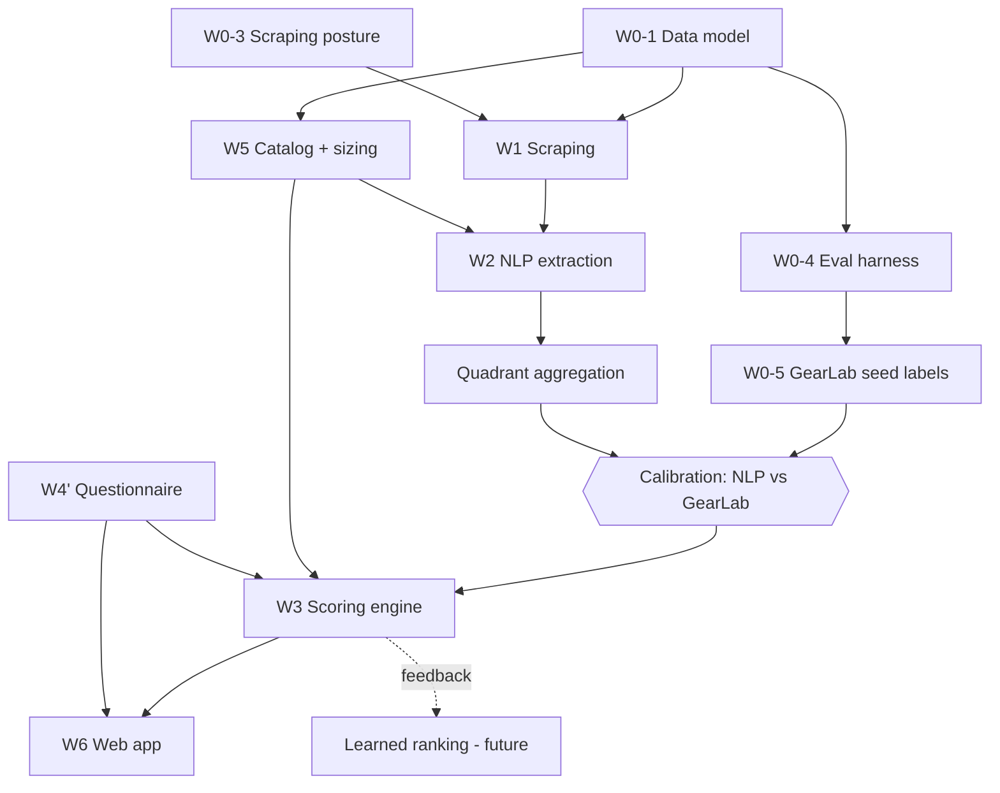
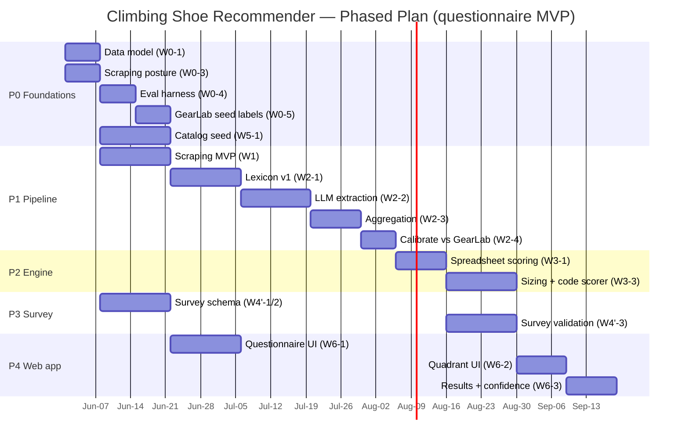

# Climbing Shoe Recommender — Project Plan & Agent Task Spec

**Version:** 2.0
**Status:** Active. Supersedes `baseline_project_context` (v1).
**Last updated:** 2026-05-25

---

## 0. How To Use This Document (read first, agent)

This is the single source of truth for the project. It replaces the v1 baseline. It encodes:

- Resolved product decisions (§2 Decision Log) — **do not re-litigate** without user sign-off.
- Workstreams, the recommendation math, the data model, the eval strategy, and a task backlog with stable IDs (§5–§11).

Operating rules for the agent working this project:

- Act as a rigorous, honest technical mentor. No sycophancy. Challenge flawed assumptions; explain *why* and propose a better alternative.
- The user has climbing domain expertise. Trust shoe-specific corrections (they were right on the Drago classification and on "sensitive on rock" = soft).
- Prioritize accuracy over agreement. Cite sources. Provide documentation-quality notes on technical decisions.
- Math/stats/variables rendered in LaTeX. Use Mermaid for flows/architecture. Use tables for scannability.
- **Validate the pipeline before building product surface.** The web app is the last thing built, not the first.

---

## 1. Product Overview

A web application that **recommends climbing shoes** matched to a user on three independent dimensions:

1. **Fit** — does the shoe physically suit the user's foot?
2. **Style/performance** — does the shoe's character match the user's discipline, terrain, and preference?
3. **Budget** — is it within price/availability constraints?

The original availability-based recommendation angle was **dropped**. The engine is powered by a **domain-specific NLP pipeline** that mines community discussion to characterize each shoe along a 2-axis performance quadrant, **calibrated** against expert review data (GearLab).

**MVP input method: a questionnaire** (see §2, decision 3). The LiDAR/photo foot scan is deferred to a later phase.

---

## 2. Decision Log (RESOLVED — binding)

| # | Decision | Rationale | Cascades |
|---|---|---|---|
| D1 | **LLM-extraction-first** for the NLP layer. No model training from scratch at MVP. | Zero labeled data exists. Training before labels is backwards. Distill to a small classifier only *after* LLM-bootstrapped labels accrue and cost justifies it. | `trainer.py` is **deferred** (task W2-5). `NLP.py` becomes an LLM-extraction module. |
| D2 | **GearLab is calibration-only.** It grounds/anchors the labeling of the corpus and validates quadrant placement. It is **not** a live recommendation input and is **not** surfaced in product. | GearLab is a single expert source with structured scores — ideal ground truth, wrong as a social signal. Also ToS/copyright risk if redistributed. | Drives eval design (§9) and the GearLab→(x,y) mapping. |
| D3 | **Foot scan deferred. MVP uses a questionnaire** to gather fit + preference inputs and produce recommendations. | Scan is high-value but high-effort. Questionnaire ships the loop now and de-risks the engine first. | Rewrites the **Fit** term (§7) to survey-derived. W4 (scan) → W4' (survey). W6 capture UI → questionnaire UI. |
| D4 | **No image storage. Store derived measurements only.** Scan + biometric storage is a future update. | Avoids biometric/privacy legal exposure (BIPA/GDPR) at MVP. | W0-2 (biometric posture) **dropped from MVP scope**; revisit when scan returns. Survey still carries standard PII handling. |

---

## 3. The Shoe Quadrant Framework (core product concept)

Shoes are positioned on a 2-axis plane. Coordinates normalized to $[-1, 1]$.

- **Horizontal $x$:** Comfort ($-1$) ↔ Performance ($+1$)
- **Vertical $y$:** Stiff ($-1$) ↔ Soft ($+1$)

| Quadrant | Position | Climbing context |
|---|---|---|
| Q1 | Performance + Stiff ($x>0, y<0$) | Sport, technical face, precision edging, board last |
| Q2 | Comfort + Stiff ($x<0, y<0$) | All-day trad, big wall, wide toe box, flat last, **multi-pitch** |
| Q3 | Comfort + Soft ($x<0, y>0$) | Gym, beginner, slabs, neutral shape, slip-on |
| Q4 | Performance + Soft ($x>0, y>0$) | Bouldering, steep terrain, aggressive downturn, soft rand |

**Confirmed placements (do not regress):**

| Shoe | Quadrant | Note |
|---|---|---|
| La Sportiva Solution | Q1 | Performance + stiff |
| La Sportiva TC Pro | Q2 | Comfort + stiff |
| Scarpa Drago | **Q4** | Performance + soft. **Not Q1.** Soft, aggressive boulder shoe. |
| Scarpa Instinct VSR | Q4 | Performance + soft |
| Evolv Defy | Q3 | Comfort + soft |

---

## 4. Climbing Lexicon (proprietary asset)

The NLP layer maps **climbing-specific phrases to axis signals**, not generic polarity. Same word, different meaning in-context. Target: ~200–300 patterns, seeded manually + from GearLab prose, expanded via LLM corpus analysis.

| Phrase | Axis signal |
|---|---|
| "sensitive on rock" / "feel the rock" | **Soft** ($+y$). Softness reduces dampening → more tactile feedback. **Not an independent quality.** |
| "precise on small edges" | Performance + stiff (Q1) |
| "supportive all day" | Stiff + comfort (Q2) |
| "smears well" | Soft ($+y$) |
| "feet were screaming after a pitch" / "toes aching after a day" | High performance, low comfort ($+x$, aggressive fit) |
| "wore these all day on a multipitch" / "perfect for multi-pitch" | Comfort + moderate stiffness (Q2). Confirmed by GearLab: flat-midsole comfort shines on multi-pitch. |
| "aggressive downturn" | Performance + soft (Q4) |

**Bias warning (carry into aggregation):** social data is popularity-weighted. Beginner/intermediate climbers dominate online. A shoe loved by elite climbers may score middling because most reviewers misuse it. **Weight opinions by stated experience level.**

---

## 5. Workstreams (scopes)

| ID | Workstream | Produces | MVP status |
|---|---|---|---|
| **W0** | Foundations / Eval | Data model, scraping posture, eval harness, GearLab seed labels | Active (this phase) |
| **W1** | Data & Scraping Infra | Reddit/YouTube ingest, dedup, versioned snapshots | Active after W0 |
| **W2** | NLP / Lexicon / Extraction | Lexicon, LLM extractor, aggregation → quadrant | Active after W1 |
| **W3** | Recommendation Engine | Fit + Style + Budget scoring, sizing map | Active after W2 |
| **W4'** | **Questionnaire** (replaces foot scan for MVP) | Survey schema, intake UI, foot profile + target $q^*$ | Active, parallel |
| **W5** | Catalog & Data Model | 50–100 seeded shoes, geometry/last specs, lifecycle | Active after W0-1 |
| **W6** | Frontend / UX | Questionnaire UI, interactive quadrant, results | Last |
| ~~W4~~ | ~~Foot scan (LiDAR/photo)~~ | — | **Deferred** (future update, §12) |

---

## 6. Dependency Graph



Critical path: **W0-1 → W1 → W2 → AGG → CAL → W3 → W6**. W4' (questionnaire) and W5 (catalog) run parallel and join at W3.

---

## 7. Recommendation Math (v0 — survey edition)

### 7.1 Inputs

- **Survey foot profile** $\hat{\mathbf{f}}$: categorical self-reports — width $W$, instep/volume $V$, toe shape $T \in \{\text{Egyptian, Greek, Roman}\}$, arch $A$, heel size $H$.
- **Anchor sets:** $G$ = shoes the user reports fit *well* (brand + model + size); $B$ = shoes that fit *poorly*. **Highest-signal fit input** — lower noise than abstract self-report.
- **Shoe last profile** $\mathbf{s}_{\text{last},j}$ from catalog (last shape, volume, toe-box geometry, gender).
- **Shoe quadrant** $\mathbf{q}_j = (x_j, y_j)$ from NLP aggregation (§7.4).
- **User target** $\mathbf{q}^*$ from preference questions (§7.5).
- **Budget cap**, **size constraint**.

### 7.2 Fit score (survey-derived)

Two components, blended:

$$\text{Fit}_j = \lambda\,\text{Fit}^{\text{anchor}}_j + (1-\lambda)\,\text{Fit}^{\text{cat}}_j$$

- $\text{Fit}^{\text{cat}}_j$ — categorical match between $\hat{\mathbf{f}}$ and $\mathbf{s}_{\text{last},j}$ (width vs last width, toe shape vs toe-box, etc.).
- $\text{Fit}^{\text{anchor}}_j$ — similarity of shoe $j$'s last family to last families in $G$ (boost) and $B$ (penalty). Stronger, lower-noise.
- $\lambda \in [0,1]$ weights toward the anchor signal when $G \cup B \neq \varnothing$.

A global survey-fit confidence $c_{\text{survey}}$ (< scan confidence) discounts $\text{Fit}_j$. **Forward-compatibility:** when scan returns, it raises $c$ and adds true geometric dimensions without changing this structure.

### 7.3 Style score (quadrant proximity)

$$\text{Style}_j = 1 - \frac{\lVert \mathbf{q}_j - \mathbf{q}^* \rVert_2}{2\sqrt{2}}, \qquad \mathbf{q} \in [-1,1]^2$$

### 7.4 NLP axis aggregation (per shoe, per axis; $x$ shown)

$$x_j = \frac{\sum_{m=1}^{N_j} e_m\, r_m\, a_m}{\sum_{m=1}^{N_j} e_m\, r_m}, \qquad N_j \ge N_{\min}$$

- $e_m$ = author-experience weight (mitigates popularity bias, §4).
- $r_m$ = recency decay.
- $a_m \in [-1,1]$ = phrase axis signal from the lexicon (§4).
- $N_j < N_{\min}$ → spec-derived fallback placement + **low-confidence flag** (cold-start, long tail).

### 7.5 Target from questionnaire

$\mathbf{q}^*$ is derived from preference answers: discipline (boulder/sport/trad/gym), terrain (slab/vertical/overhang/crack), experience level, comfort-vs-performance goal, stiffness preference, downsizing/pain tolerance.

### 7.6 Combined rank (soft terms, hard gates)

$$\text{Score}_j = \big(\alpha\,\text{Fit}_j + \beta\,\text{Style}_j + \gamma\,\text{Budget}_j\big)\cdot \mathbb{1}[\text{size available}]\cdot \mathbb{1}[\text{price} \le \text{cap}]$$

with $\alpha + \beta + \gamma = 1$, tuned on the validation set. **Sizing and budget are gates, not soft terms.**

### 7.7 Recommendation confidence (surface to user)

$$C_j = g\big(c_{\text{survey}},\, N_j,\, \text{agreement}_j\big)$$

where $\text{agreement}_j$ = inverse variance of $a_m$. Low corpus volume or split opinion → low $C_j$, displayed honestly.

---

## 8. Data Model (W0-1)

Postgres via Supabase. Reference DDL (adjust types/constraints as needed).

```sql
-- Catalog
CREATE TABLE shoe (
  id              UUID PRIMARY KEY DEFAULT gen_random_uuid(),
  brand           TEXT NOT NULL,
  model           TEXT NOT NULL,
  version         TEXT,                 -- e.g. "Solution Comp"
  gender          TEXT,                 -- men's / women's / unisex (last differs)
  last_shape      TEXT,                 -- e.g. asymmetric, neutral
  downturn        TEXT,                 -- flat / moderate / aggressive
  stiffness_spec  TEXT,                 -- maker/spec-stated stiffness
  closure         TEXT,                 -- lace / velcro / slipper
  rubber          TEXT,
  msrp_usd        NUMERIC,
  status          TEXT DEFAULT 'active',-- active / discontinued / revised
  quadrant_x_prior NUMERIC,            -- spec-derived prior (cold-start fallback)
  quadrant_y_prior NUMERIC,
  UNIQUE (brand, model, version, gender)
);

CREATE TABLE shoe_alias (             -- for mention detection / NER
  shoe_id UUID REFERENCES shoe(id),
  alias   TEXT NOT NULL,
  PRIMARY KEY (shoe_id, alias)
);

CREATE TABLE shoe_size_map (          -- brand sizing chaos (hard gate)
  shoe_id          UUID REFERENCES shoe(id),
  brand_size       TEXT,
  us_street_equiv  NUMERIC,
  downsize_note    TEXT,
  PRIMARY KEY (shoe_id, brand_size)
);

-- Calibration ground truth (internal only; D2)
CREATE TABLE gearlab_label (
  shoe_id       UUID REFERENCES shoe(id),
  metric        TEXT,                  -- comfort, edging, smearing, pulling, sensitivity, crack
  score         NUMERIC,               -- normalized 0..1
  source_url    TEXT,
  snapshot_date DATE,
  PRIMARY KEY (shoe_id, metric, snapshot_date)
);

-- Corpus
CREATE TABLE corpus_snapshot (
  id          UUID PRIMARY KEY DEFAULT gen_random_uuid(),
  source      TEXT,                    -- reddit / youtube
  scraped_at  TIMESTAMPTZ,
  version     TEXT
);

CREATE TABLE mention (
  id           UUID PRIMARY KEY DEFAULT gen_random_uuid(),
  snapshot_id  UUID REFERENCES corpus_snapshot(id),
  shoe_id      UUID REFERENCES shoe(id),
  source       TEXT,
  author_hash  TEXT,                   -- hashed, no raw PII
  body         TEXT,
  permalink    TEXT,
  created_utc  TIMESTAMPTZ
);

-- LLM extraction output (D1)
CREATE TABLE extraction (
  mention_id    UUID REFERENCES mention(id),
  attribute     TEXT,                  -- heel/toe/width/arch/downturn/stiffness/rand
  axis          TEXT,                  -- x or y
  signal_value  NUMERIC,               -- a_m in [-1,1]
  archetype     TEXT,                  -- boulderer/trad/sport/gym
  experience    TEXT,                  -- level -> e_m weight
  confidence    NUMERIC,
  lexicon_version TEXT
);

-- Aggregated quadrant position
CREATE TABLE shoe_axis_score (
  shoe_id        UUID REFERENCES shoe(id),
  axis           TEXT,                 -- x or y
  value          NUMERIC,              -- [-1,1]
  n_mentions     INT,
  agreement      NUMERIC,
  confidence     NUMERIC,
  computed_at    TIMESTAMPTZ,
  lexicon_version TEXT,
  PRIMARY KEY (shoe_id, axis, computed_at)
);

-- User (questionnaire; D3, D4 -> derived only, no images)
CREATE TABLE user_survey (
  id              UUID PRIMARY KEY DEFAULT gen_random_uuid(),
  foot_width      TEXT,                -- narrow/medium/wide
  instep          TEXT,                -- low/medium/high
  toe_shape       TEXT,                -- egyptian/greek/roman
  arch            TEXT,                -- low/medium/high
  heel_fit        TEXT,
  street_size     NUMERIC,
  known_good_shoes JSONB,             -- anchor set G [{brand,model,size}]
  known_bad_shoes  JSONB,             -- anchor set B
  discipline      TEXT,
  terrain         TEXT,
  level           TEXT,
  goal_x_target   NUMERIC,            -- q* x
  goal_y_target   NUMERIC,            -- q* y
  budget_cap_usd  NUMERIC,
  created_at      TIMESTAMPTZ DEFAULT now()
);

CREATE TABLE recommendation (
  id          UUID PRIMARY KEY DEFAULT gen_random_uuid(),
  survey_id   UUID REFERENCES user_survey(id),
  shoe_id     UUID REFERENCES shoe(id),
  fit_score   NUMERIC,
  style_score NUMERIC,
  total_score NUMERIC,
  confidence  NUMERIC,
  rank        INT
);

-- Versioned proprietary asset
CREATE TABLE lexicon (
  id       UUID PRIMARY KEY DEFAULT gen_random_uuid(),
  pattern  TEXT,
  axis     TEXT,
  polarity NUMERIC,                    -- a contribution in [-1,1]
  version  TEXT
);
```

**Versioning principle:** corpus snapshots, lexicon, and axis scores are all versioned so any quadrant placement is reproducible. Shoes are revised/discontinued — track lifecycle via `shoe.status` + `version`.

---

## 9. Eval Strategy (W0-4)

Without eval, the recommender is unfalsifiable. Define metrics **before** building W2/W3.

### 9.1 GearLab → (x, y) mapping (calibration target)

Normalize each GearLab metric to $[0,1]$: Comfort $C$, Edging $E$, Smearing $Sm$, Pulling/Steep $P$, Sensitivity $Se$.

$$x^{\text{GL}} = \tanh\!\big(\kappa\,[\,w_E E + w_P P - w_C C\,]\big) \quad (\text{+1} = \text{performance})$$

$$y^{\text{GL}} = \tanh\!\big(\kappa\,[\,w_{Sm} Sm + w_{Se} Se - w_E E\,]\big) \quad (\text{+1} = \text{soft})$$

Tune weights so confirmed placements land correctly (Solution Q1, Drago Q4, TC Pro Q2, Defy Q3). Sign note: **sensitivity → soft** (consistent with "sensitive on rock" = soft).

### 9.2 Offline metrics (pipeline correctness)

- **Axis MAE:** $\text{MAE}_x = \frac{1}{n}\sum_j |x_j^{\text{NLP}} - x_j^{\text{GL}}|$, same for $y$. Set a pass threshold (e.g. $\le 0.2$).
- **Quadrant agreement:** % of overlapping shoes that NLP places in the same quadrant as the GearLab mapping. Report a 4×4 confusion matrix.

### 9.3 Online metrics (recommendation quality — later)

- Recommendation acceptance rate.
- Self-reported fit satisfaction (post-purchase survey).
- Return/regret rate.
- Ranking quality (nDCG) once feedback labels exist.

---

## 10. Scraping Posture (W0-3)

| Source | Access path | Limit / cost | Commercial allowed? | Action |
|---|---|---|---|---|
| **Reddit** | PRAW + OAuth 2.0 | ~60 QPM practical via PRAW (100 QPM official cap), 10-min rolling window allows bursts; 10 QPM unauthenticated | **No** — free tier is non-commercial only | Use free tier for **prototype corpus only**. Budget commercial access before launch (≈ $0.24 / 1k calls, or standard tier from ~$12k/yr). Pushshift is dead → no historical bulk; collect forward + cache. |
| **YouTube** | Data API v3 (metadata/search/captions) | 10k units/day default quota | Metadata yes; transcript scraping is ToS-gray and fragile | Prefer official captions where permitted or licensed transcripts. **Verify ToS** before scaling. Transcripts > comments for signal. |
| **GearLab** | Manual / low-rate fetch | Respect robots.txt | Internal calibration only (D2) | No redistribution, no surfacing scores in product. Cache locally. |

**Implementation:** token-bucket rate limiter (sliding window), exponential backoff on 429, aggressive local caching to minimize calls. Hash author IDs; store no raw PII.

**Flag:** the product is commercial; Reddit's free tier explicitly forbids commercial use. This is a cost + legal line item, not an afterthought.

---

## 11. Task Backlog (stable IDs; status: TODO unless noted)

### W0 — Foundations
| ID | Task | Deps | Notes |
|---|---|---|---|
| W0-1 | Implement data model (§8) in Supabase | — | Unblocks everything. Start here. |
| ~~W0-2~~ | ~~Biometric/consent posture~~ | — | **Dropped at MVP** (D4). Revisit with scan. |
| W0-3 | Scraping posture + rate-limiter (§10) | — | Parallelizable with W0-1. |
| W0-4 | Eval harness + metrics + GearLab→(x,y) map (§9) | W0-1 | Define before W2/W3. |
| W0-5 | GearLab seed: load labels + convert to (x,y) + extract seed phrases | W0-1, W0-4 | Internal-only calibration set; feeds W2-1 lexicon. |

### W1 — Scraping
| ID | Task | Deps |
|---|---|---|
| W1-1 | `sources.py`: source registry, OAuth, rate-limit/backoff | W0-3 |
| W1-2 | `compile.py`: ingest → normalize → dedup → versioned snapshot | W1-1, W0-1 |
| W1-3 | Shoe-mention detection (alias table / NER) | W5-1 |

### W2 — NLP / Lexicon (LLM-first)
| ID | Task | Deps |
|---|---|---|
| W2-1 | Lexicon v1: phrase→axis map, ~200–300 patterns (manual + GearLab seed) | W0-5 |
| W2-2 | `NLP.py`: LLM extraction — attributes + archetype + experience, gated by lexicon | W2-1, W1-2 |
| W2-3 | Aggregation → $(x_j, y_j)$ per §7.4 (experience + recency weighting, $N_{\min}$ gate) | W2-2 |
| W2-4 | Calibrate vs GearLab labels (§9.2); iterate lexicon | W2-3, W0-5 |
| W2-5 | **Deferred:** `trainer.py` distillation to small classifier — only after labels accrue (D1) | W2-4 |

### W3 — Scoring
| ID | Task | Deps |
|---|---|---|
| W3-1 | Spreadsheet scoring v0 (Fit/Style/Budget, §7) | W2-4 |
| W3-2 | Per-brand sizing map (hard gate) | W5-1 |
| W3-3 | Code scorer; tune $\alpha,\beta,\gamma,\lambda$ on validation set | W3-1, W3-2 |
| W3-4 | Confidence $C_j$ propagation + display contract | W3-3 |

### W4' — Questionnaire (replaces scan for MVP)
| ID | Task | Deps |
|---|---|---|
| W4'-1 | Survey schema: fit inputs (width/instep/toe/arch/heel) + anchor shoes $G,B$ | W0-1 |
| W4'-2 | Preference inputs → target $\mathbf{q}^*$ mapping | W0-1 |
| W4'-3 | Validate survey fit signal vs known-good-fit anchors on real users | W4'-1, W3-1 |

### W5 — Catalog
| ID | Task | Deps |
|---|---|---|
| W5-1 | Seed 50–100 shoes: brand/model/version/gender, last, downturn, stiffness, closure, rubber, MSRP, aliases, quadrant prior | W0-1 |
| W5-2 | Lifecycle handling (discontinued/revised/version) | W5-1 |

### W6 — Frontend (last)
| ID | Task | Deps |
|---|---|---|
| W6-1 | Questionnaire UI (fit + preference intake) | W4'-1, W4'-2 |
| W6-2 | Interactive quadrant (first-class element; drag/inspect shoes) | W3-3 |
| W6-3 | Results + confidence display | W6-2, W3-4 |

---

## 12. Build Sequencing / Phases



Durations are estimates for a small team; adjust to actual velocity.

---

## 13. Open Items / Future Updates

- **Foot scan re-introduction (post-MVP):** LiDAR via ARKit (`ARMeshAnchor`/RealityKit; **not** ARFaceAnchor/TrueDepth — that API is face-only) + ARCore ToF; photo fallback with calibration reference + MediaPipe/YOLOv8 keypoints; per-dimension confidence. Slots into §7.2 by raising $c$ and adding geometric dimensions. Re-open biometric posture (W0-2) at that point — derived measurements only, no images (D4).
- **Learned ranking:** replace the weighted scorer once online feedback labels exist.
- **`trainer.py` distillation:** LLM → small classifier when volume/cost justify (W2-5).
- **Cold-start / long tail:** shoes below $N_{\min}$ corpus rely on spec priors; consider expert-seeded placement for high-importance models.

---

## 14. Sources

- GearLab climbing shoe test methodology (Comfort/Smearing/Edging/Pulling metrics; multi-pitch = flat-midsole comfort): https://www.outdoorgearlab.com/topics/climbing/best-climbing-shoes/how-we-test
- GearLab climbing shoe review (retest Nov 2025; ~17 tested / 27 compared): https://www.outdoorgearlab.com/topics/climbing/best-climbing-shoes
- Reddit API pricing/limits 2026 (free tier 100 QPM official / ~60 via PRAW, 10-min rolling window, non-commercial only, Pushshift dead): https://octolens.com/blog/reddit-api-pricing , https://www.redditcommentscraper.com/article-reddit-api-pricing-alternative.html