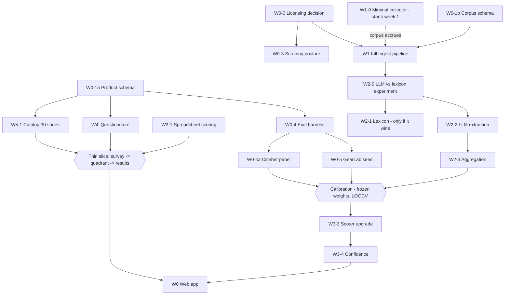
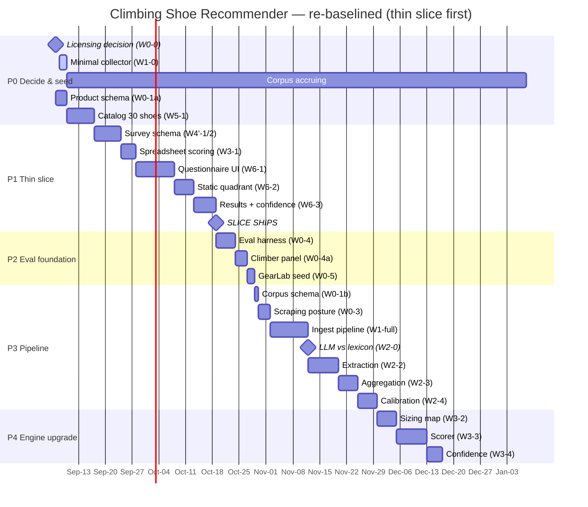

# Climbing Shoe Recommender — Project Plan & Agent Task Spec

**Version:** 3.0
**Status:** Active. Supersedes v2.0 (2026-05-25).
**Last updated:** 2026-09-07
**Change basis:** feasibility review of all 22 backlog tasks, P0–P4. Every reconfiguration below was reviewed and signed off; see §2.1 for the disposition table.

---

## 0. How To Use This Document (read first, agent)

This is the single source of truth for the project. It encodes:

- Resolved product decisions (§2 Decision Log) — **do not re-litigate** without user sign-off.
- Workstreams, the recommendation math, the data model, the eval strategy, and a task backlog with stable IDs (§5–§11).

Operating rules for the agent working this project:

- Act as a rigorous, honest technical mentor. No sycophancy. Challenge flawed assumptions; explain *why* and propose a better alternative.
- The user has climbing domain expertise. Trust shoe-specific corrections (they were right on the Drago classification and on "sensitive on rock" = soft).
- Prioritize accuracy over agreement. Cite sources. Provide documentation-quality notes on technical decisions.
- **Ship a thin product slice before the pipeline.** This reverses v2's "validate the pipeline before building product surface." See D7 — the reversal is deliberate and reasoned, not drift.

---

## 1. Product Overview

A web application that **recommends climbing shoes** matched to a user on three independent dimensions:

1. **Fit** — does the shoe physically suit the user's foot?
2. **Style/performance** — does the shoe's character match the user's discipline, terrain, and preference?
3. **Budget** — is it within price/availability constraints?

The original availability-based recommendation angle was **dropped**. The engine is powered by a **domain-specific LLM extraction pipeline** that mines community discussion to characterize each shoe along a 2-axis performance quadrant, **calibrated** against expert review data (GearLab).

**MVP input method: a questionnaire** (see §2, D3). The LiDAR/photo foot scan is deferred to a later phase.

**Terminology note.** This is *not* a RAG system, and the term should not be used for it. Nothing is retrieved at query time; there is no vector store anywhere in §8. The design is **batch LLM extraction feeding an offline aggregate**. That is the correct architecture here — recommendations must be reproducible and fast, and an LLM in the request path would make them neither.

---

## 2. Decision Log (RESOLVED — binding)

| # | Decision | Rationale | Cascades |
|---|---|---|---|
| D1 | **LLM-extraction-first** for the NLP layer. No model training from scratch at MVP. | Zero labeled data exists. Training before labels is backwards. Distill to a small classifier only *after* LLM-bootstrapped labels accrue and cost justifies it. | `trainer.py` is **deferred** (W2-5). `NLP.py` becomes an LLM-extraction module. |
| D2 | **GearLab is calibration-only.** It grounds/anchors the labeling of the corpus and validates quadrant placement. It is **not** a live recommendation input and is **not** surfaced in product. | GearLab is a single expert source with structured scores — ideal ground truth, wrong as a social signal. Also ToS/copyright risk if redistributed. | Drives eval design (§9) and the GearLab→(x,y) mapping. |
| D3 | **Foot scan deferred. MVP uses a questionnaire** to gather fit + preference inputs and produce recommendations. | Scan is high-value but high-effort. Questionnaire ships the loop now and de-risks the engine first. | Rewrites the **Fit** term (§7) to survey-derived. W4 (scan) → W4' (survey). W6 capture UI → questionnaire UI. |
| D4 | **No image storage. Store derived measurements only.** Scan + biometric storage is a future update. | Avoids biometric/privacy legal exposure (BIPA/GDPR) at MVP. | W0-2 **dropped from MVP scope**; revisit when scan returns. Survey still carries standard PII handling. |
| **D5** | **Reddit commercial access is decided before any W1 code is written.** | v2 deferred this to "before launch," which means building the whole ingest and *then* learning the data is unusable. Free tier is non-commercial; the product is commercial; standard tier starts ~$12k/yr. | New task **W0-0**, first in P0. Gates W0-3 and all of W1-full. |
| **D6** | **Catalog seeds at 25–30 shoes, not 50–100.** | Reddit shoe discussion is a steep power law: only ~15–25 shoes will ever clear $N_{\min}$ regardless of catalog size. 100 shoes means 75 served by spec priors — an NLP veneer over a spec sheet. | W5-1 rescoped. Raises the corpus-backed fraction of the catalog from ~25% to ~65%. |
| **D7** | **A thin product slice ships before the NLP pipeline.** 30 hand-placed shoes, survey, quadrant, ranked results, no NLP. | v2's ordering assumed the pipeline was the risky part. It isn't — batch extraction is routine. The real risks are legal source access and whether anyone wants this. Pipeline-first defers both by months. | **Reverses §0 of v2.** Restructures §12 entirely. W6-2 moves into P0/P1. |
| **D8** | **Calibration weights are frozen before measurement, and evaluation uses LOOCV, not a holdout split.** | v2 was circular: §9.1 tuned the GearLab mapping to hit the confirmed placements, then §9.2 graded NLP against that fitted mapping. And an 80/20 split of n≈20 leaves 4 test shoes — CI on 4-sample accuracy is ~±45pp. | Rewrites §9. Adds the climber panel (W0-4a) as a second ground-truth source. |
| **D9** | **Sizing is a soft warning, not a hard gate** — except where the brand does not make the size at all. | Downsizing convention is contested and personal. A hard gate over noisy self-reported sizing silently drops shoes that would have fit. | Rewrites §7.6. W3-2 rescoped. |
| **D10** | **Survey fit validation is a directional check (n≈8–12), not a statistical study.** | A real claim needs 30–50 participants and weeks of recruitment. Solo and pre-launch, that is not available. | W4'-3 rescoped. Real validation waits for §9.3 post-launch data — which is why the feedback columns land in W0-1a now. |

| **D11** | **Reddit is not load-bearing. Apply for free non-commercial access now; build the corpus on YouTube and forums.** | Self-service app registration is closed — every OAuth client needs manual approval, reported at 2-4 weeks with a real chance of silent rejection. Cost turned out not to be the obstacle (metered access is about $3.60 at this volume); *access latency and uncertainty* are. | Resolves W0-0. Splits W1-0 into 0a (apply), 0b (YouTube/forums collector), 0c (Reddit adapter on approval). Forces a source-agnostic collector interface. See §10.0. |

### 2.1 Review disposition (2026-09-07)

| Verdict | Count | Tasks |
|---|---|---|
| Keep as written | 9 | W0-0, W0-5, W2-2, W2-3, W3-1, W3-4, W4'-1, W4'-2, W6-1, W6-3 |
| Rework | 8 | W0-1, W0-4, W1-1/2/3, W2-1, W2-4, W3-2, W3-3, W6-2 |
| Cut / rescope | 2 | W5-1, W4'-3 |
| Defer | 3 | W0-3, W2-5, W5-2 |

W5-2 was omitted from the review sheet and is dispositioned **defer** by default — at a 30-shoe hand-curated catalog, a discontinued shoe is a manual edit, not a subsystem. Revisit when the catalog grows past ~50.

---

## 3. The Shoe Quadrant Framework (core product concept)

Shoes are positioned on a 2-axis plane. Coordinates normalized to $[-1, 1]$.

- **Horizontal $x$:** Comfort ($-1$) ↔ Performance ($+1$)
- **Vertical $y$:** Stiff ($-1$) ↔ Soft ($+1$)

| Quadrant | Position | Climbing context |
|---|---|---|
| Q1 | Performance + Stiff ($x>0, y<0$) | Sport, technical face, precision edging, board last |
| Q2 | Comfort + Stiff ($x<0, y<0$) | All-day trad, big wall, wide toe box, flat last, **multi-pitch** |
| Q3 | Comfort + Soft ($x<0, y>0$) | Gym, beginner, slabs, neutral shape, slip-on |
| Q4 | Performance + Soft ($x>0, y>0$) | Bouldering, steep terrain, aggressive downturn, soft rand |

**Confirmed placements (CORRECTED in v3 — do not regress):**

| Shoe | Quadrant | v2 said | Note |
|---|---|---|---|
| La Sportiva Solution | **Q1** | ~~Q4~~ | Performance + stiff. Downturned, but the P3 midsole makes it stiff for a boulder shoe. |
| La Sportiva TC Pro | **Q2** | Q2 | Comfort + stiff. Unchanged. |
| Scarpa Drago | **Q4** | ~~Q1~~ | Performance + soft. Soft, aggressive boulder shoe. |
| Scarpa Instinct VSR | **Q4** | ~~Q1~~ | Performance + soft, but **less soft than the Drago** — sits nearer the $y=0$ boundary. |
| Evolv Defy | **Q3** | ~~Q2~~ | Comfort + soft. Gym/beginner shoe. |

> **v2 defect, now fixed.** The v2 quadrant column contradicted §3's own axis definitions, its own per-shoe notes, and the list in §9.1 — on four of five rows. The notes and §9.1 agreed with each other, so they were the surviving reading. The Drago row was the sharpest case: it asserted "**Not Q4**" when Q4 is exactly what its own note ("performance + soft") describes. Because this table is calibration ground truth for §9.1's weight tuning, the inversion would have propagated into every downstream MAE. Fixed before W0-5 loads any labels.

---

## 4. Climbing Lexicon (proprietary asset — scope now conditional)

The lexicon maps **climbing-specific phrases to axis signals**, not generic polarity. Same word, different meaning in-context.

**Target revised: 60–80 patterns, not 200–300** — and the asset is now *conditional* on W2-0 (§11). Phrase frequency in review text is Zipfian: most matched signal comes from perhaps twenty patterns, and patterns 200–300 fire on almost nothing. Author 60–80, then measure the marginal contribution of the last twenty before writing more.

| Phrase | Axis signal |
|---|---|
| "sensitive on rock" / "feel the rock" | **Soft** ($+y$). Softness reduces dampening → more tactile feedback. **Not an independent quality.** |
| "precise on small edges" | Performance + stiff (Q1) |
| "supportive all day" | Stiff + comfort (Q2) |
| "smears well" | Soft ($+y$) |
| "feet were screaming after a pitch" / "toes aching after a day" | High performance, low comfort ($+x$, aggressive fit) |
| "wore these all day on a multipitch" / "perfect for multi-pitch" | Comfort + moderate stiffness (Q2). Confirmed by GearLab: flat-midsole comfort shines on multi-pitch. |
| "aggressive downturn" | Performance + soft (Q4) |

**Bias warning (carry into aggregation):** social data is popularity-weighted. Beginner/intermediate climbers dominate online. A shoe loved by elite climbers may score middling because most reviewers misuse it. **Weight opinions by stated experience level.**

---

## 5. Workstreams (scopes)

| ID | Workstream | Produces | MVP status |
|---|---|---|---|
| **W0** | Foundations / Eval | Licensing decision, data model, eval harness, GearLab seed labels | Active (this phase) |
| **W1** | Data & Scraping Infra | Minimal collector now; full ingest after D5 resolves | W1-0 active; W1-full gated |
| **W2** | NLP / Lexicon / Extraction | Lexicon, LLM extractor, aggregation → quadrant | After the thin slice |
| **W3** | Recommendation Engine | Fit + Style + Budget scoring, sizing map | Partly in thin slice (W3-1) |
| **W4'** | **Questionnaire** | Survey schema, intake UI, foot profile + target $q^*$ | In thin slice |
| **W5** | Catalog & Data Model | **25–30** seeded shoes, geometry/last specs, lifecycle | In thin slice (W5-1) |
| **W6** | Frontend / UX | Questionnaire UI, interactive quadrant, results | **In thin slice** (moved from last) |

---

## 6. Dependency Graph


```mermaid
flowchart TD
  W0_0[W0-0 Licensing decision] --> W0_3[W0-3 Scraping posture]
  W0_0 --> W1F[W1-full Ingest pipeline]
  W1_0[W1-0 Minimal collector - starts week 1] -.corpus accrues.-> W1F

  W0_1a[W0-1a Product schema] --> W5_1[W5-1 Catalog 30 shoes]
  W0_1a --> W4P[W4' Questionnaire]
  W5_1 --> SLICE{{Thin slice: survey -> quadrant -> results}}
  W4P --> SLICE
  W3_1[W3-1 Spreadsheet scoring] --> SLICE
  SLICE --> W6[W6 Web app]

  W0_1a --> W0_4[W0-4 Eval harness]
  W0_4 --> W0_4a[W0-4a Climber panel]
  W0_4 --> W0_5[W0-5 GearLab seed]
  W0_4a --> CAL
  W0_5 --> CAL{{Calibration - frozen weights, LOOCV}}

  W0_1b[W0-1b Corpus schema] --> W1F
  W1F --> W2_0[W2-0 LLM vs lexicon experiment]
  W2_0 --> W2_1[W2-1 Lexicon - only if it wins]
  W2_0 --> W2_2[W2-2 LLM extraction]
  W2_2 --> W2_3[W2-3 Aggregation]
  W2_3 --> CAL
  CAL --> W3_3[W3-3 Scorer upgrade]
  W3_3 --> W3_4[W3-4 Confidence]
  W3_4 --> W6
```

**Critical path to a shippable product:** W0-1a → W5-1 → W4' → W3-1 → W6. The NLP pipeline is an *upgrade path* for shoe placement, not a precondition for shipping.

**Critical path to an NLP-backed product:** W0-0 → W1-full → W2-0 → W2-2 → W2-3 → CAL → W3-3.

---

## 7. Recommendation Math (v0 — survey edition)

### 7.1 Inputs

- **Survey foot profile** $\hat{\mathbf{f}}$: categorical self-reports — width $W$, instep/volume $V$, toe shape $T \in \{\text{Egyptian, Greek, Roman}\}$, arch $A$, heel size $H$.
- **Anchor sets:** $G$ = shoes the user reports fit *well* (brand + model + size); $B$ = shoes that fit *poorly*. **Highest-signal fit input** — lower noise than abstract self-report. Consider shipping fit v0 on anchors alone; every question removed from a questionnaire raises completion.
- **Shoe last profile** $\mathbf{s}_{\text{last},j}$ from catalog (last shape, volume, toe-box geometry, gender).
- **Shoe quadrant** $\mathbf{q}_j = (x_j, y_j)$ — hand-placed in the thin slice, NLP-derived after §7.4 lands.
- **User target** $\mathbf{q}^*$ from preference questions (§7.5).
- **Budget cap**, **size constraint**.

### 7.2 Fit score (survey-derived)

$$\text{Fit}_j = \lambda\,\text{Fit}^{\text{anchor}}_j + (1-\lambda)\,\text{Fit}^{\text{cat}}_j$$

- $\text{Fit}^{\text{cat}}_j$ — categorical match between $\hat{\mathbf{f}}$ and $\mathbf{s}_{\text{last},j}$.
- $\text{Fit}^{\text{anchor}}_j$ — similarity of shoe $j$'s last family to last families in $G$ (boost) and $B$ (penalty). Stronger, lower-noise.
- $\lambda \in [0,1]$ weights toward the anchor signal when $G \cup B \neq \varnothing$. **Set by judgment, not tuned** (D8 rationale; see §7.6).

A global survey-fit confidence $c_{\text{survey}}$ discounts $\text{Fit}_j$. **Forward-compatibility:** when scan returns, it raises $c$ and adds true geometric dimensions without changing this structure.

### 7.3 Style score (quadrant proximity)

$$\text{Style}_j = 1 - \frac{\lVert \mathbf{q}_j - \mathbf{q}^* \rVert_2}{2\sqrt{2}}, \qquad \mathbf{q} \in [-1,1]^2$$

### 7.4 NLP axis aggregation (per shoe, per axis; $x$ shown)

$$x_j = \frac{\sum_{m=1}^{N_j} e_m\, r_m\, a_m}{\sum_{m=1}^{N_j} e_m\, r_m}, \qquad N_j \ge N_{\min}$$

- $e_m$ = author-experience weight (mitigates popularity bias, §4).
- $r_m$ = recency decay.
- $a_m \in [-1,1]$ = phrase axis signal.
- $N_j < N_{\min}$ → spec-derived fallback placement + **low-confidence flag**.

**$N_{\min}$ must be assigned a value** — it was unspecified in v2 and is the most consequential free number in the plan, because it decides what fraction of the catalog carries real signal. Start at $N_{\min} = 25$ and publish the sensitivity curve (catalog coverage vs $N_{\min}$) as a W2-3 deliverable.

### 7.5 Target from questionnaire

$\mathbf{q}^*$ is derived from preference answers: discipline (boulder/sport/trad/gym), terrain (slab/vertical/overhang/crack), experience level, comfort-vs-performance goal, stiffness preference, downsizing/pain tolerance. Assert that each of the four disciplines lands in the quadrant §3 associates with it.

### 7.6 Combined rank (soft terms, one hard gate)

$$\text{Score}_j = \big(\alpha\,\text{Fit}_j + \beta\,\text{Style}_j + \gamma\,\text{Budget}_j\big)\cdot \mathbb{1}[\text{size exists}]\cdot \mathbb{1}[\text{price} \le \text{cap}]$$

with $\alpha + \beta + \gamma = 1$.

**Two changes from v2:**

1. **Sizing is no longer a hard gate on fit** (D9). The only hard size gate is $\mathbb{1}[\text{size exists}]$ — the brand does not make that size at all. Downsizing mismatch becomes a **ranked warning** the user can relax ("runs small, most climbers size up half"), which is also better product copy than an empty result set.
2. **$\alpha, \beta, \gamma, \lambda$ are set by judgment and documented, not tuned.** Tuning requires user-to-good-shoe pairs, which do not exist and cannot come from GearLab — GearLab grades shoes, not matches. Counting $\kappa$ and the $w$ terms, v2 proposed 7+ free parameters against ~20 data points. Externalize the weights to config; defer tuning to post-launch §9.3 data.

### 7.7 Recommendation confidence (surface to user)

$$C_j = g\big(c_{\text{survey}},\, N_j,\, \text{agreement}_j\big)$$

where $\text{agreement}_j$ = inverse variance of $a_m$. Low corpus volume or split opinion → low $C_j$, displayed honestly.

**Promoted to first-class (W3-4).** With most of the catalog served by spec priors rather than corpus signal, this is not a finishing touch — it is the mechanism that makes shipping a thin corpus honest rather than misleading. A recommendation derived from four mentions and one derived from eighty must not arrive looking identical, and the flag must survive from aggregation through to the rendered card.

---

## 8. Data Model (W0-1)

Postgres via Supabase. **Split into two migrations** (D5 cascade): the product schema ships now; the corpus schema waits until the source question resolves.

**On Supabase specifically:** keep it, but recognize you are using it as managed Postgres — there is no auth in the MVP, no realtime, no storage (D4 forbids it). Talk to it through `psycopg` rather than the `supabase` client so the decision stays reversible.

### 8.1 W0-1a — Product schema (build now)

```sql
CREATE TABLE shoe (
  id              UUID PRIMARY KEY DEFAULT gen_random_uuid(),
  brand           TEXT NOT NULL,
  model           TEXT NOT NULL,
  version         TEXT,
  gender          TEXT,
  last_shape      TEXT,
  downturn        TEXT,
  stiffness_spec  TEXT,
  closure         TEXT,
  rubber          TEXT,
  msrp_usd        NUMERIC,
  status          TEXT DEFAULT 'active',
  quadrant_x_prior NUMERIC,            -- hand-placed in the thin slice
  quadrant_y_prior NUMERIC,
  UNIQUE (brand, model, version, gender)
);

CREATE TABLE shoe_alias (
  shoe_id UUID REFERENCES shoe(id),
  alias   TEXT NOT NULL,
  PRIMARY KEY (shoe_id, alias)
);

CREATE TABLE shoe_size_map (
  shoe_id          UUID REFERENCES shoe(id),
  brand_size       TEXT,
  us_street_equiv  NUMERIC,
  downsize_note    TEXT,
  size_exists      BOOLEAN DEFAULT TRUE,  -- the ONLY hard gate (D9)
  PRIMARY KEY (shoe_id, brand_size)
);

CREATE TABLE user_survey (
  id              UUID PRIMARY KEY DEFAULT gen_random_uuid(),
  survey_token    TEXT UNIQUE NOT NULL,   -- anonymous; links follow-up to recommendation
  foot_width      TEXT,
  instep          TEXT,
  toe_shape       TEXT,
  arch            TEXT,
  heel_fit        TEXT,
  street_size     NUMERIC,
  known_good_shoes JSONB,                 -- anchor set G [{brand,model,size}]
  known_bad_shoes  JSONB,                 -- anchor set B
  discipline      TEXT,
  terrain         TEXT,
  level           TEXT,
  goal_x_target   NUMERIC,
  goal_y_target   NUMERIC,
  budget_cap_usd  NUMERIC,
  created_at      TIMESTAMPTZ DEFAULT now()
);

CREATE TABLE recommendation (
  id          UUID PRIMARY KEY DEFAULT gen_random_uuid(),
  survey_id   UUID REFERENCES user_survey(id),
  shoe_id     UUID REFERENCES shoe(id),
  fit_score   NUMERIC,
  style_score NUMERIC,
  total_score NUMERIC,
  confidence  NUMERIC,
  rank        INT,
  -- §9.3 online metrics. Absent in v2; without these the eval loop is unclosable.
  accepted        BOOLEAN,
  satisfaction    NUMERIC,
  returned        BOOLEAN,
  feedback_at     TIMESTAMPTZ
);
```

> **v2 defect, now fixed.** v2's `recommendation` had nowhere to record acceptance, satisfaction or regret, and `user_survey` carried no token to link a follow-up back to what was recommended — yet §9.3 asks for exactly those metrics. Adding the columns later is cheap; adding them after users have already been through the funnel loses that cohort permanently.

### 8.2 W0-1b — Corpus schema (build after W0-0)

```sql
CREATE TABLE gearlab_label (
  shoe_id       UUID REFERENCES shoe(id),
  metric        TEXT,                  -- comfort, edging, smearing, pulling, sensitivity, crack
  score         NUMERIC,               -- normalized 0..1
  source_url    TEXT,
  snapshot_date DATE,
  PRIMARY KEY (shoe_id, metric, snapshot_date)
);

CREATE TABLE corpus_snapshot (
  id          UUID PRIMARY KEY DEFAULT gen_random_uuid(),
  source      TEXT,
  scraped_at  TIMESTAMPTZ,
  version     TEXT
);

CREATE TABLE mention (
  id           UUID PRIMARY KEY DEFAULT gen_random_uuid(),
  snapshot_id  UUID REFERENCES corpus_snapshot(id),
  shoe_id      UUID REFERENCES shoe(id),
  source       TEXT,
  author_hash  TEXT,                   -- hashed, no raw PII
  body         TEXT,
  permalink    TEXT,
  created_utc  TIMESTAMPTZ
);

CREATE TABLE extraction (
  mention_id    UUID REFERENCES mention(id),
  attribute     TEXT,
  axis          TEXT,
  signal_value  NUMERIC,
  archetype     TEXT,
  experience    TEXT,
  confidence    NUMERIC,
  lexicon_version TEXT
);

CREATE TABLE shoe_axis_score (
  shoe_id        UUID REFERENCES shoe(id),
  axis           TEXT,
  value          NUMERIC,
  n_mentions     INT,
  agreement      NUMERIC,
  confidence     NUMERIC,
  computed_at    TIMESTAMPTZ,
  lexicon_version TEXT,
  PRIMARY KEY (shoe_id, axis, computed_at)
);

CREATE TABLE lexicon (
  id       UUID PRIMARY KEY DEFAULT gen_random_uuid(),
  pattern  TEXT,
  axis     TEXT,
  polarity NUMERIC,
  version  TEXT
);
```

**Versioning principle:** corpus snapshots, lexicon, and axis scores are all versioned so any quadrant placement is reproducible.

---

## 9. Eval Strategy (W0-4)

Without eval, the recommender is unfalsifiable. Define metrics **before** building W2/W3.

### 9.1 GearLab → (x, y) mapping (calibration target)

Normalize each GearLab metric to $[0,1]$: Comfort $C$, Edging $E$, Smearing $Sm$, Pulling/Steep $P$, Sensitivity $Se$.

$$x^{\text{GL}} = \tanh\!\big(\kappa\,[\,w_E E + w_P P - w_C C\,]\big) \quad (\text{+1} = \text{performance})$$

$$y^{\text{GL}} = \tanh\!\big(\kappa\,[\,w_{Sm} Sm + w_{Se} Se - w_E E\,]\big) \quad (\text{+1} = \text{soft})$$

**Axis independence must be checked before this formula is committed.** $E$ appears in both expressions with opposite signs, which correlates $x$ and $y$ by construction — contradicting §3's claim that these are two independent dimensions. Verify that Solution (Q1) and Drago (Q4) actually resolve apart under it. If they do not, drop $E$ from the $y$ expression and re-derive.

**Frozen-weight protocol (D8).** Fit $\kappa$ and the $w$ terms using domain reasoning plus the five §3 anchors **only**. Write the resulting values into this document. Then never touch them again. Every remaining GearLab shoe is an untouched test set.

Sign note: **sensitivity → soft** (consistent with "sensitive on rock" = soft).

### 9.2 Offline metrics (pipeline correctness)

- **Axis MAE:** $\text{MAE}_x = \frac{1}{n}\sum_j |x_j^{\text{NLP}} - x_j^{\text{GL}}|$, same for $y$.
- **Quadrant agreement:** % of overlapping shoes placed in the same quadrant, reported as a 4×4 confusion matrix **with its sample size stated**.

**Resampling: leave-one-out cross-validation, not an 80/20 split.** The calibration set is the GearLab overlap — roughly 17–27 shoes. An 80/20 split leaves 4 test shoes; the confidence interval on 4-sample accuracy is about ±45 points, which cannot pass or fail anything. LOOCV gives ~20 folds instead of 4 test points and is the right tool at this $n$.

**State the pass threshold before the run, not after seeing the number.**

### 9.3 The agreement ceiling (W0-4a — new)

Have **two or three climbers independently place 40–60 shoes** on the quadrant. This produces:

- A second ground-truth source that is not GearLab, breaking the single-source dependency.
- **An inter-rater agreement ceiling.** Without it there is no way to know what MAE is even achievable — if two expert climbers disagree by 0.25 on average, an NLP MAE of 0.2 is at the noise floor and a threshold of 0.2 is meaningless.

This is the highest-value missing piece in v2's eval design and it costs a few hours of three people's time.

### 9.4 Online metrics (recommendation quality — post-launch)

- Recommendation acceptance rate.
- Self-reported fit satisfaction (post-purchase survey).
- Return/regret rate.
- Ranking quality (nDCG) once feedback labels exist.

These are the only route to tuning $\alpha, \beta, \gamma, \lambda$ (§7.6), which is why `recommendation` carries the feedback columns from day one.

---

## 10. Scraping Posture (W0-3)

### 10.0 W0-0 DECISION (resolved 2026-09-13)

**Decision (CONFIRMED 2026-09-13): free non-commercial Reddit access only. YouTube and climbing forums are the corpus. No advertising on the platform. Do not plan around Reddit being available.**

Three calls, settled and binding:

1. **Free non-commercial tier only.** No paid Reddit agreement will be pursued. Apply for free access; if it is refused, the project proceeds without Reddit.
2. **YouTube + forums are the primary corpus**, not a fallback.
3. **No ads on this platform.** Settles the advertising restriction — it cannot be breached by a product that carries no advertising.

**The consequence to keep visible.** Free-tier access is *non-commercial*, and that is a property of the product, not of the API key. No ads is one half of staying inside it; the other half is that **affiliate links on shoe recommendations would very likely count as commercial use**, and that is the obvious way a shoe recommender earns money. So this decision is not merely "no ads" — it is a commitment to run non-commercially for as long as Reddit data is in the corpus. If a revenue model ever appears, the choice is to strip Reddit-derived signal or to re-license. Keeping Reddit non-load-bearing (point 2) is what keeps that exit cheap.

**The risk moved, it did not vanish.** YouTube and the forums are now primary, so *their* terms are now the governing ones. Before W1-0b collects anything: check YouTube's API terms for the same commercial-use question, and check `robots.txt` plus terms for Mountain Project and UKClimbing. This is a smaller surface than Reddit's, not a zero one.

**What changed the answer.** Two findings contradict what v3 assumed on 2026-09-07:

| | v3 assumed | Reported reality (Sep 2026) |
|---|---|---|
| Bundled commercial tier | ~$12,000 **per year** | ~$12,000 **per month** for ~50M calls — about 12x worse |
| Metered commercial rate | $0.24 / 1k calls | Unchanged — at ~15k calls that is **about $3.60** |
| App registration | self-service, start any time | **Closed.** Manual approval for every new OAuth client, free or paid |
| Approval latency | not considered | **2-4 weeks reported, with a real chance of silent rejection** |
| Commercial path | "budget it before launch" | Separate written approval via a sales process, not the developer queue |
| Advertising | not considered | Cannot display Reddit content alongside advertisements |

**Cost was never the obstacle.** At this project's volume the metered rate is trivial. The obstacle is **access latency and uncertainty**: you cannot start collecting on demand, and you may be refused with no recourse.

**Therefore:**

1. **Submit the free non-commercial application now.** It costs nothing, and the 2-4 week queue is the long pole — every day it is not submitted is a day added to the end. Non-commercial is the honest classification today: there is no product, no revenue, no launch date.
2. **Do not make Reddit load-bearing.** YouTube transcripts plus climbing forums (Mountain Project, UKClimbing) become the primary corpus. If Reddit approval lands, it is an upgrade.
3. **Defer the commercial conversation** until there is a launch date or revenue. Re-open it then — and budget the *metered* rate, not the bundled tier, unless volume genuinely reaches tens of millions of calls.
4. **Flag for the monetization plan:** the advertising restriction needs checking before any ad-supported revenue model is designed around Reddit-derived content. Affiliate links on shoe recommendations may or may not fall inside it.

> **Source quality caveat.** Reddit publishes no official commercial rate card. The pricing and latency figures above come from third-party 2026 reports, corroborated across several but not verified against Reddit directly. The *policy* points — non-commercial-only free tier, mandatory approval, written approval for commercial use, the advertising restriction — trace to Reddit's own Developer Platform documentation and Responsible Builder Policy. Re-verify pricing at the point a commercial application is actually made.

### 10.1 Source table

| Source | Access path | Limit / cost | Commercial allowed? | Action |
|---|---|---|---|---|
| **Reddit** | PRAW + OAuth 2.0, **approval required** | ~60 QPM practical via PRAW (100 QPM official cap) | **No** — free tier is non-commercial only; commercial needs written approval | **Apply now, plan without it** (§10.0). Pushshift is dead → no historical bulk; collect forward + cache. |
| **YouTube** | Data API v3 | 10k units/day default quota | Metadata yes; captions are harder than v2 implied | **Official captions require the video owner's OAuth**, so third-party captions are effectively unavailable through the sanctioned route. The practical path (`youtube-transcript-api`) is the unofficial one. Treat this as a weaker fallback than v2 assumed. |
| **GearLab** | **Manual transcription** | n/a | Internal calibration only (D2) | At 17–27 shoes this is manual-entry scale, not scraping scale. Transcribe by hand — faster than writing a scraper at $n=27$ and removes a legal surface entirely. |

**Implementation (when unblocked):** token-bucket rate limiter (sliding window), exponential backoff on 429, aggressive local caching. Hash author IDs; store no raw PII. The PII hashing and caching are worth keeping regardless of which source survives; the Reddit-specific quota logic is not.

**W1-0, corrected (2026-09-13).** v3 said "a crude collector running today beats a well-built one starting in eight weeks," and scheduled W1-0 for week 1. **That premise was wrong** — it assumed self-service app registration, which no longer exists. You cannot start collecting Reddit on demand; the clock starts when approval lands, 2-4 weeks out at best.

The underlying logic still holds — Pushshift is dead, so the corpus only grows **forward in wall-clock time** and every idle day is unrecoverable. What changes is *what you can do about it*:

- **W1-0a (today, ~1 hour):** submit the Reddit access application. This is the item on the critical path, and it is paperwork, not code.
- **W1-0b (today, ~2 days):** build the collector against **YouTube and forums**, which need no approval queue. This is where the corpus actually starts accruing this week.
- **W1-0c (on approval):** add the Reddit source behind the same interface. If approval never comes, nothing downstream breaks.

The collector must therefore be written source-agnostic from the first commit — a source registry with pluggable adapters, not a Reddit client with a thin wrapper.

---

## 11. Task Backlog (stable IDs; status: TODO unless noted)

### W0 — Foundations
| ID | Task | Deps | Effort | Notes |
|---|---|---|---|---|
| **W0-0** | **Reddit licensing decision** | — | 0.5d | **NEW, first.** Written decision: pay, stay non-commercial and delay monetization, or drop Reddit for YouTube + forums. Gates W0-3 and W1-full. |
| **W0-1a** | Product schema (§8.1) | — | 2–3d | Includes the §9.3 feedback columns and the anonymous survey token. Unblocks the thin slice. |
| **W0-1b** | Corpus schema (§8.2) | W0-0 | 1d | Deferred until the source is known. |
| W0-3 | Scraping posture + rate-limiter (§10) | W0-0 | 2–3d | **Deferred.** Size it to whichever source survives. |
| **W0-4** | Eval harness + metrics + GearLab map (§9) | W0-1a | 1w | **Rework.** Check axis independence first; LOOCV not a split; freeze weights before measuring. |
| **W0-4a** | **Climber panel: 2–3 raters place 40–60 shoes** | W5-1 | 3d | **NEW.** Second ground-truth source + inter-rater agreement ceiling. |
| W0-5 | GearLab seed: load labels + convert to (x,y) + seed phrases | W0-1b, W0-4 | 2d | **Manual transcription.** Blocked on the §3 correction — now applied. |

### W1 — Scraping
| ID | Task | Deps | Effort | Notes |
|---|---|---|---|---|
| **W1-0** | **Minimal collector, running continuously** | — | 2d then passive | **NEW, start week 1.** Script + cron + table, prototype terms. Corpus only accrues forward. |
| W1-full | `sources.py` + `compile.py`: registry, OAuth, ingest → normalize → dedup → versioned snapshot | W0-0, W0-1b | 2w | Replaces W1-1/W1-2. Built around whichever source survived. |
| W1-3 | Shoe-mention detection (alias table / NER) | W5-1 | 1w | Report precision **and** recall on a hand-labeled sample of ≥100 mentions. |

### W2 — NLP / Extraction (LLM-first)
| ID | Task | Deps | Effort | Notes |
|---|---|---|---|---|
| **W2-0** | **Experiment: LLM-only vs lexicon-gated extraction** | W1-full | 0.5d | **NEW.** Score both against GearLab on the same sample. If LLM-only wins, **W2-1 is deleted.** Run this before investing in the lexicon. |
| W2-1 | Lexicon v1: 60–80 patterns (was 200–300) | W0-5, W2-0 | 1w | **Conditional on W2-0.** Measure marginal value of the last twenty before writing more. |
| W2-2 | `NLP.py`: LLM extraction — attributes + archetype + experience | W2-0, W1-full | 1.5w | Batch 10–20 mentions per call. Low tens of dollars at Haiku-class pricing. |
| W2-3 | Aggregation → $(x_j, y_j)$ per §7.4 | W2-2 | 1w | **Assign $N_{\min}$ (start 25) and publish the coverage-vs-$N_{\min}$ sensitivity curve.** |
| W2-4 | Calibrate vs GearLab (§9.2); iterate | W2-3, W0-5, W0-4a | 1w | **Frozen weights, LOOCV, threshold stated in advance.** |
| W2-5 | **Deferred:** `trainer.py` distillation (D1) | W2-4 | — | Revisit only when per-call cost becomes material. |

### W3 — Scoring
| ID | Task | Deps | Effort | Notes |
|---|---|---|---|---|
| W3-1 | Spreadsheet scoring v0 (§7) | W5-1 | 3–4d | **In the thin slice.** Sanity-check ordering with a climber before writing Python. |
| W3-2 | Per-brand sizing map | W5-1 | 1w | **Soft warning, not a hard gate** (D9). Hard gate only on "brand doesn't make this size." |
| W3-3 | Code scorer; weights by judgment, externalized to config | W3-1, W3-2 | 1.5w | **No tuning at MVP** — no validation set exists (§7.6). |
| W3-4 | Confidence $C_j$ propagation + display contract | W3-3 | 4d | **Promoted** — runs alongside W3-3, not after. |

### W4' — Questionnaire
| ID | Task | Deps | Effort | Notes |
|---|---|---|---|---|
| W4'-1 | Survey schema: fit inputs + anchor shoes $G,B$ | W0-1a | 1w | Best idea in the plan. Validate anchors against the catalog. Consider anchors-only for v0. |
| W4'-2 | Preference inputs → target $\mathbf{q}^*$ | W0-1a | 3d | Pure function + fixture tests; assert discipline → quadrant. |
| W4'-3 | **Directional** fit check, $n \approx 8$–12 | W4'-1, W3-1 | 1w | **Rescoped** (D10). Sanity-check, not validation. Real validation = §9.4 post-launch. |

### W5 — Catalog
| ID | Task | Deps | Effort | Notes |
|---|---|---|---|---|
| W5-1 | Seed **25–30** shoes (was 50–100) | W0-1a | 1w | **Rescoped** (D6). Hand-placed quadrant priors. Include the five §3 anchors. |
| W5-2 | Lifecycle handling (discontinued/revised/version) | W5-1 | — | **Deferred.** At 30 shoes a discontinued shoe is a manual edit. Revisit past ~50. |

### W6 — Frontend (moved earlier)
| ID | Task | Deps | Effort | Notes |
|---|---|---|---|---|
| W6-1 | Questionnaire UI | W4'-1, W4'-2 | 1–2w | **In the thin slice.** Anchor picker needs catalog autocomplete, not free text. |
| W6-2 | Interactive quadrant | W5-1 | 1w static + 1w interactive | **Moved from second-to-last into the thin slice.** Hand-placed shoes test the product hypothesis with no corpus. |
| W6-3 | Results + confidence display | W6-2, W3-1 | 1w | Low-confidence results visibly distinct; gated-out shoes never shown. |

---

## 12. Build Sequencing / Phases (re-baselined 2026-09-07)

**Why this differs from v2.** The v2 Gantt opened 2026-06-01 and ran ~16 weeks to ~2026-09-19. Fourteen of those weeks elapsed with no implementation written. This schedule re-baselines from a standing start and reorders per D7: something shippable reaches climbers at week six, before the NLP pipeline exists.


```mermaid
gantt
  title Climbing Shoe Recommender — re-baselined (thin slice first)
  dateFormat YYYY-MM-DD
  axisFormat %b-%d

  section P0 Decide & seed
  Licensing decision (W0-0)        :milestone, m0, 2026-09-07, 0d
  Minimal collector (W1-0)         :active, c0, 2026-09-08, 2d
  Corpus accruing                  :c1, after c0, 120d
  Product schema (W0-1a)           :p0a, 2026-09-07, 3d
  Catalog 30 shoes (W5-1)          :p0b, after p0a, 7d

  section P1 Thin slice
  Survey schema (W4'-1/2)          :p1a, after p0b, 7d
  Spreadsheet scoring (W3-1)       :p1b, after p1a, 4d
  Questionnaire UI (W6-1)          :p1c, after p1b, 10d
  Static quadrant (W6-2)           :p1d, after p1c, 5d
  Results + confidence (W6-3)      :p1e, after p1d, 6d
  SLICE SHIPS                      :milestone, m1, after p1e, 0d

  section P2 Eval foundation
  Eval harness (W0-4)              :p2a, after p1e, 5d
  Climber panel (W0-4a)            :p2b, after p2a, 3d
  GearLab seed (W0-5)              :p2c, after p2b, 2d

  section P3 Pipeline
  Corpus schema (W0-1b)            :p3a, after p2c, 1d
  Scraping posture (W0-3)          :p3b, after p3a, 3d
  Ingest pipeline (W1-full)        :p3c, after p3b, 10d
  LLM vs lexicon (W2-0)            :milestone, m2, after p3c, 0d
  Extraction (W2-2)                :p3d, after p3c, 8d
  Aggregation (W2-3)               :p3e, after p3d, 5d
  Calibration (W2-4)               :p3f, after p3e, 5d

  section P4 Engine upgrade
  Sizing map (W3-2)                :p4a, after p3f, 5d
  Scorer (W3-3)                    :p4b, after p4a, 8d
  Confidence (W3-4)                :p4c, after p4b, 4d
```

**Milestones:**

| When | Milestone |
|---|---|
| Week 1 | W0-0 licensing decision written; collector running |
| **Week 6** | **Thin slice ships — 30 shoes, survey, quadrant, results, no NLP** |
| Week 8 | Eval foundation complete, agreement ceiling known |
| Week 12 | W2-0 verdict — lexicon kept or deleted |
| Week 15 | Calibration reported against a frozen mapping |
| Week 18 | NLP-backed placements replace hand placements |

Durations assume a solo builder. The v2 note "estimates for a small team" no longer applies.

---

## 13. Open Items / Future Updates

- **Foot scan re-introduction (post-MVP):** LiDAR via ARKit (`ARMeshAnchor`/RealityKit; **not** ARFaceAnchor/TrueDepth — that API is face-only) + ARCore ToF; photo fallback with calibration reference + MediaPipe/YOLOv8 keypoints. Slots into §7.2 by raising $c$ and adding geometric dimensions. Re-open biometric posture at that point — derived measurements only, no images (D4).
- **Learned ranking:** replace the weighted scorer once online feedback labels exist (§9.4).
- **`trainer.py` distillation:** LLM → small classifier when volume/cost justify (W2-5).
- **Catalog growth past 30:** triggers W5-2 (lifecycle) and raises the long-tail cold-start problem again.
- **Cold-start is the majority case, not the tail.** At $N_{\min}=25$, expect roughly 15–25 of 30 shoes corpus-backed. §7.7 confidence display is what makes this honest.

---

## 14. Sources

- GearLab climbing shoe test methodology (Comfort/Smearing/Edging/Pulling metrics; multi-pitch = flat-midsole comfort): https://www.outdoorgearlab.com/topics/climbing/best-climbing-shoes/how-we-test
- GearLab climbing shoe review (retest Nov 2025; ~17 tested / 27 compared): https://www.outdoorgearlab.com/topics/climbing/best-climbing-shoes
- Reddit API pricing/limits 2026 (free tier 100 QPM official / ~60 via PRAW, non-commercial only, Pushshift dead): https://octolens.com/blog/reddit-api-pricing , https://www.redditcommentscraper.com/article-reddit-api-pricing-alternative.html

---

## 15. Changelog

**v3.0 (2026-09-07)** — feasibility review of all backlog tasks; 22 dispositions signed off.
- Fixed the §3 quadrant table (inverted on 4 of 5 rows; was calibration ground truth).
- Added D5–D10.
- Split W0-1 into product/corpus schemas; added §9.3 feedback columns and survey token.
- Added W0-0 (licensing), W0-4a (climber panel), W1-0 (collector), W2-0 (lexicon experiment).
- Rescoped W5-1 (30 shoes), W2-1 (60–80 patterns), W4'-3 (directional check).
- Rewrote §9: frozen weights, LOOCV, agreement ceiling, axis-independence check.
- Sizing demoted from hard gate to warning (§7.6).
- Reversed the build order: thin product slice before pipeline (D7). §12 re-baselined to 18 weeks from 2026-09-07.
- Clarified that this is batch extraction, not RAG.

**v2.0 (2026-05-25)** — questionnaire MVP; superseded `baseline_project_context` v1.
